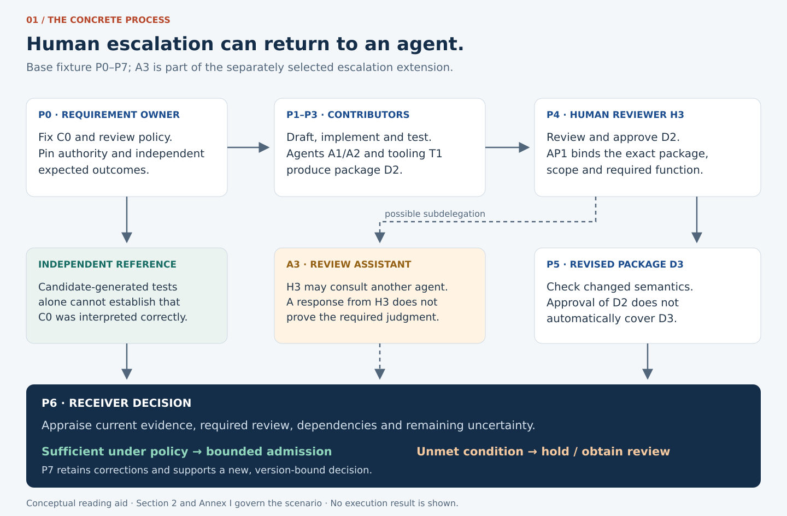
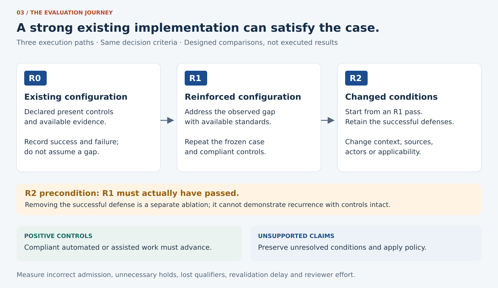
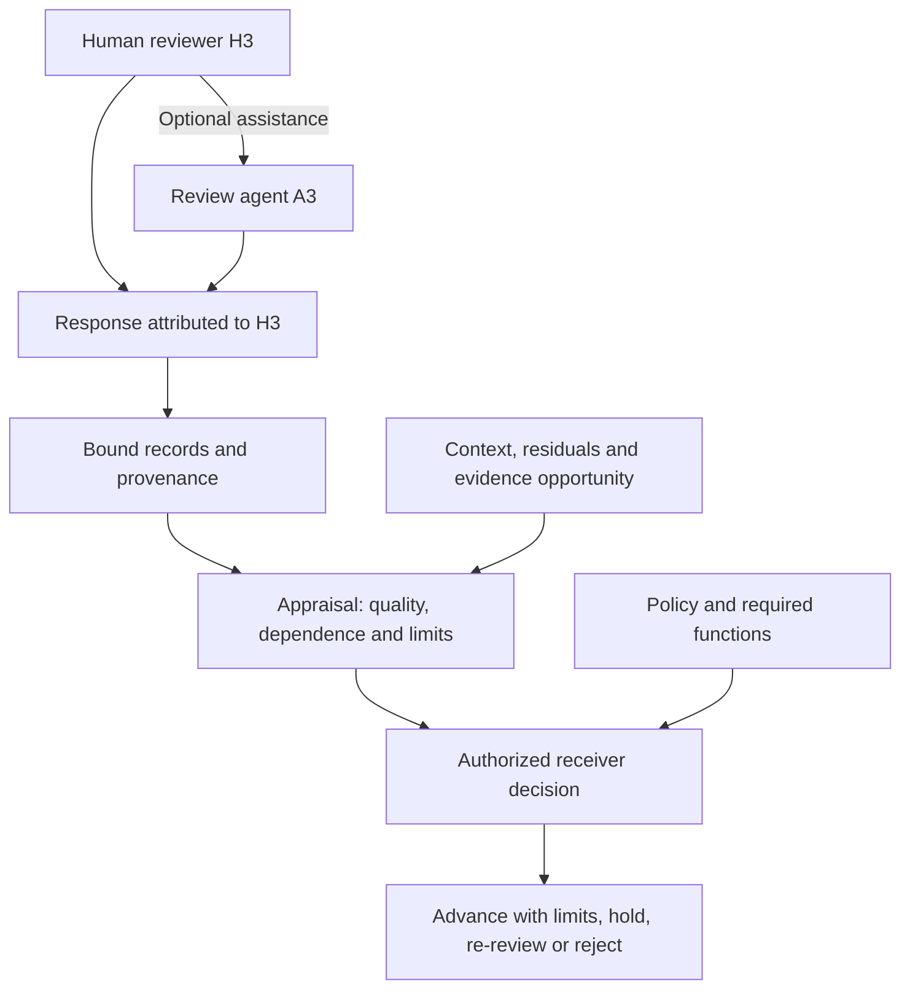
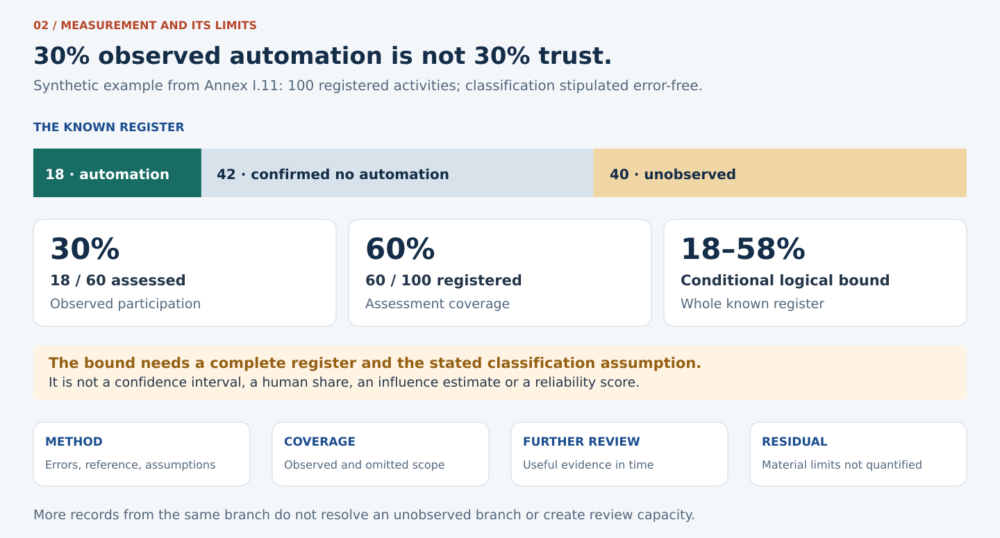

# [Use Case] Contextual trust under recursive human–agent escalation

**[Start with the short case](FG_TIDA_Issue_Body_Contextual_Trust_v1.0.md)** · **[Read the complete dossier](FG_TIDA_Use_Case_Contextual_Trust_Recursive_Escalation_v1.0.md)** · **[Visual reading edition](FG_TIDA_Visual_Reading_v1.0.html)**

> **For this package, this action and this moment: what can be relied on, what remains unresolved, and what must be reviewed before proceeding?**

| Contribution status | Technical contract | Evaluation status |
|---|---|---|
| Proposed · hypothetical · individual contribution | 26 HAP requirements · versioned profiles | 66 test designs · none executed |

---

**Version:** 1.0 — first publication edition  
**Prepared:** 29 September 2026  
**Evidence cut-off:** 29 September 2026  
**Status:** Submitted to FG-TIDA as a proposed, hypothetical, implementation-neutral individual expert contribution. No acceptance, adoption or pilot results are claimed.  
**Template:** Official FG-TIDA use-case issue template, revision 21d8ae207d781bb585854130375bc54e4e91357f [F01]. Its ten sections are retained in order; supporting annexes follow Section 10.

### Choose your reading route

| Understand the case · 5 minutes | Review the decision · 15 minutes | Inspect the evidence contract |
|---|---|---|
| Read the FG-TIDA fit and neighboring-work boundaries below, then [the situation](#situation). | Follow [requirements](#requirements), [assessment](#assessment) and the [R0/R1/R2 journey](#evaluation-paths). | Open [Annex C](#annex-c) for test designs, [Annex H](#annex-h) for exact gaps and [Annex I](#annex-i) for escalation and measurement limits. |

**Two reading layers:** the short case introduces the decision; the complete dossier retains every requirement, fixture, source and qualification. The figures summarize those records and do not supersede them.

---

**Why this case belongs in FG-TIDA**

The technical object is the receiver's evidence-based admission of a versioned specification-and-code package across human, agent and organizational boundaries. The proposed contribution is a bounded use case, reusable evidence requirements and falsifiable acceptance designs—not a claim that the group's own contributors failed review.

| ToR connection [F02] | Concrete contribution from this case |
|---|---|
| 4.1; 3.3 | P0–P7 facts and HAP-01–26 tie requirements to an actual decision type. |
| 4.3; Annex A.2.2/A.2.4 | Test when review, subdelegation or changed context affects current reliance. |
| 4.4; Annex A.1.1/A.1.2 | Preserve actor, delegation, evidence and unresolved-claim semantics across recipients. |
| 4.5; 3.4 | Compare implementations with independent expectations and positive controls. |
| 4.6; clause 5 | Return source-specific overlap and gap findings to the relevant workstreams. |

**Scope boundary:** Consistent with ToR clause 2, policies and mandates are inputs; this contribution does not define general AI governance, agentic protocols or national digital-ID content. Fit is a contributor's mapping, not acceptance by FG-TIDA or an assertion of exclusive remit. Sections 4 and 7 give the detailed mapping.

**Nearest cases: what is reused and what this case adds**

| Neighbor | Reuse / boundary | Distinct question tested here |
|---|---|---|
| UC #6, changed context [F06] | Consume context applicability and legitimate intervention conditions. Its stated human-input/capacity assumptions remain its own. | Was the required review function actually fulfilled when the human subdelegates, or is fulfillment unresolved? |
| UC #7, action-time identity/state [F04]; UC #5, model substitution [F07] | Reuse actor, execution, continuity and origin findings; do not redefine identity or provider verification. | What do those findings support about this contribution and review of this package? |
| UC #12, representation/action lineage [F05] | Reuse supported derivation; similarity is not lineage. | Do drafting, review and tests inherit the same disputed source, and what does that mean for corroboration? |
| UC #14, external verification [F08]; UC #17, policy conformance [F09] | Consume scoped verification and conformance findings, without becoming their domain verifier. | Are those findings applicable and sufficient for this receiver's mixed-origin package and action? |
| UC #4, federated defense [F10] | Reuse attributable findings and local decision boundaries. | Exercise benign contribution/review and reversible admission, without requiring an incident or coordinating containment. |

These are bounded scenario distinctions, not claims that neighboring cases cannot be extended. The human-oversight proposal, Theme #16 [F03], is a direct interface: this case supplies a concrete challenge to the evidence of function fulfillment inside an escalation route.

**Other groups and mechanisms: reuse before proposing additions**

| Existing work | Retained responsibility | Question for the selected composition |
|---|---|---|
| C2PA/IPTC and W3C PROV [NR45–NR47] | Asset assertions, source types, derivation, influence relations and provenance of assertions, within their respective scopes. | Are task-critical limitations and common dependencies preserved and correctly interpreted at admission? |
| W3C VC; IETF OAuth, RATS and SCITT; SPIFFE [NR19–NR22, NR25] | Their respective credentials, delegation, appraisal, transparency and workload identity mechanisms. | Do their scoped findings support the required review claim and this action? RATS already separates appraisal from relying-party policy. |
| OpenTelemetry/OpenLineage and GitHub controls [NR10, NR16–NR17] | Execution/lineage records, repository checks and artifact bindings. | Which branches remain unobserved, and does repository success satisfy the receiver's separate conditions? |
| NIST, ISO/IEC quality/risk work and JCGM [NR01–NR07, NR41–NR44, NR48] | Existing assessment, risk and measurement concepts. | Are these concepts applied consistently to this claim, population, decision and residual limitation? |
| Disclosure and labeling initiatives, including MIHR [NR26–NR27, NR32, NR49] | Preserve each native declaration and its method; no compulsory replacement label. | What further evidence, if any, is required before relying on it for this review or admission? |

The proposed gap is **decision-specific composition and acceptance**, to be demonstrated rather than presumed. H.9–H.10 distinguish missing evidence, configuration, semantic mapping, profile and possible standards gaps. An implementation that already satisfies the same requirements is a successful outcome. No extra adapter, field vocabulary or named approach is required solely to participate.

**Executive reading — decision, gap and evaluation**

This use case examines whether a receiving organization can justifiably rely on a specification-and-code package for a bounded testbed action.
A human escalation path may contain further agent delegation; arrival at a human account does not establish independent human judgment.
Actor type alone establishes neither superior quality nor adequate oversight.
Identity, provenance, labeling, attestation and observability supply different forms of evidence; their sufficiency must be appraised for the intended action.
The proposed receiver profile preserves review functions, source dependence, quality, coverage, validity and residual uncertainty.
It also records whether useful additional evidence can be obtained, assessed and acted on before the response window closes.
The evaluation compares native controls, a strengthened existing-standards composition and the proposed qualification profile, with compliant positive controls.
Any demonstrated gap remains scoped to the tested requirements, configurations and evidence; failure of one implementation does not prove a universal standards absence.
The scenario is hypothetical. Test designs and public-source analysis are available; no pilot results or submission are claimed.

**Working definition — contextual reliance:** The bounded decision to depend on a contribution or review for a specified task, artifact version, context, consequence and validity period, based on evidence whose quality, coverage, independence and residual uncertainty are stated. Authorization and mandatory review conditions remain separate policy requirements; a strong outcome score cannot waive them.

**Publication and technical identifiers:** This is publication version 1.0. The identifiers below name separately scoped technical fixtures and extensions; their version suffixes are retained for reproducibility and do not denote earlier publications of this edition.

**Profiles at a glance**

| Profile / material | Function | Status and boundary |
|---|---|---|
| `prestandardization-v0.4` | Specifications, code and reversible testbed admission; P0–P7. | Frozen hypothetical fixture; applicable designs selected from the 50-design T-series catalogue. None executed. |
| `escalation-context-v0.1` | Recursive human–agent escalation; reviewer assistant A3 in Annex I.2. | Proposed extension; eight ES-series designs, not executed. |
| `measurement-reliance-v0.1` | Assessment scope, uncertainty and further-evidence capacity. | Proposed extension; eight MQ-series designs, not executed. |
| Industrial connector, Annex F | Downstream GitHub-to-MES/ERP behavior. | Conceptual variant; no production deployment claimed. |
| `manufacturing-v0.3`, Annex G | Engineering-change comparison dossier. | Separate comparison scenario; not the primary fixture. |

**Reading layers:** This file retains the complete dossier. The companion `FG_TIDA_Issue_Body_Contextual_Trust_v1.0.md` provides a shorter discussion body following the same ten template sections. It is an editorial summary, not a replacement specification or a published issue. MIHR remains an attributed example and optional adapter candidate; no provider is required.

**Purpose:** Determine what evidence justifies relying on a human, automated or hybrid contribution, review or decision for a specified task, artifact version, context and consequence, including when human escalation is subdelegated and material uncertainty remains.

**Supporting attribution questions:** At each material step of a process, establish who or what is acting, on whose behalf, which human and automated contributions can be supported by evidence, what cannot be determined, whether identity continuity remains supported, and whether information has materially changed.

**Reliance question:** Beyond identifying human, automated or hybrid participation, what evidence justifies relying on this contribution or decision for this task, version and changing context? Actor type alone establishes neither superior quality nor adequate oversight. Annexes H–I develop this question.

**Narrative hook:** Robots writing specifications for trust in robots.

**Technical subtitle:** Human and agent participation, provenance and continuity in an international pre-standardization process producing executable trust specifications.

**Opening:** An international IT pre-standardization group is developing trust and identity specifications for humans and agents. FG-TIDA can implement human escalation, but the human on that route can introduce an agent into the escalation pipeline; therefore, “human escalation” does not demonstrate that independent human judgment has occurred. Its growing body of comments, specifications, schemas, code and tests is connected through GitHub and automated tools. Agents may draft the rules, answer one another, implement those rules and review the implementation. The group then faces its own subject of study: what evidence justifies relying on the resulting package, and within what limits? Establishing who contributed, what people reviewed and how agreement became executable behavior supports that decision.

“Robots” is the opening shorthand for software agents, not physical robots. The question is not whether automation should be excluded; it is whether participation, sources, review and authority can be established at each consequential step, including when they remain unknown.

**Reading guide:** Sections 1–10 describe the pre-standardization case. Annexes A–E retain the architecture, measurements, evaluation designs and source review. Annex F carries the same question into an industrial connector. Annex G contains the manufacturing scenario and context for comparison.

**Acknowledgements and origin of the case:** Iván Abril Palma attributes the motivating observation about agents contributing to specifications intended to establish trust in agents and humans to **Nelson Trasatti**, in their discussion on 29 September 2026 [PC01]. The opening framing develops that observation into a hypothetical specification-to-execution process. The discussion with **Larisa Ginosyan, Founder and CEO of MIHR (Machine Intelligence Human Ratio)**, on 28 September 2026 motivated the complementary question of how human and automated participation can be labeled and supported by evidence [PC02]. MIHR's public WHE material is reviewed separately in [R35–R37] and Annex A.5. These attributions acknowledge input to the problem framing; they do not assert co-authorship, approval of this contribution or organizational endorsement.

**Additional reading:** Annex H distinguishes verified public work from this contribution's inferences and proposals. Annex I specifies the evidence sought at an escalation boundary and how to compare human, agent and hybrid outcomes.

**Focused reading:** H.9–H.10 identify exactly what remains to be tested against existing mechanisms. I.10–I.14 explain what can be measured, what more could be learned in time, and which residuals remain outside the assessment. I.15 records design choices and their rationale.

## 1. Identification

**Title:** Contextual trust under recursive human–agent escalation

**Scenario:** Robots writing specifications for trust in robots

**Submitting organization:** Individual expert contribution — Iván Abril Palma, The Integral Management Society / Tegrity.AI

**Contact name:** Iván Abril Palma

**Contact email:** ivan.abril@tegrity.ai

**Sector** *(tick all that apply; a cross-industry case may tick more than one)*:

- [ ] Education
- [ ] Displaced persons / humanitarian
- [ ] Health
- [ ] Financial services
- [ ] Telecom
- [ ] Media and publishing
- [ ] Logistics
- [ ] Energy
- [ ] Critical infrastructure
- [ ] Smart home / IoT
- [x] Other (specify): International IT pre-standardization, collaborative specifications and software engineering for trust and identity; downstream industrial application in Annex F.

## 2. The situation

**Plain language description** *(3 sentences)*: An international IT pre-standardization group develops specifications for trust and identity among humans and agents, using GitHub to connect discussion, normative proposals, schemas, reference code and executable tests. As people and agents create and review this material, the group needs evidence of who performed each activity, where material ideas and rules came from, which human judgments occurred, and whether successive contributors and artifacts remain the same. The immediate decision is whether a specific specification-and-code package may enter a controlled testbed under the group's agreed review conditions, with unresolved provenance and changed behavior made explicit.

**Actor** *(every party involved)*: Maintainer organization M operating the repository and testbed; contributing organization S; human requirement owner H1; human contributor H2; authorized human reviewer H3; drafting and coding/review agents A1 and A2 with distinct executions; non-AI schema/build tooling T1; identity and authorization providers; evidence issuers; appraiser V; repository/CI/testbed workflow W; and auditor Q. The wider group may contain many organizations; M and S define the bounded first profile. Their mandates are stipulated, not attributed to actual FG-TIDA roles.

**Action:** Propose, discuss, edit, review and implement a trust requirement; generate schemas and tests; build a versioned reference package; and evaluate it against synthetic inputs through a reversible testbed decision. GitHub events and APIs connect the artifacts to agent harnesses, CI, evidence services and the testbed. The first profile neither adopts an international standard nor authorizes production deployment.

**Decision required:** May M rely on this exact specification-and-code package for controlled testbed admission, considering demonstrated quality, required review functions, independence, authority, observation coverage, remaining uncertainty and the time available to obtain or act on further evidence? Participation and provenance support this decision; their percentages are not a measure of justified reliance.

**Problem encountered:** In the stipulated starting configuration, a large volume of apparently distinct contributions obscures whether people wrote, selected, challenged or merely transmitted generated material. A drafting agent's proposal may be summarized by another agent, converted into code and tested against expectations derived from that same proposal. Repeated agreement then appears to be independent validation, while the actual human review and the continuity of the acting agents remain unresolved. Later wording or code can reverse a material condition while keeping familiar account names, document titles and approval indicators.

**Central escalation failure:** A response may arrive through an authenticated human account after the person has delegated the substantive review to another agent. If the procedure required independent human judgment, receipt of that response alone does not satisfy it. The contribution may still be correct and useful; what is unsupported is the stronger claim about how it was reviewed. Distinguish authorization, performance, independent corroboration and the human function actually required. Annex I follows this chain beyond the nominal human handoff.

**Current mitigation:** Contributor declarations, source citations, recorded review decisions, account/app attribution, repository history, branch protections, independent test fixtures, build attestations and workflow logs. These controls may already be sufficient when properly combined; their adequacy is tested rather than dismissed [R38–R42].

**Residual gap:** The receiving group needs a reviewable chain from source and contribution through requirement, executable implementation, review and observed behavior. It must distinguish evidence of participation from mere account ownership, approval from intellectual origin, and independent support from repeated use of one source. Whether existing controls satisfy this combined need remains a testable composition question.

### Visual guide · from specification to decision

**Read this figure with:** the frozen P0–P7 table below and Annex I.2. A3 belongs to the selected escalation extension; the base fixture is unchanged. A human response and evidence of the required human function are separate findings.

### Concrete process and frozen case facts

This is a hypothetical international group inspired by the form of work described by the user. It is not an audit finding that FG-TIDA participants are bots or that its actual specifications have the stated defect. The first fixture contains M and S, synthetic contributions and a controlled testbed. Countries, hosting locations and applicable policies must be recorded before a live pilot; the initial case does not assume that a domestic regime covers the whole collaboration.

**Fixture identity:** `prestandardization-v0.4`. P0–P7 below belong to this profile; the manufacturing P0–P7 remains `manufacturing-v0.3` in Annex G. Each evaluation must select one profile before collecting results.

**Frozen requirement C0:** If policy requires human approval for an action and applicable approval evidence is missing, the corresponding approval claim remains `NOT_ESTABLISHED` and cannot satisfy that action's approval condition. This does not require human approval for every automated action. The state name is local to this hypothetical fixture, not a proposed replacement for the contributor corpus vocabulary.

**Controlled change C1:** An earlier clause and implementation preserve missing required-approval evidence as unresolved. A later clause, schema default or code path instead treats that absence as a satisfied approval condition. Explanations and generated tests may continue to describe the change as equivalent. Detection requires comparison with C0 and independent expected outcomes, not only agreement among generated artifacts.

| Step | Process activity | Actor and system | Information and evidence boundary |
|---|---|---|---|
| P0 | Define trust requirement C0 and review policy | H1, group decision record and GitHub issue | Requirement/version, mandate, materiality, permitted automation and independently specified expected outcomes. |
| P1 | Contribute rationale, sources and proposed text | H2 and/or delegated tools, GitHub discussion/issue | D0 contribution bundle; content snapshots, source references, actor/account/app distinctions and unresolved generation history. |
| P2 | Draft specification text and synthesize comments | A1 execution E1, agent harness and repository | D1; source-to-proposition links and declared drafting role. Repeated comments do not by themselves establish independent support or group consensus. |
| P3 | Implement the clause, schema and tests | A2 execution E2 and non-AI tooling T1, pull request and CI | D2 package manifest identifies specification, schema, code, fixtures and workflow revisions; candidate-derived tests remain distinct from independent fixtures. |
| P4 | Review and approve the bounded candidate | H3 and the authorized group/repository procedure | AP1 binds the exact D2 package digest, review scope, authority, time and intended testbed admission; review activity and intellectual origin stay separate. |
| P5 | Revise specification or implementation | A1 execution E3 or another actor, issue/PR workflow | D3 reverses C1's missing-evidence treatment, with the presence or absence of an authorized rule change controlled by the fixture; actor continuity is assessed separately. |
| P6 | Decide admission and evaluate executable behavior | M, V and W, CI and isolated testbed | Check current actors, lineage, AP1 applicability, C0 behavior and artifact/configuration binding. An admitted package produces scoped test observations, not its own certificate of trustworthiness. |
| P7 | Challenge, correct and re-evaluate | Authorized group owner, reviewer, implementer and W | Versioned correction or authorized requirement change, retained prior evidence, targeted revalidation and a new bounded decision. |

The package is a process artifact, not just a document: comments feed propositions; propositions feed normative text and schemas; those feed code, tests and runtime behavior. Branches, parallel proposals and independently governed organizations remain visible. The minimal traceability chain is contribution/source → clause/version → schema and code → review → build/artifact → testbed execution and result.

**Self-validation boundary:** The candidate specification, agents implementing it and tests generated from it cannot alone establish that its approval semantics are correct. C0, applicable authority and reference outcomes must be fixed independently of the candidate implementation. A human title alone is not independent evidence either. Shared dependencies are recorded without assuming that all uses of the same model are necessarily identical or correlated.

**Downstream relevance:** A trust specification can later govern agents that call industrial applications. Annex F preserves the GitHub-to-MES/ERP example to show how a rule can become an operational state change. Pre-standardization remains the initial case and reader entry point.

### What “human”, “bot” and “same entity” mean here

- **Human participation:** evidence about a person's action at a particular step, with a declared assurance boundary. It does not automatically establish unassisted authorship, comprehension, expertise or exclusive origin.
- **Automated participation:** software execution, classified where supported as AI agent/model, non-AI automation or automation of unknown type. “Robot” is used colloquially; physical robotics is outside the base case.
- **Hybrid participation:** evidenced human and automated contributions to the same activity or artifact. It is a relation between contributions, not necessarily a third type of actor.
- **Continuity:** a claim about a specified subject: principal, human participant, logical agent, execution, configuration or artifact lineage. The same principal can use different actors; the same logical agent can have multiple executions and changing models.
- **Idea provenance:** traceability of an expressed proposition, option, constraint or rationale to recorded contributions and transformations. “First observed here” does not establish first invention, exclusive intellectual origin or copyright authorship.
- **Content drift:** a material change relative to a versioned proposition, constraint or decision basis. A contradiction may reflect a valid correction, changed scope, drift, tampering or an unresolved cause; content alone does not establish which.

## 3. Actors and context

**Taxonomy roles involved**

- [x] Principal — M and S for their respective repository, contribution and agent mandates.
- [x] Relying party — M's receiving testbed-admission workflow at P6; later auditor Q.
- [x] Builder — providers of A1/A2, schema/build tooling T1, evidence adapters and reference implementation.
- [x] Deployer / Owner — M and S for their respective systems.
- [x] Agent instance — E1, E2 and E3, associated with logical agents only where supported.
- [x] User — requirement owners, contributors, implementers and reviewers.
- [x] Infra provider — GitHub, identity, CI, artifact-store, model-service and testbed operators.
- [x] Attestor — issuers of scoped identity, execution, review or build-provenance statements.
- [x] Other (specify): Group governance owner, independent fixture owner and evidence custodian.

**Mandates in this case**

The group procedure and organizational grants are declared inputs. Being a contributor, repository administrator or agent does not automatically confer authority to alter an agreed requirement, approve one's own work or declare a standard adopted.

| Grantor | Grantee | What is conferred | Governing regime |
|---|---|---|---|
| Group's authorized governance owner | H1 | Record C0 and the procedure for changing it; define bounded review conditions. | Declared group terms and decision procedure; applicable organizational policy. |
| M | S and authorized contributors | Submit proposals and candidate implementations within the contribution scope. | Repository/contribution rules and organization-specific grants; no automatic adoption authority. |
| S | H2, A1 and A2 | Draft, edit, implement or review within explicit delegated scope. | S's versioned tool-use policy and delegation records. |
| Authorized review owner | H3 | Review the identified package and approve its stated next step when conditions hold. | Group review procedure and role assignment; exact version/scope required. |
| M and S separately | Evidence issuers/custodians | Record and disclose the permitted minimum evidence. | Applicable data-access, confidentiality, retention and disclosure policies. |
| M | V and W | Appraise evidence and apply the authorized testbed-admission policy. | Versioned local policy; no power to invent approval or certify the entire framework. |

**Cross-border?**

- [x] Yes — intended international organizational context; jurisdictions and hosting/evidence-transfer locations must be supplied by pilot owners. The synthetic fixture makes no cross-border legal-conformance claim.
- [ ] No

**Embodied (physical actuation or sensing)?**

- [ ] Yes
- [x] No — software agents and synthetic testbed effects only.

**Agent action type**

- [x] Read-only
- [x] Consequential (reversible) — proposed artifact changes, candidate admission and isolated testbed state.
- [ ] Irreversible — formal standard adoption, production release and binding external commitments are excluded.

**Crosses organisational boundary?**

- [x] Yes — contributions, tools and evidence are controlled by different participating organizations and providers.
- [ ] No

**Risk level**

- [ ] Low
- [x] Medium — for this bounded synthetic profile; potential downstream impact is not represented as a measured risk result.
- [ ] High

Publication, formal adoption or production use requires a separately authorized scope and impact assessment. The proposed testbed profile does not establish those outcomes.

## 4. Theme relevance

| Theme | Yes | Primary | Justification |
|---|---|---|---|
| Dynamic Identity | [x] | [x] | Establish the acting subject and the supported continuity relation across human/agent handoffs, executions and revisions. |
| Continuous Trust and Attestation | [x] | [ ] | Appraise participation and provenance statements with source, scope, integrity, freshness and assurance limits. |
| Delegation | [x] | [ ] | Distinguish the person or organization represented from the actor executing or approving a step. |
| Discovery and Cross-Border Trust | [x] | [ ] | Cross-organizational discovery and interpretation of issuers/profiles are exercised; cross-border policy obligations remain explicit pilot inputs, not assumed conformance. |
| Runtime Enforcement (Control Plane) | [x] | [ ] | The receiver applies its policy before admitting a candidate package whose evidence or approval may no longer apply. |
| Embodied AI Identity and Trust | [ ] | [ ] | No physical actuation or sensing in the initial profile. |

**Related theme proposals:** Proposed interfaces to Theme #1 (accountability records), #5 (authority provenance), #6 (policy/conformance), #7 and #27 (verifier obligations), #16 (human oversight), #19 (privacy), and #22 (remote attestation). These are suggested mappings, not agreements by their proposers [F03].

### Relationship to existing use cases

The issue bodies of the ten current use-case submissions were reviewed on 29 September 2026. The closest overlaps are below. Issue numbers identify repository submissions; they are not newly assigned case identifiers.

| Existing use case | Reuse and interface | Distinct question in this proposal |
|---|---|---|
| #7 — Agent identity and action-time state [F04] | Reuse action/execution/state binding and supported continuity. | Was this specific contribution or approval human, automated or mixed, and how is that supported? |
| #12 — Same action, different lineage [F05] | Reuse the distinction between evidenced derivation and similar outputs. | Apply it to human/AI contributions from discussion through specification, code and execution, with downstream industrial use. |
| #6 — Same agent, changed context [F06] | Reuse current applicability checks and bounded human intervention. | Does the participation/approval evidence still apply to the revised artifact and actor? |
| #5 — Silent model substitution [F07] | Reuse origin binding and visibility of intermediary substitution. | Distinguish model/provider substitution from logical-agent continuity, human handoff and semantic change. |
| #14 — Agent-produced regulatory deliverables [F08] | Reuse external evidence appraisal across organizations. | Begin with mixed or unknown production roles instead of assuming the work is agent-produced. |
| #17 — AI-drafted communications and colliding obligations [F09] | Consume a policy-conformance verdict without redefining it. | Keep provenance, participation and continuity separate from the correctness or compliance of the resulting content. |
| #4 — Federated ecosystem defense [F10] | Optional exchange of attributable findings and bounded requalification. | Exercise process transparency and reliance, including benign changes, without assuming an attack. |

The remaining reviewed submissions, #9, #10 and #13, concern payment authority, expanding scientific-agent coordination and deterministic runtime enforcement respectively. None was identified as a direct substitute for the combined question here. This is a scoped duplication review, not a claim that the topic has never been studied elsewhere.

### Relationship to FG-TIDA Terms of Reference and the contributor corpus

The proposed outputs align with ToR 4.1 (use cases/requirements), 4.4 (machine-readable trust metadata) and 4.5 (assessment), and Annex A.1.1 (identity layers), A.1.2 (delegation), A.2.4 (human oversight) and A.2.8 (behavioral signals) [F02]. This mapping does not establish adoption or exclusive ownership.

The current contributor Annex III supplies relevant challenge dimensions: 7 (identity/representation), 12 (accountability/repair), 14 (evidence-to-decision), 4 (effective human oversight), 5 (indeterminacy), 6 (privacy-preserving interoperability), 11 (policy/objective integrity), and 13 (authority versus intervention history) [F11]. Their wording is not redefined here. Local requirement IDs below use the HAP prefix to avoid changing the existing S1–S14 corpus.

The opening tables state the ToR fit, nearest-case boundaries and external-work interfaces. Annex A.6 specifies how source-preserving findings from different domains support this receiver decision. The supporting contributor material [F11–F12] remains background, not a required implementation or adopted vocabulary. Dynamic Identity remains the retained base-profile primary theme; a later submission can review placement under Continuous Trust and Attestation without silently changing the frozen fixture.

**Incremental-value boundary:** Native controls can resolve missing digests, missing mandatory approval and direct C0 violations. The additional question is whether the selected composition also preserves common dependencies, inherited limitations, feasible further review and contextual applicability. A strong existing composition that achieves the required outcome establishes no incremental need for another mechanism.

## 5. Requirements

Candidate requirements for this case; “Must” expresses the proposed profile's acceptance needs, not an adopted standard. Supporting detail and test IDs are in Annexes A–C.

| # | Type | Requirement description | Criticality |
|---|---|---|---|
| HAP-01 | Technical | Bind each material activity to a process instance, step, action, event time, input/output versions and source record; represent branches, merges and asynchronous ordering. | Must |
| HAP-02 | Technical | Distinguish represented principal, account, human participant, logical agent, execution and automated service. Preserve identifier namespaces and the supported links between them. | Must |
| HAP-03 | Technical | Report claimed actor type separately from appraised actor type and assurance. Human-owned credentials, a personhood proof or successful login shall not by themselves label subsequent actions or content as human-produced. | Must |
| HAP-04 | Technical | Distinguish AI execution, non-AI automation and automation of unknown type where evidence permits. Record hybrid contributions at activity/role level without inventing a hybrid identity. | Must |
| HAP-05 | Technical | Each material claim shall retain issuer, issuer relationship, subject, scope, time, method/profile version, evidence references, appraisal and known limitations. A valid signature shall not be treated as proof of the claim's truth. | Must |
| HAP-06 | Technical | Retain provenance links for generation, transformation, quotation, review, approval and transmission where evidenced. Record inputs made available separately from supported derivation or influence. | Must |
| HAP-07 | Technical | Represent expressed ideas as bounded propositions or design options with source/version references. Distinguish first recorded occurrence, declared origin, supported derivation and independent reconstruction; allow inseparable or unknown origin. | Must |
| HAP-08 | Technical | Bind any human approval to its content/action scope, version or digest, person/role evidence, relevant mandate, time and validity conditions. Approval shall not transfer silently to changed content. | Must |
| HAP-09 | Technical | Distinguish presence/authentication, declared review, observed review activity, approval and demonstrated understanding; only claim the states supported by the selected evidence profile. | Must |
| HAP-10 | Technical | Evaluate continuity separately for each subject level and record supporting transition evidence. A shared name, model, account or key alone shall not establish all continuity claims; key rotation alone shall not disprove logical continuity. | Must |
| HAP-11 | Technical | Retain versioned baselines for material propositions, constraints, purpose and context. Identify additions, omissions, reversals, changes of qualification and changed decision effects within a declared comparison scope. | Must |
| HAP-12 | Technical | Separate semantic change detection from explanation and authority. Distinguish justified revision, unexplained contradiction, changed scope, suspected tampering and unresolved cause without inferring identity change from disagreement alone. | Must |
| HAP-13 | Technical | Preserve unknown, missing, withheld, not-applicable, conflicting and failed-appraisal states; preserve the reason for each. Absence of an AI signal shall not establish human origin, and missing evidence shall not be interpreted as zero contribution. | Must |
| HAP-14 | Technical | Any participation percentage shall identify its numerator, denominator, unit, stage, population, observation window, counting/weighting rules, overlap policy, evidence coverage and uncertainty. A detector confidence score shall not be presented as an AI-contribution percentage. | Must |
| HAP-15 | Technical | Support separate measures for participation, retained content lineage and human approval coverage. Do not produce an exclusive human/AI split where mixed or unknown contributions cannot be allocated defensibly. | Must |
| HAP-16 | Technical | Carry material provenance limitations through transformations and handoffs, with explicit mapping losses. An unsupported incoming claim shall not become established merely by aggregation, signing or relabeling. | Must |
| HAP-17 | Technical | Protect scoped evidence against alteration, replay and approval substitution; check current status/freshness and relevant trust anchors. Preserve original claims and append corrections or superseding assessments. | Must |
| HAP-18 | Technical | Reassess affected conclusions when material actor, version, context, evidence or issuer-status conditions change. Identify dependent steps potentially affected, without requiring global process visibility. | Must |
| HAP-19 | Technical | Separate evidence appraisal and semantic assessment from the receiver's authorized routing decision. Unresolved conditions must invoke the declared policy; they shall not silently satisfy a positive evidence requirement. | Must |
| HAP-20 | Technical | Enable independent replay of deterministic checks from disclosed evidence and pinned policy versions; mark inaccessible or non-reproducible evidence explicitly. Preserve native evidence semantics through adapters. | Must |
| HAP-21 | Technical | Minimize disclosed personal data and confidential content; support role/pseudonymous claims, protected evidence references, retention controls and disclosure logs. No universal biometric registry or full prompt-history disclosure is required. | Must |
| HAP-22 | Business | Present an understandable process-level answer showing who acted, evidenced contribution roles, continuity, changed content and unresolved limits, with drill-down to the supporting records. | Must |
| HAP-23 | Business | Reuse existing identity, PLM/document, workflow and observability systems; measure added delay, integration effort and investigation effort against the baseline. | Should |
| HAP-24 | Technical | Where statistical detectors or semantic models are used, record version, domain, threshold and calibration/test scope, permit abstention, and report errors separately from deterministic evidence failures. | Must |
| HAP-25 | Legal | Represent externally determined disclosure, data-access and retention obligations as versioned policy inputs. A technical provenance finding shall not itself determine copyright, legal authorship, liability or regulatory compliance. | Must |
| HAP-26 | Technical | Assess the profile with positive, negative, boundary and changed-condition cases using independently specified expected outcomes; preserve the possibility that an existing standards-based implementation already satisfies the case. Pin the profile owner, approved version and controlled-change record defined in Annex A.1.1 for each evaluation. | Must |

**Contextual-reliance extension:** Annex I applies HAP-02–09, HAP-13, HAP-16–26 to recursive escalation, quality comparison and changing decision context. Its additional proposed policy fields and ES-series cases require an explicitly selected extension profile; they do not silently alter the base acceptance suite.

### Directly reusable conditions and their case basis

This table makes existing obligations and selected-extension conditions easier to apply; it creates no new HAP IDs or hidden base-profile gates. Each row identifies a fact in this case, its existing home and an observable acceptance condition. Extension conditions apply only when that extension is selected and frozen. The complete test rows retain authority over these summaries.

| Case fact / failure to resolve | Existing requirement or selected extension | Acceptance evidence |
|---|---|---|
| AP1 approves D2; the receiver now considers D3. | HAP-01, 05, 08, 17–18; base profile. | Retain the approved subject, digest, scope and validity; do not transfer approval silently. Use T10–T11, T46 and T49 for approval applicability and version-bound review. |
| H3 may transmit A3's answer without performing the reserved function. | HAP-02–03, 08–09, 19; escalation extension I.3/I.7. | Distinguish delivery, assistance and evidenced function fulfillment. ES01/04 preserve failure or uncertainty; ES02 accepts sufficient permitted assisted review. |
| Different reviewers/tests can inherit the same disputed interpretation. | HAP-06–07, 13, 16, 26; ES03 and MQ04 when selected. | Keep the supported dependency and avoid counting repeated support as independent corroboration; accept a corrected case with sufficient external checking. |
| A precise label covers only recorded activities, with off-platform work unresolved. | HAP-05, 13–15, 24; measurement extension I.10–I.13. | State the claim type, method and observation boundary. MQ02/03 distinguish finite-register bounds from unsupported whole-process estimates. Unquantified is not zero. |
| Useful further review may arrive after the intervention window. | HAP-18–19, 23; selected capacity provisions in I.11–I.12. | Name the relevant additional evidence, owner, access and assessment/intervention feasibility. MQ07/ES07 distinguish timely review from authorized fallback; a deadline does not satisfy missing approval. |
| A source finding crosses an organization or evidence format. | HAP-05, 13, 16, 20; A.5 and MQ06 when selected. | Preserve source meaning, limits and unresolved states, or report material loss. Existing native records may satisfy this directly; a new connector is not a pass condition. |
| The task, material version, evidence source or consequence changes. | HAP-10–12, 17–19, 25; ES06/MQ08 when selected. | Reassess affected reliance and retain unaffected findings. Harmless changes must not trigger unnecessary global review. |
| Identity and quality findings can be positive while required authority is missing. | HAP-19, 25–26; Section 6 and I.3/I.5. | Keep appraisal, mandatory function, authorization and receiver action distinct. Neither a trust score nor human/agent type overrides a required condition. |

**Reuse rule:** An existing term, record or requirement is reused directly when its subject, meaning, scope, evidence status, owner and validity conditions match the case. Document that equivalence with its source reference; do not require a renamed local field. If meaning differs, state the actual difference and necessary mapping loss. A label match alone is not equivalence. The proposed logical records in A.5/I.12 are checklists of meaning, not mandatory serialization formats.

**Acceptance rule:** Freeze the selected profile, case facts, mandatory functions and independent expected outcomes before comparison. Apply the same inputs, scope and criteria to each implementation. Include both unsupported-claim cases and compliant positive controls; always holding or always returning unknown does not pass. Distinguish satisfying the use case from demonstrating improvement over existing controls, and distinguish both from institutional acceptance of the contribution. Unavailable evidence can justify a scoped unresolved finding; it cannot satisfy an indispensable condition merely because the field is populated.

## 6. Assessment criteria

**Success criteria:** A receiving party can make a bounded, evidence-supported decision at P6 and a later reviewer can reconstruct its basis. The system answers the questions below without collapsing uncertainty into a binary label.

| Expected result | What the receiver obtains | What the result does not claim |
|---|---|---|
| O1 — Current actor and representation | Human, AI agent, other automation or unresolved actor type, with the represented principal and supported execution binding. | A person behind an agent means the agent's activity was performed by that person. |
| O2 — Contribution provenance | Roles and recorded sources for propositions, content transformations and decisions; supported derivation links and declared-origin claims remain distinct. | Complete recovery of an idea's mental origin or model-training influences. |
| O3 — Participation measures | Reproducible, scoped ratios where measurable; mixed/overlapping contributions and unknown coverage displayed. | A universal percentage of intelligence, creativity, causal importance or legal ownership. |
| O4 — Continuity | Supported continuity, supported change or unresolved relation at each specified identity level. | Same identifier implies same execution/state, or changed wording proves a different entity. |
| O5 — Content change | Version-linked material changes, reasons/evidence where available, and effects on earlier approval or reliance. | Every contradiction is malicious, or a detector determines which assertion is true. |
| O6 — Operational outcome | Receiver-authored advance, hold, request-evidence or re-review outcome, with authority, evidence basis and remaining unknowns. | An evidence issuer gains authority over another organization's process. |

For the frozen base profile, deterministic mandatory checks must match every specified expected outcome. Positive cases must still advance when the declared requirements are satisfied; returning “unknown” for everything does not pass. Semantic or actor-classification models are evaluated separately against independently labeled, held-out data. There are no measured results in this contribution.

**Additional outcome sought in Annex I:** Distinguish delivery to a human, evidence of the required review function, and the measured effect of that review. Report when the human, agent or hybrid configuration performs better for the specified task and context, or when the evidence cannot support a comparison. An actor label, approval event or aggregate benchmark is insufficient on its own.

**Measurement and gap extension:** Annex H.9 distinguishes native capabilities, profile work and unresolved implementation evidence. Annex I.10–I.14 requires a decision-scoped result, coverage and uncertainty statement, feasible further-evidence actions, and residual limitations. Its MQ-series designs supplement rather than change the frozen base suite.

**Measurable metric:**

| Metric | Definition / reporting rule | Proposed acceptance treatment |
|---|---|---|
| Actor-attribution error | False human, false AI and false other-automation findings per labeled class; report abstentions separately. | Zero unsupported positive actor claims in the finite deterministic suite. Statistical rates and confidence intervals reported on held-out samples. |
| Continuity errors | False continuity and false discontinuity per subject level, including concurrent executions and authorized key/model changes. | Match frozen expectations; do not equate credential continuity with logical or human continuity. |
| Provenance coverage | Supported required lineage links / required links in the declared observed process scope. | All material known gaps exposed; report coverage alongside any contribution ratio. Unknown total scope prevents a whole-process coverage claim. |
| Unsupported-origin rate | Origin/derivation claims presented as established without satisfying the profile / positive origin/derivation claims. | Zero in the frozen suite; positive controls prevent success by universal abstention. |
| Approval validity | Invalid or stale approvals accepted / invalid-approval cases; valid approvals wrongly rejected / valid cases. | Zero stale approvals accepted and all specified positive approval cases recognized. |
| Semantic-change performance | Precision, recall and abstention on material reversals, omissions, changed qualifiers and legitimate corrections, with adjudicated context. | Domain owner sets thresholds before testing; proposed initial pilot target ≥95% recall and ≤5% false alerts on the declared held-out set, reported with uncertainty. These targets are not benchmark results. |
| Percentage reproducibility | Independent recalculation using the same ledger, units and rules; unknown/mixed mass retained. | Exact agreement for deterministic counts; no renormalization that hides unobserved portions. |
| Handoff preservation | Material qualifiers preserved / material qualifiers presented at the incoming boundary. | No material qualifier silently lost in the enumerated adapter cases. |
| Revalidation performance | Time from relevant change becoming observable to affected finding and routing decision. | Report p50/p95 and missed cases against a response window fixed before execution. |
| Business impact | Review/investigation minutes, unnecessary holds, integrations added and delay per candidate package against R0. | Establish baseline and report measured differences; no savings asserted in advance. |

### Expected deliverables from a pilot

1. A versioned process/evidence profile and documented trust assumptions.
2. A minimum interoperable record and adapters to existing mechanisms.
3. A participation ledger and human-readable process report.
4. Frozen positive, boundary and rejection vectors with reference outcomes.
5. Separate deterministic-conformance and statistical-evaluation reports.
6. A gap report identifying what existing standards already cover, what needs profiling, and any narrowly evidenced standardization gaps.

## 7. Duplication check

**Detailed gap disposition:** Annex H.9 distinguishes native semantics, profile work, deployment questions, deliberate scope limits and unverified capabilities. H.10 defines the comparison that can establish or falsify an additional standards gap; I.13 supplies the measurement-extension cases.

**Existing standards or SDOs:** The matrix distinguishes published standards, consortium/project specifications, drafts, research and vendor services. The “remaining question” column is the author's scoped assessment for this use case, not a claim that the cited work is defective or cannot be extended.

### Standards, specifications and adjacent work

| Work / status reviewed | Existing capability to reuse | Remaining question for this case |
|---|---|---|
| W3C PROV-DM / PROV-O, Recommendations [R01–R02] | Entities, activities, responsible agents, derivation, attribution and provenance of provenance; a natural basis for the contribution graph. | How the asserted links are evidenced and appraised, and how uncertain human/automated participation is conveyed at a receiving decision. PROV does not supply a universal method for establishing derivation. |
| C2PA 2.4, consortium technical specification [R03] | Signed content-provenance manifests, actions, ingredients and bindings for supported assets. | Map asset evidence to the process step, actor and approval. Cryptographic validity does not by itself establish truth, complete history or the mental origin of an idea. |
| IPTC Digital Source Type, controlled vocabulary [R04] | Established terms for generative, edited-with-generative and other media origins. | Labels need a stated subject, version and evidence basis. They are not a measurement method for an entire industrial process. |
| W3C Verifiable Credentials 2.0 and DID Core 1.0, Recommendations [R05–R06] | Issuer-attributed claims and identifier/control relationships. | Appraise the human/agent/role claim itself; distinguish subject from controller and possession of a credential from performing an activity. |
| IETF RFC 9334 RATS, Informational architecture [R07] | Separates evidence production, appraisal, attestation results and relying-party decisions. | Define the particular participation/runtime claims and their support; attested execution does not establish intellectual authorship. |
| IETF RFC 8693, Standards Track [R08] | Token exchange and distinct delegation/impersonation semantics, including actor relationships. | A delegated human principal remains distinct from the software actor and from the provenance of its output. |
| IETF RFC 9421 and Web Bot Auth work [R09–R10] | HTTP-message integrity/authentication; bot identification using keys and request signatures. RFC 9421 is Standards Track; Web Bot Auth protocol work remains draft work in the reviewed documents. | Bind verified requests to the relevant execution and artifact; an unsigned or unrecognized request is not thereby human. |
| W3C WebAuthn Level 2, Recommendation [R11] | Public-key authentication with separate user-presence and user-verification concepts. | Bind a review ceremony to the exact artifact/action. A successful ceremony alone does not prove reading, understanding or unaided creation. |
| SPIFFE project specifications/concepts [R12] | Workload identity, SVIDs and trust domains. | Preserve logical-agent and execution distinctions when workload identities are reused; a workload identity is not a human identity or content-origin finding. |
| OpenTelemetry GenAI agent conventions, Development status [R13] | Agent and operation spans and correlations for observable execution. | Supply assurance, evidence completeness and human-role semantics; a trace ID alone is not attestation. Pin versions because the conventions are developing. |
| OpenLineage, open project specification [R14] | Job, run, input/output dataset and extensible facet records. | Extend/match to expressed propositions and participation roles without assuming that data flow establishes an idea's exclusive origin. |
| OMG BPMN 2.0.2; IEEE 1849-2023 XES [R15–R16] | Process/task modeling and interoperable event-log structures. | A planned human task or logged resource assignment needs execution evidence; neither label should silently become proof of actual human performance. XES review here uses the official scope, not paid full-text clause analysis. |
| NISO CRediT contributor taxonomy [R17] | Role distinctions such as conceptualization, analysis and writing; useful conceptual precedent for role-specific contributions. | It is not an origin detector or a percentage calculator. Any industrial role mapping is a declared extension, not claimed CRediT conformance. |
| NIST AI 100-4, technical report [R18] | Separates provenance, watermarking and synthetic-content detection approaches and their evaluation needs. | Test those mechanisms as different evidence classes, with deployment-specific error and coverage limits. |
| W3C AI Content Disclosure Community Group [R19] | Active work on interoperable AI-content disclosure. | Coordinate content-label semantics; a Community Group effort is not a W3C Recommendation or proof of process-wide provenance. |
| SummaC, peer-reviewed research [R20] | NLI-based inconsistency assessment for summarization; useful methodological precedent. | Industrial proposition drift, temporal context and continuity need separate validation. Summarization benchmark performance does not transfer to this process. |
| EU AI Act Article 50 and Commission transparency code [R21–R22] | External disclosure/marking references where applicable. | Encode applicable obligations as policy inputs; they do not define a universal contribution percentage or prove process conformance. |
| EU GDPR [R23] | Data minimization, purpose/storage limits and safeguards relevant to personal evidence. | The profile must define lawful and proportionate evidence handling; identity evidence is not a justification for collecting all worker activity. |
| in-toto Statement v1 and SLSA v1.2 build provenance, project specifications [R33] | Digest-bound subjects and typed claims; software-build records distinguish definition, dependencies, builder and execution details. | Reuse the attestation pattern while defining a separate industrial-process claim profile. Do not call a knowledge-work activity a conformant SLSA build without satisfying its scope and requirements. Neither structure measures intellectual contribution. |
| IETF SCITT architecture, RFC 9943, Standards Track, June 2026 [R34] | Auditable registration of signed statements, transparency receipts and interoperable evidence structures for supply-chain artifacts. | Registration does not establish substantive accuracy. The process profile must still define actor, proposition, approval and change semantics; ledger order need not equal event order. |

### Who is implementing parts of this, and how

These entries summarize public provider documentation. They are not independent product evaluations, endorsements or claims that the providers implement this proposed use case.

| Organization / initiative | Publicly documented approach | Relevance and bounded limitation |
|---|---|---|
| Cloudflare [R24] | Web Bot Auth integration: published keys, registration and signatures on HTTP requests. | Positive attribution of participating bot traffic; no proof of human authorship or complete downstream process lineage. |
| Visa [R25] | Trusted Agent Protocol with agent recognition and consumer/payment context, using HTTP signatures. | Concrete agent-to-business reliance mechanism. Merchant and consumer recognition do not quantify human contribution to the agent's reasoning. |
| HUMAN Security [R26] | Behavioral/ML bot detection and documented agent-classification/trust capabilities. | A route for observing non-cooperative activity. A classification is evidence with error limits, not a deterministic origin certificate. |
| World / AgentKit [R27] | Proof-of-human mechanisms and explicit delegation to AI agents. | Particularly useful counterexample: an agent linked to a verified human is still an agent. Integration must preserve that distinction. |
| Adobe / Content Authenticity Initiative [R28] | Content Credentials in supported generation/editing workflows; AEM exposes provenance metadata such as issuer and AI-tool information. | Practical artifact-level integration. Coverage depends on supported tools/formats and does not establish the entire process or all idea origins. |
| Google DeepMind / SynthID [R29] | Watermarks inserted during supported generation and subsequently detected. | Evidence of involvement of a compatible generator, subject to detection conditions; not universal human-versus-AI attribution. |
| Anthropic [R30] | Describes SynthID-derived text watermarking and a detection API in private preview, updated 1 September 2026. | Provider explicitly distinguishes probable Claude involvement from identifying a person/chat or proving human origin. Availability and model coverage must be checked for a pilot. |
| ProLitteris / MyCopyright, with Swiss Trust Layer and Swisscom services [R31] | Timestamped file evidence, identification and AI-use labels, including separate human-authored and human-approved labels. Some functions are described as developing/planned. | Close to versioned human contribution/approval disclosure. Public documentation is not independent proof that a named person actually originated every idea or that all advertised functions are deployed. |
| Provenance Label v1.2 [R32] | Human/AI percentage declarations, role/context notes, optional registration and disclosed confidence signals. | Close to the percentage question, but percentages are estimates/declarations. This case additionally requires defined denominators, mixed/unknown portions and independently checkable process evidence. |
| MIHR — Machine Intelligence Human Ratio [R35–R37] | WHE describes Where, How and Extent of AI use; L1–L5 express autonomy. A public manifest exposes weighted activity declarations. Omni-Guard is described separately as probabilistic content detection. | Keep declared autonomy, measured participation and detector probability separate. A label does not establish the actor or intellectual provenance of a particular execution. See Annexes A.5 and B.4. |

**MIHR source status:** The public manifest identifies MIHR AI LABELING SYSTEM as an Armenian LLC and Larisa Ginosyan as CEO; this is declarant-provided identification, not an independent company-register check [R36]. The provider uses WHE and AI Transparency Label terminology [R35]. The earlier “MHR/TAC” placeholder is corrected accordingly; a separate TAC specification was not identified. The manifest host identifies itself as a demonstration environment [R37]. A public example is therefore evidence of a published declaration, not proof of production deployment or independently verified performance. This review did not retrieve a versioned normative WHE specification, signed machine-readable manifest schema or API contract; these remain integration questions. Provider descriptions of standardization, certification or legal effects do not establish SDO adoption or regulatory acceptance.

**Overlap notes:** The case should first be attempted by composing existing mechanisms. Its proposed contribution is a testable receiving-party profile joining participation, provenance, continuity and semantic-change evidence over a process, including how uncertainty survives handoffs. A new identity architecture, generic provenance standard, content watermark or universal human/AI score is not proposed. If an existing implementation passes the same frozen tests, that satisfies the use case and narrows or removes the claimed gap.

**Suggested standardization route:** Begin as a use-case contribution with Dynamic Identity as the primary theme and bounded interfaces to the existing themes. Request review of the gap matrix before proposing any new theme or normative vocabulary. Coordinate relevant evidence/label aspects with W3C, IETF, C2PA/IPTC, OpenTelemetry/OpenLineage and process-model/event-log communities rather than assigning their functions to FG-TIDA.

**GitHub variant overlap:** GitHub already provides app/user attribution, commit-signature verification, configurable review protections, event payloads and build attestations [R38–R42]. Annex F composes those controls and tests the remaining interpretation at the application boundary. It does not assume that GitHub permits stale approvals when correctly configured, nor that build provenance certifies human intellectual origin or business-rule correctness.

## 8. Maturity

**Pilot status**

- [x] Hypothetical
- [ ] Pilot in progress
- [ ] Deployed in production

**Reference implementation:** N/A for this combined profile. Sections 7 and Annex D identify reusable public mechanisms; none has been integrated or tested here.

**Evidence status:** Public-source review completed; scenario, requirements, metrics and test designs proposed. No claim of customer validation, executed conformance, measured savings, detector accuracy, or confirmed standardization gap is made. The source register identifies published material separately from candidate requirements.

**Next validation sequence:** Freeze the pre-standardization profile with its authorized group/process owner; inventory available evidence at each step; agree bounded adapters with participating evidence providers; freeze tests and acceptance thresholds; execute deterministic and statistical campaigns separately; revise the duplication check using the results.

Before any pilot begins, the participating process owners must validate the synthetic steps, available records and reversible decision boundary. A domain-expert workshop must fix proposition scope, material reversals versus legitimate corrections, measurement units and weights. The applicable privacy/confidentiality owners must determine disclosure, access and retention policy. These are pilot entry conditions, not prerequisites for inviting FG-TIDA review of a hypothetical case; the owners and teams have not yet been appointed. During the pilot, two independently maintained implementations must exchange the same frozen record profile and report mapping losses. Successful exchange is a validation result required for an interoperability claim, not something already achieved merely by entering a pilot.

## 9. IP and confidentiality

**Confidentiality level**

- [x] Public — proposed classification for this synthetic contribution.
- [ ] FG-internal only
- [ ] Redact before publication

**IP notes:** This document includes synthetic business facts and public technical references. It contains no customer records, production secrets, private meeting transcript or claimed third-party endorsement. Submission/publication is being made through the FG-TIDA use-cases contribution process and does not imply acceptance, adoption or validation. Any later code, datasets, licensed standards text or vendor integration requires its own provenance, license and disclosure record.

## 10. Assets

**Link to assets:**

- [ ] Dataset
- [ ] Code
- [ ] Protocol
- [x] Other: This Markdown document; process profile, requirements, information-record design, measurement definitions, proposed test matrix and public reference register.

No external URL has yet been assigned to this contribution. Existing public references are listed in Annex D. Annex A is an illustrative record design, not an adopted schema or implemented protocol; Annex C contains designs, not executable or executed tests.

**IP notes:** No changes are made to the existing canonical corpus, its case numbering, requirements, hypotheses or charter. This is a separate candidate contribution.

---

### Find the supporting material

| Reader's question | Annex route | What is retained there |
|---|---|---|
| What records and interfaces are needed? | [A · Evidence and exchange](#annex-a) | Records, profile governance, optional adapters and scoped assessment. |
| What does a percentage actually mean? | [B · Participation](#annex-b), [I · Measurement](#annex-i) | Definitions, coverage, examples and residual limits. |
| How can the claim fail—or pass? | [C · Evaluation](#annex-c) | R0/R1/R2; 50 T-series designs, profile applicability and independently specified expectations. |
| Which sources and open validations support it? | [D · Sources](#annex-d), [E · Boundaries](#annex-e) | Reference register, personal attributions and validation conditions. |
| How does it transfer to industry? | [F · Industrial connector](#annex-f), [G · Manufacturing comparison](#annex-g) | GitHub-to-MES/ERP variant and manufacturing comparison scenario. |
| What is the gap against existing work? | [H · Industry and standards](#annex-h) | Source-qualified overlap, reusable capabilities and unresolved questions. |
| What happens inside recursive review? | [I · Contextual reliance](#annex-i) | Eight ES and eight MQ designs; function, uncertainty and capacity. |

**Reading priority:** the main case gives the decision and requirements. Annex C supplies the evaluation route, including successful controls; Annexes H–I support the gap and its conditions. All annexes remain part of the complete dossier.

## Annex A — Information model, interfaces and expected process report

### A.1 Architectural responsibilities

| Layer / responsibility | Existing source systems or mechanisms | Inbound information | Outbound information |
|---|---|---|---|
| Business/process | GitHub issues/discussions, specification repository and testbed workflow; PLM/portals for Annex F/G variants | Process definition, requirements, roles, review gates and materiality rules. | Versioned process instance, steps, artifacts, decisions and response windows. |
| Profile governance | Version-controlled profile repository and approval/change register | Owner mandates, proposed rule changes, impact analysis, independent fixture expectations and applicable policy. | Approved profile/version/digest, effective time, compatibility statement, migration or revalidation requirements and change history. |
| Identity and representation | Human identity provider, workload identity, delegated credentials, optional attestation | Identity bindings, role evidence, keys/status, execution and grant references. | Scoped actor/principal associations and continuity evidence; no content-origin verdict. |
| Evidence capture | Editors, agent harnesses, transformation tools, API gateways, version stores | Observable actions, inputs/outputs, approval ceremonies and tool/model metadata. | Attributable event records, artifact references/digests, provenance edges and collection limits. |
| Evidence appraisal | Existing verifiers and profile-specific adapters | Claims, signatures, freshness, scope, policy and supporting records. | Appraisal result per claim with reasons, conflicts and missing/withheld evidence. |
| Semantic comparison | Domain rules, structured comparisons, optional NLI/LLM evaluator and human adjudication | Versioned propositions, conditions, evidence changes and declared materiality. | Change classification, affected claims, uncertainty and possible dependency effects. |
| Reliance and oversight | Receiving organization's policy and workflow owner | Appraisals, semantic findings, grant applicability and human-review capacity. | Authorized routing outcome and version-specific review/approval request. |
| Audit and qualification | Audit store, report service; optional Theme #13 adapter | Native results, source relationships and unresolved qualifiers. | Reviewable process report, targeted revalidation references and attributable signals. |

Transport may use existing APIs, events or linked records. No global database, central controller, blockchain or specific vendor is mandatory. Storage must preserve versioned artifacts and evidence references, with access controls and declared retention. A graph projection may join records across stores without replacing the owners' source systems.

### A.1.1 Profile ownership and controlled change

For a pilot, M and S designate a profile maintainer and authorized approvers for the common exchange semantics. M's receiving process owner retains authority over M's acceptance policy; agreement on a shared record does not confer that authority on S, an evidence issuer or the maintainer. Domain experts approve measurement and materiality definitions. Privacy/legal owners supply applicable policy constraints, and an evaluator independent of the implementation freezes expected outcomes. Named assignments remain pending.

The approved package records `profile_id`, `profile_version`, digest, owners/approvers, status, effective time, scope, component versions and change history. Evidence appraisal, semantic comparison, participation measurement and routing policy remain separately versioned components. MP1 in Annex B is an illustrative measurement profile, not an approved full evidence profile.

Each change requires a stated reason, affected claims/fixtures, backward-compatibility assessment and authorized approval before it becomes effective. New releases preserve previous versions and results. Changes to denominators, actor definitions, thresholds or acceptance policy require explicit revalidation; earlier findings are not silently reinterpreted. Emergency withdrawal records its authority, cause, effective time and affected reliance. A pending or withdrawn profile cannot silently substitute for the version pinned to a process instance.

This governance controls the pilot profile only. It does not authorize changes to external standards, the FG-TIDA theme proposals or the contributor's S1–S14 corpus.

### A.2 Minimum logical record

| Record group | Minimum semantics |
|---|---|
| Process binding | Process ID/version, step/activity ID, action, purpose, event time and observation time, ordering/parent links where known. |
| Actor binding | Claimed and appraised actor type, human/logical-agent/execution references as applicable, account, principal, representation/grant references and identifier namespace. |
| Contribution | Role; proposition/artifact/version; source and output references; relationship type; evidence basis; whether direct, joint, imported or unresolved. |
| Human intervention | Person/role assurance, authentication/presence evidence if used, stated review scope, review/approval event, artifact/action digest, authority and validity conditions. |
| Continuity | Subject level, prior/current references, assertion source, transition evidence, result and limitations. Multiple simultaneous executions remain distinct. |
| Semantic change | Earlier/current proposition, context and baseline versions, change category, materiality, reason evidence, evaluator/version, scope and uncertainty. |
| Measurement | Unit, denominator, numerator, observation boundary, mixed/unknown handling, weights if used, estimator status and reproducible source ledger. |
| Appraisal | Issuer and relationship, method/profile, trust assumptions, checked conditions, result, confidence only when meaningful, failure class and evidence access state. |
| Profile binding | Exchange-profile ID/version/digest, component-profile references, approval/effective status and change or withdrawal reference; local receiving-policy version remains distinct. |
| Reliance | Receiver, applicable policy/authority, decision time, outcome, reasons, unresolved conditions and revalidation triggers. |
| Lifecycle/privacy | Creation, freshness/status, supersession/correction links, custody, permitted disclosure, retention and redaction indicators. |

Use field-specific states. For example, “withheld” describes access, “conflicting” describes the evidence relationship, and “not established” describes the conclusion. They must not be flattened into one score. A missing field must remain distinguishable from an issuer's explicit declaration of an unknown value.

### A.3 Example of the expected answer at P6

Illustrative report, not an observed result:

> The current package was submitted by execution E3 on behalf of contributor organization S. Its logical association with A1 is supported, while E1 and E3 remain different executions. H2 contributed D0, A1 drafted the clause, A2 implemented it, and H3 approved D2; the origins of two imported propositions remain unknown. D3 treats missing required-approval evidence as a satisfied condition, contrary to C0, without an authorized rule change. AP1 does not cover D3. Admission is held pending correction or authorized reconsideration and version-specific review. A valid build record does not resolve those gaps.

The report must also be able to produce a positive result: a corrected candidate that satisfies C0 and has applicable approval can advance. A deliberate change to C0 requires the designated requirement-change authority, new independently specified expectations and applicable review; passing candidate-generated tests alone is insufficient. The new basis remains recorded and does not retrospectively validate the old assertion.

### A.4 Provenance of ideas: operational boundary

A proposition ledger records the first occurrence visible within the declared process, later citations, transformations, selection, rejection, synthesis and adoption. An explicit source citation is a claim to test, not proof that the source caused the output. Prompt inclusion establishes availability; evidence of usage or a derivation relationship requires the applicable profile. W3C PROV supplies representational relations, while case #12 is an especially relevant comparison for distinguishing lineage from similarity [R01–R02, F05].

For model-generated content, training-data lineage may be unavailable. A model-produced expression can incorporate prior human knowledge without a recoverable source. Human contributors can likewise import ideas from unrecorded reading, memory or external AI. The profile therefore reports observed production and supported dependencies; it does not infer a complete genealogy of cognition.

No private chain-of-thought disclosure is required. Observable artifacts, source references, declared rationale, transformation records and appropriately scoped attestations are the intended evidence.

### A.5 Minimum adapter contracts and MIHR/WHE candidate mapping

These are proposed logical contracts for this case, not published MIHR API fields or endpoints. Their transport may be a file, an event or an existing authenticated API. Each adapter preserves the native source, identifier, issuer/declarant, source version or captured digest, retrieval time, subject scope, evidence-access state and mapping version. An unavailable native field remains unavailable rather than receiving an invented value.

| Contract | Inbound information | Outbound information and required boundary |
|---|---|---|
| Declaration intake | Native label/manifest and supporting records where available. | A source-preserving declaration record; authenticity, declared content and substantive appraisal stay separate. A webpage capture supports what was displayed at retrieval, not issuer-signature verification. |
| Process binding | Declaration scope plus explicit local domain/process/activity mapping. | Bound scope and unresolved matches. Organization-wide labels are not assigned to every event without a supported mapping. |
| Execution evidence | Identity/attestation results, traces, artifact versions and approval events. | Activity-level evidence links; telemetry, credentials and attestations retain their distinct assurance limits. |
| Assessment exchange | Pinned profile, source records and local appraisal/change findings. | Per-claim results, reasons, missing/withheld/conflicting states, comparison scope and revalidation dependencies. A receiving adapter reports every material mapping loss. |
| Reliance response | Assessment plus current authority, applicable policy and required human capacity. | Receiver-issued advance/hold/request-evidence/re-review decision. An appraiser cannot create a missing approval or authorize its own exception. |

For WHE intake, map the source's domain to declared process scope, its technology/function to declared capability, and its autonomy grade to a native autonomy claim [R35]. Preserve the grade rather than converting it into an AI percentage or a universal approval rule. Interpret oversight obligations only after the relevant definition and local policy are pinned. This proposed mapping must be confirmed against an actual versioned provider contract before integration.

MIHR is not a required dependency; the profile must be satisfiable by any implementation meeting the adapter contracts and the applicable evidence and acceptance requirements.

A label that requires human approval creates a testable question at the receiving boundary: is a suitably authorized reviewer available, and does an applicable approval exist for this version? If either required condition is unsupported, apply the receiver's declared policy. Restore progress only through valid evidence or an authorized exception. This is a case-derived condition on review availability and applicable approval, achievable by any implementation satisfying the profile.

Two independent teams should consume equivalent frozen fixtures and compare normalized results, qualifier preservation and native evidence references. VC/RATS-oriented evidence and OpenTelemetry/OpenLineage-oriented evidence are possible inputs; they are not substitutes with equal assurance merely because an adapter can parse both. No team, stack, endpoint or deployment is selected here.

### A.6 Combining scoped assessments across evidence domains

The receiving group needs to determine what separately produced assessments collectively establish for this exact package, decision and time. HAP-05–09, 13, 16 and 18–20 ground the following conditions in the case. Here, an evidence domain has its own questions, admissible evidence and limits of inference. A positive result in one domain does not automatically resolve another. Source owners retain responsibility for their findings; combining them does not create new authority or independent support.

| Domain | What the source evidence can establish | Unresolved condition and required receiver treatment |
|---|---|---|
| Identity and execution | An authenticated principal, delegated app or recorded execution acted within an evidenced scope. | Human account ownership does not establish human production. Preserve the distinction between principal, actor, execution and unknown generation history. |
| Production and idea provenance | Recorded contributions, first observed propositions, transformations and supported source relationships. | Observed generation does not establish exclusive intellectual origin. Retain inaccessible sources, unobserved steps and unsupported derivation claims. |
| Corroboration and independence | Multiple results and their known dependencies. | Several agents may repeat one unsupported source. Preserve common lineage; absent dependency information establishes neither independence nor dependence. |
| Meaning and executable behavior | Domain appraisal of a clause and independently specified tests of a bounded implementation. | Agreement among text, code and candidate-generated tests may preserve the same error. Relate findings through explicit clause-to-code and invariant dependencies. |
| Authority and human oversight | Applicable mandates, version-bound approvals and evidence of required reviewer availability. | Approval does not establish authorship, comprehension or unlimited review capacity. Consume the responsible owners' findings without creating missing authority or certifying capacity. |
| Runtime and temporal validity | Observed artifact/configuration bindings and evidence applicable at a stated time. | A valid prior review or build can cease to cover the current package or deployment. Identify affected reliance and request targeted requalification. |

**Indetermination must retain its cause.** Missing evidence, withheld evidence, conflicting sources, an out-of-scope observation and a question that the available method cannot determine require different responses. Some gaps can be resolved by retrieving a record or obtaining an independent review; others remain outside the observation boundary. High confidence within that boundary does not close the residual outside it. A single trust score or human/AI percentage must not erase these distinctions. Stronger evidence in another domain matters only through an explicit, supported dependency relevant to the decision [F12].

**Example at P6:** A valid signature and successful CI establish their respective bounded findings. They do not establish independent support if the drafting agent, reviewer and test generator all inherited an unverified interpretation of C0. If AP1 covers D2, it also does not establish approval of D3. The receiver assessment should retain these positive technical findings alongside the common-source dependency and approval gap, identify their materiality for testbed admission, and direct the missing-evidence question to the relevant requirement or review owner. The authorized receiver applies the pinned policy. Unknown information is not automatically an ecosystem-wide veto; its effect depends on the affected scope and applicable decision conditions.

**Expected output:** A decision-scoped qualification record linking each material proposition to its source assessments, profile/version, dependency relationships, unresolved states, temporal limits and revalidation trigger. It states what is supported, what remains undetermined, why that matters here and which owner can resolve an actionable gap. It does not infer human authorship from writing style, reconstruct inaccessible cognition, grant authority or replace native identity, provenance, semantic or runtime assessments.

**Evaluation of added value:** Reuse T22–T23, T34–T35, T38–T39, T41–T44 and the applicable artifact-binding and review controls in T47/T49. Compare a well-configured native-controls baseline, a strengthened existing-standards composition and the proposed receiver profile using equivalent evidence, pinned policies and independently specified expected findings. Measure unsupported positive conclusions, loss of material qualifiers, recognition of shared dependencies, requalification delay, unnecessary holds and reviewer effort. Include compliant positive controls T30/T50. If the baseline preserves the same distinctions with equal or lower operational burden, an incremental benefit from the proposed profile is not established. These are proposed comparisons; no evaluation has been executed.

## Annex B — Participation percentages without false precision

### B.1 Separate quantities

| Quantity | Example unit | Permitted interpretation |
|---|---|---|
| Activity participation | Fixed process activity or subactivity. | Which actor classes are evidenced as participating in the observed workflow. |
| Expressed-contribution provenance | Predefined proposition, design option or artifact component. | How much of the defined output set has supported human, automated, joint or unknown derivation. |
| Surface retention | Versioned text span, field or other defined component. | Retained material traceable to recorded edits/generation, when a defensible mapping exists. |
| Review/approval coverage | Material item at its current version. | Items covered by the required human-review or approval evidence. |
| Computational use | Calls, tokens, runtime or cost. | Resource usage; never a substitute for intellectual contribution or human understanding. |

Human and AI participation rates can overlap. If a human and an AI work on the same activity, it may count in both participation rates, provided the report states that these are overlapping incidence measures. If an exclusive partition is needed, retain separate human-only, AI-only, other-automation-only, joint and unknown categories under the selected evidence profile.

### B.2 Worked counting example

A **synthetic accounting example**, not a measured industry result: ten pre-defined activity units have the following support under profile MP1:

- 3 human-only within MP1's observation boundary;
- 4 AI-only within that boundary;
- 1 joint human/AI;
- 2 unknown;
- 0 other-automation-only.

The report may show the exclusive partition **30% / 40% / 10% joint / 20% unknown**. It may additionally show human participation in **4/10 = 40%** and AI participation in **5/10 = 50%**, explicitly noting that the joint activity appears in both.

These numbers are activity incidence, not percentages of ideas, effort, value or causation. They do not imply that the full process has been observed. A separate completeness assessment must state whether ten units cover the whole defined process or only the instrumented portion.

For exclusive attribution of the joint/unknown units, the evidence is insufficient. Report “not separable under MP1” instead of dividing the joint unit in half or redistributing unknown units. “Human-only” means only within the stipulated profile and trust boundary; where off-system assistance cannot be excluded, that limitation must accompany the classification.

### B.3 Preconditions and anti-gaming rules

1. Freeze unit definitions, stage boundaries and any weights before collecting evaluation results. Splitting one automated step into many events must not change the business-unit denominator.
2. Publish the ledger and deduplication rules to authorized reviewers; maintain the original source and the aggregation logic.
3. Keep unknown and joint portions visible. If the total population is unknown, return a scoped observed ratio or “not computable”, not a whole-process percentage.
4. Any time-, token- or word-based ratio must keep that name. A short human constraint can be decisive despite representing little text.
5. Re-evaluate inherited labels after translation, synthesis, copying or later editing. Approval does not turn generated text into human-origin text.
6. Separate deterministic counts from subjective estimates; identify who estimated what and how. An estimated share of idea influence remains an estimate.
7. Do not translate a detection probability or score, such as 0.8, into “80% AI-written”.
8. Report sensitivity to reasonable unit/weight choices if a weighted business contribution index is proposed. That index must not be advertised as a physical measurement of intelligence.

### B.4 Published MIHR example: a different quantity

The public manifest declares 43.20% AI-enabled activity. Its weights permit this reconstruction [R36]:

| Domain | Overall weight | AI-enabled share within domain | Weighted contribution |
|---|---:|---:|---:|
| Research and Development | 30% | 60% | 18.0 percentage points |
| Marketing | 30% | 42% | 12.6 percentage points |
| Financial Planning & Analysis | 12% | 30% | 3.6 percentage points |
| Legal & Corporate Secretarial | 15% | 60% | 9.0 percentage points |
| Total | 87% | Not a simple average | 43.2 percentage points |

**Author's inference:** The products sum to 43.2%; listed domains cover 87%. This reconciles declared activity weights, not intellectual origin. For this use case, require support for the weights, execution records and residual coverage before independently accepting a whole-organization result. Preserve declaration and appraisal separately.

This check concerns the published example’s arithmetic only. All 66 T/ES/MQ designs remain unexecuted.

## Annex C — Evaluation design and expected outcomes

### C.0 Fixture identity and applicability

T01–T50 are reusable test designs, not executed results. For the main case, instantiate H1/H2/H3 and A1/A2 using Section 3, D0–D3 as contribution/specification-code packages, C1 as the missing-approval reversal, and “dossier” as the bounded candidate package. Industrial-specific T45/T48 and their G-C0 behavior remain in the Annex F fixture. Record `case_profile_id`, profile version, concrete inputs and independently frozen expected outcomes for every run; do not transfer a pass between profiles. The original manufacturing fixture remains in Annex G.

### Why the three paths matter

**R0 shows what existing controls achieve. R1 tests whether careful engineering closes an observed gap. R2 tests whether that successful correction remains applicable when conditions change.** No failure or superiority is predetermined. These execution paths are distinct from the choice of implementation compared; their complete definitions follow below.

### C.1 Three execution paths

| Path | Configuration and purpose | Interpretation |
|---|---|---|
| R0 — Existing configuration | Run the defined workflow with its declared present controls and evidence. Record both successes and failures. | Establishes the baseline. A failure is not assumed; a successful existing solution is valid evidence. |
| R1 — Reinforced configuration | Address the observed R0 gap using available standards and controls. Repeat the same frozen case and positive controls. | Demonstrates correction only if measured results satisfy the predefined criteria. This contribution does not assert that R1 has run. |
| R2 — Changed conditions with controls preserved | Starting from an R1 configuration that actually passed, vary actor/execution, content, dependencies, evidence freshness or context while retaining the relevant defenses. | Tests continuing applicability and possible recurrence. Disabling/removing the successful defense is a separate ablation experiment, not evidence of recurrence with defenses intact. |

Do not change expected outcomes after seeing candidate results. Case outcomes concern the declared evidence profile; hypothesis evaluation and implementation performance are recorded separately. No superiority of a candidate approach, detector or vendor is built into the expected outputs.

### C.2 Proposed test matrix

All rows below have status **DESIGNED — NOT EXECUTED**. “Established” always means supported under the declared evidence profile, not universal certainty.

| Test | Controlled condition | Required finding / behavior | Requirement links |
|---|---|---|---|
| T01 | H1 performs a recorded step with profile-sufficient human/action binding. | Establish scoped human participation; retain automation-assistance limits. | 01–03, 09 |
| T02 | A1 performs a step with valid execution/workload evidence. | Establish automated actor and represented principal separately. | 02–05 |
| T03 | A verified human delegates to an agent. | Retain human principal and automated actor; do not relabel the activity human. | 03, 06 |
| T04 | Human account/session is used, but actual actor evidence is absent. | Actor remains not established; a human account is insufficient. | 03, 13 |
| T05 | H2 directs an AI draft and materially edits it. | Record contribution roles and joint lineage; do not force an exclusive split. | 04, 06–07, 15 |
| T06 | T1 formats/extracts without AI; the process also contains AI steps. | Distinguish this step's non-AI automation from AI participation elsewhere. | 04, 14 |
| T07 | A human pastes text whose earlier history is unavailable. | Establish the paste/transmission event only; upstream origin remains unknown. | 06–07, 13 |
| T08 | A1 receives source D0 but the relevant output's derivation is not evidenced. | Record source availability; do not assert established derivation from availability alone. | 06–07 |
| T09 | Two actors independently produce equivalent propositions. | Similarity alone does not establish derivation or shared identity. | 07, 10 |
| T10 | H3 approves exactly D2 within mandate and validity window. | Recognize applicable approval; distinguish approval from origin and demonstrated understanding. | 08–09 |
| T11 | D2 approval is attached to altered D3. | Reject the claimed approval applicability; preserve the original AP1 record. | 08, 17–19 |
| T12 | Authentication/presence succeeds but no version-specific review occurs. | Do not infer review or approval of the dossier. | 03, 08–09 |
| T13 | Same logical agent starts a new supported execution with authorized key rotation. | Logical continuity can remain established; execution and key changes are explicit. | 10, 17 |
| T14 | A replacement agent uses the same name/account; continuity evidence is missing. | Do not establish logical continuity from the unchanged label. | 02, 10, 13 |
| T15 | Provider/model changes while authorized logical-agent continuity is evidenced. | Preserve logical continuity and flag configuration change separately. | 10–12, 18 |
| T16 | Same actor reverses C1, same scope/time assumptions, no new evidence. | Flag unexplained material contradiction; do not infer actor substitution. | 11–12, 19 |
| T17 | Same actor revises C1 after an authenticated new test and applicable review. | Record justified revision and changed basis; allow next step if policy conditions are met. | 08, 11–12, 19 |
| T18 | Translation preserves wording broadly but drops a critical negation or condition. | Flag the material changed proposition; retain the upstream and transformation records. | 06, 11–12, 16 |
| T19 | Two conflicting claims arrive concurrently from different branches. | Preserve both and their contexts; do not silently choose by arrival time or authority of the recorder. | 01, 11–13, 16 |
| T20 | Claim is validly signed but false/unsupported, or issuer lacks relevant standing. | Signature result may pass; substantive claim appraisal does not thereby pass. | 05, 17, 19 |
| T21 | Evidence is replayed, expired, altered or for another process/version. | Reject the attempted binding with distinguishable failure reason. | 05, 08, 17 |
| T22 | Adapter strips an unknown qualifier and forwards a positive label. | Detect non-conforming mapping; do not upgrade the conclusion. | 13, 16, 20 |
| T23 | Same source assertion is repeated by several dependent services. | Preserve common lineage; do not treat repetitions as independent corroboration. | 05–06, 16 |
| T24 | Watermark/detector returns no signal, low confidence or a high score. | Respect its scope; neither no signal nor high score establishes complete origin or percentage. | 13–15, 24 |
| T25 | Ten-unit ledger contains the joint and unknown units in Annex B. | Reproduce 30/40/10/20 partition; report overlapping rates as such. | 14–15, 20 |
| T26 | One step is split into many telemetry events or total process coverage is unknown. | Preserve frozen business denominator; decline unsupported whole-process ratio. | 01, 14–15 |
| T27 | Confidential evidence is withheld but its existence is attested. | Preserve access limitation; apply the receiver's evidence policy without exposing protected contents. | 05, 13, 19, 21 |
| T28 | Revocation/correction affects a previously relied-on binding. | Preserve historical finding and validity context; requalify affected present/future reliance. | 17–18 |
| T29 | Logs omit a branch, event order is ambiguous or only part of the process is instrumented. | Bound the reconstruction; do not claim complete lineage or zero missing activity. | 01, 13, 16, 20 |
| T30 | All profile requirements pass for an unchanged, correctly evidenced dossier. | Advance under receiver policy; a system that always holds/abstains fails this positive control. | 19, 22, 26 |
| T31 | Same content is reproduced by a different proven actor. | Detect actor change despite semantic consistency; keep the content assessment separate. | 02, 10–12 |
| T32 | Artifact hash changes only because of formatting, under a declared semantic-equivalence rule. | Record new artifact version and benign content change; determine approval reuse only under explicit policy. | 08, 11–12 |
| T33 | A signed record claims human authorship, but the visible evidence only proves AI-output approval. | Reject the stronger authorship inference; preserve supported approval. | 05–09, 13 |
| T34 | No observed contradiction, but material upstream content or evidence is inaccessible. | Report no contradiction in examined scope; global consistency remains unestablished. | 11–13, 24 |
| T35 | Different observers use incompatible actor taxonomies or assurance profiles. | Retain native labels/profile IDs and mapping uncertainty; no silent equivalence. | 05, 16, 20 |
| T36 | Human/agent credentials or the evidence producer are compromised outside what the profile can observe. | Expose the trust assumption and residual inability; where independent evidence reveals compromise, invalidate affected reliance. Do not claim guaranteed detection. | 05, 13, 17–18, 26 |
| T37 | A valid technical provenance label is presented as legal authorship or regulatory clearance; an applicable evidence-retention policy changes. | Decline the unsupported legal inference; use the authorized policy version and preserve its effect on access, retention and reappraisal. | 18–19, 21, 25 |
| T38 | The same fixed dossier workload is run through existing controls and the proposed adapters under comparable conditions. | Record integrations, reviewer effort, unnecessary holds and added latency, with measurement conditions; report differences without assuming benefit. | 20, 22–23, 26 |
| T39 | A profile release changes the counting denominator or materiality threshold without the designated approval, or after a run begins. | Keep the pinned version; flag unauthorized/inapplicable replacement. An approved effective release triggers scoped revalidation and preserves earlier results. | 14, 17–20, 26 |
| T40 | A label describes AI-enabled activity and an autonomy grade, but the receiving application presents either as a percentage of AI-origin ideas. | Preserve the source metric/grade; reject the unsupported conversion. Establish execution-specific participation only from profile-sufficient evidence. | 03–05, 13–16, 20, 24 |
| T41 | The policy requires current human review, but the named reviewer is unavailable or no approval covers the current version. | Preserve the declared oversight boundary and the observed capacity/evidence gap; hold or escalate under authorized policy. Restore progress when the required valid review or authorized exception is established. | 08–09, 13, 18–19, 22, 26 |
| T42 | Two independent adapters exchange the same declaration and evidence, including absent, withheld and conflicting fields and differing source profiles. | Preserve field states and source/profile bindings across the handoff; report incompatible semantics. A signed declaration must not be upgraded to observed execution merely by passing through the second adapter. | 05, 13, 16, 20–21, 26 |
| T43 | An app posts a generated contribution through a human-associated account; generation evidence is absent or separately available. | Report account attribution and programmatic action separately. Content origin is supported only to the scope of available generation evidence; otherwise leave it unresolved. | 02–07, 13, 20 |
| T44 | A coding agent and reviewing agent use the same unverified requirement; both approve the patch's behavior. | Preserve the shared dependency; do not treat agreement or two agent names as independent domain validation. Apply the frozen quality invariant separately. | 05–07, 11–13, 16, 26 |
| T45 | The patch changes the mapping of an unknown quality result from HOLD to RELEASE_ELIGIBLE; its generated explanation says the rule is unchanged. | Compare executable behavior with the approved invariant and flag the contradiction. An explanation alone cannot override the observed code/test result. | 06, 11–12, 18–20, 26 |
| T46 | A new commit follows approval; stale-review protection is enabled in one configuration and absent or bypassed in another. | Honor the actual repository policy and approval state; independently bind the receiver's required review to the exact candidate. Correctly configured native protection counts as successful existing mitigation. | 08, 17–20, 26 |
| T47 | A valid build attestation identifies the expected artifact, but the deployed connector digest or routing configuration differs. | Expose the mismatch and affected scope; build provenance for one artifact does not cover another artifact/configuration. | 01, 05–06, 10, 17–20 |
| T48 | MES event delivery is duplicated or reordered, or a connector reads an older quality record after a correction. | Preserve event/revision identity; avoid duplicate state effects and do not apply superseded quality state as current evidence. | 01, 13, 17–20 |
| T49 | Two runs have similar generated comments; only one has profile-sufficient version-bound human review and independent domain evidence. | Distinguish the runs by that evidence, not writing style or comment count. Allow the compliant run to advance under policy. | 08–09, 13–15, 19, 22, 26 |
| T50 | Discussion, code, tests and build are automated, with complete valid records and a policy permitting that bounded automation. | Report the evidenced automated roles without inventing human review. Permit advancement if every applicable condition is satisfied; automation itself is not a failure. | 03–05, 13, 19, 22, 26 |

Requirement links refer to HAP IDs. R0/R1/R2 are execution paths, not three different definitions of success. Each applicable test is instantiated against the same business question; a recurrence claim requires the R1-success precondition.

### C.3 Independent evaluation and falsification

- Freeze input artifacts, event ordering constraints, grants, policies and expected findings before running the candidate.
- Use an evidence ledger produced independently of the candidate evaluator. Do not let its own label serve as ground truth.
- Ground deterministic tests in controlled execution records. For semantic tests, use two independent domain reviewers and adjudicate disagreements; preserve unresolved items instead of forcing a gold label.
- Blind reviewers to the candidate system and test path when feasible. Keep calibration data separate from evaluation data.
- Compare at least an existing-controls baseline and a standards-based reinforced implementation; any additional implementation is a candidate under the same rules.
- Report per-test inputs, observed evidence, output, expected output, reasons, implementation/version, duration and status. Separate design, execution, pass/fail, not-exercised and unavailable-evidence states.
- Report errors and abstentions together. A low false-positive rate achieved by universal abstention is not sufficient.
- The claimed gap is refuted or narrowed if an existing implementation satisfies the receiving-party needs without the proposed extension. A contribution-measurement claim is refuted if reasonable unit definitions radically change the claimed business meaning or if the denominator cannot be supported.
- Failure to identify hidden off-system AI use is not concealed by an “all checks passed” result; the report must preserve the evidence boundary.

## Annex D — Reference register

Source review was conducted on **29 September 2026**. This register includes primary pages consulted and associated normative or project links for follow-up; it does not imply full clause-by-clause review of every linked specification. Numbered citations support the existing-work descriptions; requirements, expected outcomes, targets and gap assessments are proposals by the author. Published versions are pinned where stated. Live issue bodies and documentation can change after the review date.

### FG-TIDA and existing contribution sources

**[F01] FG-TIDA use-case template.** Official repository file; pinned to its latest file-changing commit identified in the review, 21d8ae207d781bb585854130375bc54e4e91357f, 8 September 2026.  
https://github.com/FG-TIDA/use-cases/blob/21d8ae207d781bb585854130375bc54e4e91357f/.github/ISSUE_TEMPLATE/fg-tida-use-case-proposal.md

**[F02] ITU-T FG-TIDA Terms of Reference.** Scope and candidate deliverables; institutional source.  
https://www.itu.int/en/ITU-T/focusgroups/tida/Pages/ToR.aspx

**[F03] FG-TIDA theme proposals.** Proposal/discussion records, not adopted standards.  
Theme #1: https://github.com/FG-TIDA/themes/issues/1  
Theme #5: https://github.com/FG-TIDA/themes/issues/5  
Theme #6: https://github.com/FG-TIDA/themes/issues/6  
Theme #7: https://github.com/FG-TIDA/themes/issues/7  
Theme #13: https://github.com/FG-TIDA/themes/issues/13  
Theme #16: https://github.com/FG-TIDA/themes/issues/16  
Theme #19: https://github.com/FG-TIDA/themes/issues/19  
Theme #22: https://github.com/FG-TIDA/themes/issues/22  
Theme #27: https://github.com/FG-TIDA/themes/issues/27

**[F04] Use case #7 — Maintaining agent identity and action-time state across changing executions.** Forkit AI; hypothetical proposal.  
https://github.com/FG-TIDA/use-cases/issues/7

**[F05] Use case #12 — Same action, different lineage: distinguishing representation-to-action descent from independent reconstruction.** ICAM proposal.  
https://github.com/FG-TIDA/use-cases/issues/12

**[F06] Use case #6 — Same agent, changed context: authority applicability before continuation or return to operation.** Proposal.  
https://github.com/FG-TIDA/use-cases/issues/6

**[F07] Use case #5 — Silent model substitution by an intermediary.** Proposal.  
https://github.com/FG-TIDA/use-cases/issues/5

**[F08] Use case #14 — Agent-team delivery of regulated medical-device compliance work.** Proposer-reported production case; not independently audited here.  
https://github.com/FG-TIDA/use-cases/issues/14

**[F09] Use case #17 — Verification under collision: AI-drafted client communications in regulated financial services.** CTGT proposal.  
https://github.com/FG-TIDA/use-cases/issues/17

**[F10] Use case #4 — Federated ecosystem defense across independently governed organizations.** Nelson Trasatti; hypothetical proposal.  
https://github.com/FG-TIDA/use-cases/issues/4

**[F11] Contributor Annex III — Challenges Exposed by the Case, v1.3.** Public working challenge framework, not an adopted FG-TIDA deliverable.  
https://github.com/dakleyer/structural-awareness-contributions/blob/main/submissions/itu-fg-tida/2026-theme-contributions/delegated-authority-os-under-context-change/04_ANNEX_III_Challenges_Exposed_by_the_Case.md

**[F12] Theme #13 charter preparation draft v0.2, 28 September 2026.** Working proposal; not an established WG or approved charter.  
https://github.com/dakleyer/structural-awareness-contributions/blob/main/research/ecosystem-awareness/fg-tida/charter/THEME_13_WORKING_GROUP_CHARTER_PREPARATION_DRAFT_v0.2.md

**[F13] Remaining use-case submissions checked for overlap.**  
Use case #9: https://github.com/FG-TIDA/use-cases/issues/9  
Use case #10: https://github.com/FG-TIDA/use-cases/issues/10  
Use case #13: https://github.com/FG-TIDA/use-cases/issues/13  
Repository issue register: https://github.com/FG-TIDA/use-cases/issues

### Standards, specifications, research and policy

**[R01] W3C PROV-DM: The PROV Data Model.** Recommendation, 30 April 2013; especially Sections 2.1.2 and 5.2–5.4 on derivation, attribution and bundles.  
https://www.w3.org/TR/prov-dm/

**[R02] W3C PROV-O: The PROV Ontology.** Recommendation, 30 April 2013; representation of the provenance relations.  
https://www.w3.org/TR/prov-o/

**[R03] C2PA Technical Specification, version 2.4.** Explicitly selected specification version, not a claim that it is the latest release; review focused on claims, actions, ingredients, digital source type and validation.  
https://spec.c2pa.org/specifications/specifications/2.4/specs/C2PA_Specification.html

**[R04] IPTC Digital Source Type.** Controlled vocabulary and guidance; use active term URIs and preserve vocabulary version/status.  
https://cv.iptc.org/newscodes/digitalsourcetype/  
https://iptc.org/news/newscodes-2024-q3-release-including-media-topics-and-digital-source-type-updates/

**[R05] W3C Verifiable Credentials Data Model v2.0.** Recommendation; verification does not itself establish truth of the carried claims.  
https://www.w3.org/TR/vc-data-model-2.0/

**[R06] W3C DID Core v1.0.** Recommendation, pinned 19 July 2022; subject/controller and verification relationships.  
https://www.w3.org/TR/2022/REC-did-core-20220719/

**[R07] IETF RFC 9334 — Remote ATtestation procedureS (RATS) Architecture.** Informational, January 2023; evidence, verifier and relying-party roles.  
https://www.rfc-editor.org/rfc/rfc9334.html

**[R08] IETF RFC 8693 — OAuth 2.0 Token Exchange.** Standards Track, January 2020; Sections 1.1 and 4.1.  
https://www.rfc-editor.org/rfc/rfc8693.html

**[R09] IETF RFC 9421 — HTTP Message Signatures.** Standards Track, February 2024; scoped message components and signature verification.  
https://www.rfc-editor.org/rfc/rfc9421.html

**[R10] IETF Web Bot Auth working group and document register.** Active standardization work; distinguish Internet-Drafts from published RFCs. Cloudflare's implemented draft versions are identified separately in R24.  
https://datatracker.ietf.org/wg/webbotauth/about/  
https://datatracker.ietf.org/wg/webbotauth/documents/

**[R11] W3C WebAuthn Level 2.** Recommendation, 8 April 2021; authentication ceremony, user presence and user verification. This is a deliberate published baseline, not a latest-version claim.  
https://www.w3.org/TR/webauthn-2/

**[R12] SPIFFE concepts.** Project documentation covering workload IDs, SVIDs and trust domains.  
https://spiffe.io/docs/latest/spiffe-about/spiffe-concepts/

**[R13] OpenTelemetry GenAI semantic conventions.** Agent spans marked Development in the reviewed source; version pinning is required for a pilot.  
https://github.com/open-telemetry/semantic-conventions-genai/blob/main/docs/gen-ai/gen-ai-agent-spans.md  
https://opentelemetry.io/docs/specs/semconv/

**[R14] OpenLineage object model and extensibility.** Project specifications for jobs, runs, datasets and facets.  
https://openlineage.io/docs/spec/object-model/  
https://openlineage.io/docs/spec/facets/

**[R15] OMG BPMN 2.0.2.** Formal specification, January 2014; process/task model reference.  
https://www.omg.org/spec/BPMN/2.0.2/About-BPMN  
https://www.omg.org/spec/BPMN/2.0.2/PDF

**[R16] IEEE 1849-2023 — XES.** Published standard; official catalogue and working-group scope reviewed. Full paid normative text was not reviewed.  
https://standards.ieee.org/ieee/1849/10907/  
https://sagroups.ieee.org/1849/

**[R17] NISO CRediT contributor role taxonomy.** Role definitions; not a method for deciding authorship.  
https://credit.niso.org/  
https://credit.niso.org/contributor-roles-defined/

**[R18] NIST AI 100-4 — Reducing Risks Posed by Synthetic Content: An Overview of Technical Approaches to Digital Content Transparency.** Technical report, 2024; review used the official overview, not a complete clause-by-clause analysis.  
https://www.nist.gov/publications/reducing-risks-posed-synthetic-content-overview-technical-approaches-digital-content  
https://nvlpubs.nist.gov/nistpubs/ai/NIST.AI.100-4.pdf

**[R19] W3C AI Content Disclosure Community Group.** Community work, not a W3C Recommendation.  
https://www.w3.org/community/ai-content-disclosure/  
https://www.w3.org/groups/cg/ai-content-disclosure/

**[R20] Laban et al. — SummaC: Re-Visiting NLI-based Models for Inconsistency Detection in Summarization.** Transactions of the Association for Computational Linguistics, 2022; research method and benchmark, not industrial-process validation.  
https://aclanthology.org/2022.tacl-1.10/  
https://github.com/tingofurro/summac

**[R21] Regulation (EU) 2024/1689, Article 50.** Official legislative source and Commission service-desk text; applicability is an external policy input to the case.  
https://eur-lex.europa.eu/legal-content/EN/ALL/?uri=CELEX%3A32024R1689  
https://ai-act-service-desk.ec.europa.eu/en/ai-act/article-50

**[R22] European Commission — Code of Practice on Transparency of AI-generated Content.** Policy implementation reference, distinct from a technical identity/provenance standard.  
https://digital-strategy.ec.europa.eu/en/policies/code-practice-ai-generated-content

**[R23] Regulation (EU) 2016/679 — GDPR; EDPB basic principles.** Article 5 is the principal data-minimization/purpose/retention reference; specific deployment obligations require their own policy determination. The direct EUR-Lex page could not be fully retrieved in this review; the EDPB's official principles summary supports the scoped overview.  
https://eur-lex.europa.eu/eli/reg/2016/679/oj/eng  
https://www.edpb.europa.eu/topics/key-gdpr-concepts/basic-principles_en

### Industry and implementation references

**[R24] Cloudflare — Web Bot Auth documentation.** Provider integration documentation, updated 1 July 2026 in the reviewed page.  
https://developers.cloudflare.com/bots/reference/bot-verification/web-bot-auth/

**[R25] Visa — Trusted Agent Protocol specifications.** Industry protocol and implementation guidance; not an IETF/ISO standard.  
https://developer.visa.com/capabilities/trusted-agent-protocol/trusted-agent-protocol-specifications  
https://github.com/visa/trusted-agent-protocol

**[R26] HUMAN Security — Detection overview; agent trust levels.** Provider descriptions of behavior-based detection and cryptographically verified agent evidence. No accuracy figures were independently validated.  
https://docs.humansecurity.com/applications/bd-detection-overview  
https://docs.humansecurity.com/applications/about-agent-trust-levels  
https://www.humansecurity.com/platform/solutions/agentic-visibility/

**[R27] World — AgentKit and proof-of-human delegation.** Provider documentation/announcement; establishes a relevant human-principal/automated-agent distinction.  
https://dev.world.org/blog/announcements/now-available-agentkit-proof-of-human-for-the-agentic-web  
https://world.org/world-id

**[R28] Adobe — Content Credentials integration in AEM; Firefly overview.** Provider documentation for supported asset workflows.  
https://experienceleague.adobe.com/en/docs/experience-manager-assets-essentials/help/content-credentials  
https://helpx.adobe.com/firefly/web/get-started/learn-the-basics/content-credentials-overview.html

**[R29] Google DeepMind — SynthID Text.** Technical implementation documentation and project; watermarking/detection scope must be preserved.  
https://ai.google.dev/responsible/docs/safeguards/synthid  
https://github.com/google-deepmind/synthid-text

**[R30] Anthropic — How Claude's text watermark works.** Published 14 August 2026, updated 1 September 2026 in the reviewed page; limitations and private-preview detector availability explicitly described.  
https://www.anthropic.com/news/claude-text-watermark

**[R31] ProLitteris — MyCopyright.** Primary provider description of file evidence, identity and labels; includes developing/planned capabilities. No copyright conclusion from those claims is adopted here.  
https://www.prolitteris.ch/en/about-prolitteris/services/mycopyright

**[R32] Provenance Label specification v1.2.** Voluntary project specification, updated 1 June 2026; declared percentages and confidence signals. Not an SDO-adopted standard.  
https://provenancelabel.org/spec/

### Additional supply-chain attestation references

**[R33] in-toto Statement v1; SLSA v1.2 Build Provenance.** Project specifications. The SLSA page marks the predicate specification Approved; its predicate identifier remains `https://slsa.dev/provenance/v1`. This is a software-build provenance model, used here as a reusable pattern rather than claimed industrial-process conformance.  
https://github.com/in-toto/attestation/blob/main/spec/v1/statement.md  
https://slsa.dev/spec/v1.2/build-provenance

**[R34] IETF RFC 9943 — An Architecture for Trustworthy and Transparent Digital Supply Chains.** Standards Track, June 2026. Sections 9.1 and 9.2 explicitly bound ordering and statement-accuracy inferences; the published RFC supersedes the architecture Internet-Draft.  
https://www.ietf.org/ietf-ftp/rfc/rfc9943.html

### MIHR primary sources

**[R35] MIHR — WHE framework and AI Transparency Label.** Provider overview, reviewed 29 September 2026. WHE expands to Where, How, Extent. The five labels run from assistance and advisory through semi-autonomy and high automation to full autonomy. The page also describes Omni-Guard and API access; no callable API specification was retrieved.  
https://themihr.ai/

**[R36] MIHR — published AI Transparency Manifest.** Voluntary declarant statement with a dated identifier, process table and weighted summary; not independently verified operational evidence.  
https://manifest.themihr.ai/manifest/share/e6298e6bfbab1bcf9cfb6334dbd34b7c

**[R37] MIHR manifest host — demonstration notice.** The indexed primary landing page describes a demonstration instance. This qualifies deployment inferences about the public example; direct retrieval of the landing page was unavailable on the follow-up request.  
https://manifest.themihr.ai/

### GitHub primary documentation

**[R38] GitHub — commit signature verification.** Signature status and persistent verification records; a verified signature is not evidence of unaided human authorship.  
https://docs.github.com/en/authentication/managing-commit-signature-verification/about-commit-signature-verification

**[R39] GitHub — app and user attribution.** Installation-token actions and actions on behalf of users are distinct. A user-attributed API action may still be programmatic; audit visibility depends on available records and access.  
https://docs.github.com/en/apps/oauth-apps/building-oauth-apps/differences-between-github-apps-and-oauth-apps  
https://docs.github.com/en/enterprise-cloud@latest/apps/creating-github-apps/authenticating-with-a-github-app/authenticating-with-a-github-app-on-behalf-of-a-user

**[R40] GitHub — protected branches.** Review requirements, stale-approval handling and approval of the most recent reviewable push are configurable controls. Verify applicable rules and bypass paths for the chosen repository.  
https://docs.github.com/en/repositories/configuring-branches-and-merges-in-your-repository/managing-protected-branches/about-protected-branches

**[R41] GitHub — artifact attestations.** Signed build-provenance statements; not a guarantee of artifact security or business correctness. Availability and repository prerequisites require confirmation before a pilot.  
https://docs.github.com/en/actions/concepts/security/artifact-attestations

**[R42] GitHub — webhook events and payloads.** Event types, delivery identity, signature headers when configured, and event-specific payload fields. Validate the selected subscriptions and permissions; event delivery is not proof of intellectual origin.  
https://docs.github.com/en/webhooks/webhook-events-and-payloads

### Personal communications — attribution, separate from public technical references

**[PC01] Nelson Trasatti — discussion with Iván Abril Palma, 29 September 2026.** Personal communication, paraphrased and attributed on Iván's account: the observation motivating the case of agents contributing to specifications for trust in agents and humans. No verbatim quotation or public transcript is claimed. This citation establishes the reported origin of the framing, not an empirical finding about named contributors.

**[PC02] Larisa Ginosyan, Founder and CEO, MIHR (Machine Intelligence Human Ratio) — discussion with Iván Abril Palma, 28 September 2026.** Personal communication, paraphrased and attributed on Iván's account, concerning human/AI participation labeling. Public descriptions and limitations of MIHR/WHE are sourced independently in [R35–R37]; the conversation is not used as evidence of a validated measurement method or an implemented integration. No verbatim quotation or public transcript is claimed.

## Annex E — Research boundary and outstanding validation

### E.1 What was established by this review

- The official ten-section FG-TIDA template and current related issue bodies provide a suitable route for this proposed case.
- Public standards and implementations address complementary parts of actor identity, content provenance, human authentication, bot recognition, labeling, process traces and semantic inconsistency.
- The proposed requirements and evaluation design extend across process activities and artifacts; they are not restricted to chat messages.
- The standards gap remains a hypothesis about composition for the specified process. A new theme is not necessary merely because several existing mechanisms must cooperate.
- Published standard status, developing project work, voluntary declarations and provider claims are distinguished in the register.

### E.2 What still requires external validation

| Item | Needed evidence / owner | Effect on this contribution |
|---|---|---|
| Process facts | Authorized group/repository/testbed owners validate steps, actors, available records, materiality and reversible decision boundary; industrial owners separately validate Annex F. | Replace synthetic assumptions with attributable pilot facts without inferring the identities or production methods of existing participants. |
| MIHR / WHE integration | Organization/framework identified from public sources [R35–R37]. Still needed: versioned specification/schema, measurement definitions, validation method, evidence model, API/security contract and permission for any non-public material. | Candidate mapping added; provider endorsement, conformance, integration and pilot participation remain unestablished. |
| Participation measurement | Domain owner and independent evaluator validate units, overlap and uncertainty treatment. | Determines which percentages are meaningful and which remain not separable or not computable. |
| Human evidence | Identity/review owners define assurance, artifact binding and limits of review evidence. | Determines when human action, review or approval can be established. |
| Continuity profile | Identity/deployment owners define logical identity across forks, restarts, key rotation and provider/model changes. | Prevents a universal definition of “same agent” being assumed. |
| Semantic drift | Domain experts freeze material propositions, context and adjudication rules. | Calibrates thresholds and separates legitimate revision from unexplained reversal. |
| Interoperability | At least two independently maintained implementations exercise the same fixed record/profile. | Tests whether adapters preserve meaning and unresolved qualifiers. |
| Formal standards overlap | Relevant SDO/FG contributors review the scoped gap matrix; full normative review where needed. | May eliminate, narrow or relocate proposed requirements. |
| Empirical outcomes | Actual executions with traces, errors, abstentions and independent review. | Required before claiming pilot success, sufficiency, recurrence or business improvement. |
| GitHub/industrial connector variant | Repository owner and MES/ERP owners confirm versions, API/event contracts, permissions, environments, synthetic datasets, business invariant and rollback boundary. | Annex F is an implementable candidate profile, not a claim that a named industrial integration has been inspected or built. |

### E.3 Profile governance and pilot entry

Profile governance is defined in A.1.1, the profile-binding record, HAP-26 and T39. Pilot entry conditions are specified in Section 8. A.5 and T42 define bounded exchange contracts and an interoperability design. T40 separates labels from execution-specific origin metrics; T41 exercises missing human capacity. No labeling provider or qualification approach is required.

P0–P7 contains eight numbered stages. There are 26 HAP requirements; business-impact evaluation is HAP-23 with test T38. The theme proposals in Section 4 are distinct from the official template's theme categories. Annex B.2 uses predefined activity units, not proven idea-origin percentages. Test designs include statistical and operational questions as well as deterministic checks.

### E.4 Scope and evidence status

Logistics and Critical infrastructure remain unchecked: engineering changes and supplier qualification do not by themselves establish either sector. Section 8 distinguishes pilot entry conditions from validation deliverables; empirical results and successful interoperability are not all prerequisites to begin a pilot.

The contribution supports review as a hypothetical use case. FG-TIDA acceptance, a confirmed standards gap, pilot success and commercial value require their own evidence; a favorable external review does not establish them. No industrial-owner or partner commitment is inferred from an exploratory conversation. The public register excludes private calendar links, meeting credentials and email content.

The issue body and complete dossier retain the hypothetical status, evidence date and unexecuted-test disclosure. No issue submission or institutional adoption is claimed. “ChatGPT talking to ChatGPT” is a possible production chain to investigate through evidence, not a finding about existing FG-TIDA discussions or individual contributors. Fully automated work can be acceptable when declared, authorized and adequately supported; the failure is an unsupported claim of human contribution, review, independence or continued applicability.

### E.5 Expected result and document-production disclosure

The outcome sought is a bounded account of who acted, what was generated or reviewed, source independence, exact approval scope and changes from prose into behavior. No universal “human percentage,” cognitive-origin certificate or self-certification of the trust framework is claimed. Specifications, test generators and implementations sharing the same assumption are explicitly distinguished from independent evaluation.

**Document-production disclosure:** The problem, requested scope and extensions were supplied by Iván Abril Palma. This contribution was researched and prepared with AI assistance from public sources and the visible user instructions. No independent human review or formal approval of this complete edition is claimed; no numerical split of intellectual contribution is claimed.

### E.6 Attribution and implementation neutrality

Nelson Trasatti and Larisa Ginosyan of MIHR are acknowledged through personal-communication notes PC01–PC02, separately from public technical references. Their input does not establish endorsement. Annex A.6 defines decision-scoped qualification across evidence domains and an incremental-value comparison with existing controls, without prescribing an implementation.

## Annex F — Concrete variant: GitHub contributions become industrial connector behavior

**Variant scope:** This conceptual variant examines downstream industrial use after the main pre-standardization case. Its manufacturing P0–P7 and domestic assumption refer to the separate comparison profile in Annex G. G0–G7 and G-C0 remain a distinct fixture; they are not substituted for the main profile.

### F.1 Business question and fixed boundary

**Question:** A proposed change has received comments, a pull request, passing checks and an apparent approval. What evidence shows who produced and reviewed the material content, which sources support it, and whether the exact connector now acting on industrial data still implements the authorized rule?

The candidate is a manufacturer/supplier software-change process for a connector between a quality system/MES and ERP staging. A discussion or issue proposes how to handle incomplete inspection results. Agents can summarize the discussion, implement the mapping, generate tests and review the patch. A human may set the constraint, materially review a version, approve deployment, or merely trigger an automated chain. Each role must be evidenced separately.

The initial implementation would use synthetic records and simulated or staging endpoints, with no production access. GitHub is the concrete collaboration and code platform; MES and ERP are application roles with no vendor or existing API assumed. GitHub hosting introduces a separately assessed hosting/data-location boundary: the domestic-processing assumption of the P0–P7 base case does not transfer automatically. Any later production release or physical consequence requires its own mandate and impact assessment.

**Frozen invariant G-C0:** A lot may be marked `RELEASE_ELIGIBLE` only when the latest applicable inspection is explicitly `PASS` and the applicable release authorization is established. `UNKNOWN`, missing, conflicting or superseded inspection evidence leaves the lot `HOLD`. These are illustrative local states, not an asserted MES/ERP standard.

**Controlled fault:** A later patch maps `UNKNOWN` to `PASS`, or bypasses the release-authorization condition, while its explanation says G-C0 is unchanged. An automated reviewer relies on the same generated explanation. Tests generated from the altered assumption can pass. The receiving gate must compare behavior with the independently frozen invariant and determine whether the current version has the required review and authority.

This is a design for a falsifiable case, not a claim that agents always make this error or that human-written code cannot do so. Fully conforming native controls and authorized automation are positive controls.

### F.2 Process: from contribution to application state

G0–G7 instantiate the roles of P0–P7 for software. They do not replace the original frozen scenario.

| Stage | Activity and artifact | Evidence needed at the next boundary |
|---|---|---|
| G0 | Domain owner records G-C0 and permitted automation in a versioned requirement linked to an issue. | Requirement version, authority, observation scope and independently specified expected outcomes. |
| G1 | People or agents discuss, summarize and propose the change. | Comment/content snapshots, actor/account/app distinction, source references and unresolved generation history. Similar wording does not establish common origin. |
| G2 | Coding agent or developer creates a branch and pull request. | Requirement-to-diff links, commit/tree identifiers, generation/edit records where available, and declared sources. Commit attribution alone is insufficient. |
| G3 | CI executes tests and produces an artifact. | Workflow revision, run and attempt, input commit, test origin, results, artifact digest and build evidence; generator-written tests remain distinct from domain-owner fixtures. |
| G4 | Authorized reviewer and release authority assess the exact candidate. | Review scope and relevant version, recorded disposition, authority and evidence of the required review. A click alone does not demonstrate comprehension. |
| G5 | A new patch or configuration changes the mapping; agents may change while labels remain stable. | Old/new behavior, actor/execution transition, affected requirement, current review applicability and declared change rationale. |
| G6 | Receiving gate authorizes merge/promotion separately; the connector applies synthetic MES input to ERP staging. | Exact approved source/build/configuration binding, current input revision, local authorization and resulting state transition. Merge is not deployment authorization. |
| G7 | A discrepancy is challenged; a correction or rollback is evaluated. | Original and corrected records, affected executions, revalidation and an authorized recovery outcome. |

### F.3 Application layers, APIs and stores

All industrial interface names below are proposed logical operations. Endpoint paths, product technology, authentication details and database choices remain to be supplied by the actual system owners.

| Layer / application | Inbound | Outbound / integration | Store and binding |
|---|---|---|---|
| Requirements and collaboration — GitHub | Requirement, issue/discussion contributions, source references and app/user events. | Approved scope and immutable review snapshots to the evidence collector; repository API reads plus selected webhooks. | Repository objects and separately retained permitted event/content snapshots; bind repository/object IDs and version/content digest. |
| Coding/review agent harness | Frozen requirement, repository snapshot, tools and delegated scope. | Proposed diff, explanation, execution record and tool actions through scoped GitHub app/user access. | Protected run records; bind logical agent, execution, configuration and source versions. Model/prompt visibility may be limited. |
| CI/build — GitHub Actions or equivalent | Exact source and workflow revisions, dependencies and fixtures. | Check results, build artifact and available provenance to registry and receiving gate. | Run/attempt records and artifact registry; bind source, workflow and artifact digest. |
| Evidence and appraisal service | Native repository records, attestations, source relationships, review events and frozen profile. | Claim-level findings and missing/conflicting qualifiers to receiver; no autonomous grant of release authority. | Access-controlled evidence store plus indexed lineage projection; source records remain authoritative. |
| Quality application / MES adapter | Synthetic lot and inspection updates with revision/effective time. | Logical `readInspection` or quality-event subscription to the connector. | MES-owned inspection store; record lot identity, record revision, corrections and currentness. |
| Industrial connector | Quality event/API response, authorized artifact and mapping/configuration, receiving policy. | Proposed eligibility update through an ERP staging API; correlated decision/effect record to evidence service. | Mapping/configuration store and idempotency ledger; record input revision, artifact/configuration digests and transaction correlation. |
| ERP staging / workflow | Scoped eligibility request with evidence/authorization reference. | Accepted or rejected reversible state transition and read-back result. | ERP-owned lot/workflow state; preserve before/after revision and response. No direct production-database write is part of this profile. |

GitHub's event-specific payloads and delivery/signature headers can support collection and transport checks [R42]. The implementation must reconcile missed events with authorized API reads, retain explicit gaps when history cannot be recovered, deduplicate deliveries and avoid assuming arrival order equals process order. Secrets and access tokens are not evidence payloads to publish.

**Required traceability join:** requirement/version → contribution snapshot → code diff/commit → review → workflow/run/attempt → artifact digest → deployed connector/configuration → inspection revision → authorized ERP state transition. Every edge needs an evidence source or an explicit unresolved state. A name, timestamp proximity or shared account is not sufficient to invent a missing edge.

### F.4 What GitHub evidence establishes, and what remains open

| Observed evidence | Supported use in this profile | Unsupported extension |
|---|---|---|
| Account/app attribution and available access-type records [R39] | Distinguish represented user from app execution where records permit. | A human account proves that a person wrote the contribution or took every action. |
| Verified commit signature [R38] | Record signature verification, signer relationship and time within its scope. | The signer conceived the code, read it or understood its industrial effect. |
| Required reviews and current branch protection [R40] | Enforce configured review gates and evaluate approval applicability after changes. | Every required review was substantive, independent or sufficient for deployment. |
| Build attestation [R41] | Bind an artifact to evidenced build provenance under the selected verification policy. | The code is correct, its ideas are human-origin, or that exact artifact is currently deployed. |
| Passing tests and agent review comments | Evidence that specified checks ran or particular judgments were recorded. | The checks cover G-C0, the reviewers had independent sources, or human oversight occurred. |

The participation report distinguishes: requirement formulation, source selection, code generation, manual editing, test design, domain validation, approval and deployment authority. Record “AI-generated, human-reviewed” only if both claims have adequate support. Human review does not convert generated code into human-origin code; AI generation does not cancel evidenced human judgment.

Comprehension is bounded evidence, not a directly observable mental state. A review record can capture the version examined, material rule, challenged assumption, relevant test and disposition; its adequacy is appraised under the agreed review profile. Unobserved off-platform assistance remains a limitation. Detector scores and writing style cannot settle who conceived a comment or whether a person substantively reviewed code.

### F.5 Quantities and expected result

Count approved measurement units such as material requirements, behavior-changing patches and version-specific review obligations. Optional discussion statistics describe only captured contributions: report automated/human/joint/unresolved production where supported, record edits and missing history, and disclose the observation window. A percentage of bot-account comments is not a percentage of AI-generated ideas or of automated process control.

For this variant, useful measures are the share of material changes with supported requirement lineage, the coverage of applicable human-review obligations, unsupported continuity/origin claims, independent-source coverage, and erroneous eligibility transitions. Measure investigation effort and delay through T38. Repeated approval of one unsupported source does not add independent evidence; sharing a model alone also does not prove that two runs share all relevant dependencies.

**Expected report, illustrative:** The proposal, patch and initial tests have evidenced automated production. The later patch changes G-C0's treatment of unknown inspection state. Review AP-G1 covers the earlier commit, while review of the new candidate is not established. Build provenance is valid for artifact B2, but does not resolve the missing approval. The staging policy therefore keeps lot L-017 on HOLD and requests a version-specific review. No claim is made about unobserved intellectual origins.

**Positive result:** With independently supported G-C0 tests, applicable authority/review and a matching deployed artifact/configuration, the same process can advance under policy. If human review is not required for a permitted automated step, its absence is reported without inventing a blocking obligation.

**Business value to measure:** prevent unsupported changes from becoming operational rules; locate the responsible contribution and affected application quickly; avoid repeating an entire review when the evidence identifies a bounded change; and allow permitted automation to proceed with an accountable basis.

### F.6 Evaluation and implementation status

Apply T01–T42 where relevant and T43–T50 in Annex C. R0 uses the actual baseline settings; R1 adds justified existing controls and evidence bindings; R2 changes actors, inputs, code or configuration while preserving R1's defenses. Passing checks must be tied to the tested revision and behavior. Keep independent domain fixtures separate from tests derived from the candidate patch. Where the native baseline already meets the need, record that success rather than manufacturing a gap.

The next implementation step requires a selected test repository, approved collector permissions, instrumented agent runs, synthetic MES/ERP contracts and fixtures, and an evaluator with frozen expected outcomes. None has been installed, executed or connected to production for this contribution. An actual FG-TIDA thread could illustrate contribution history only with appropriate scope and evidence; its participants' human/AI involvement must not be guessed from prose.

## Annex G — Manufacturing comparison scenario

**Profile:** `manufacturing-v0.3`. This comparison scenario supports the Annex F variant and remains distinct from the main pre-standardization fixture. It concerns human and automated participation, provenance and continuity in industrial engineering-change and supplier qualification. P0–P7 and actor symbols below are scoped to this profile.

### G.1 The situation

**Plain language description** *(3 sentences)*: A manufacturer and an independent supplier prepare an engineering-change dossier through human analysis, AI assistance, automated transformations and human approval. Across revisions and system handoffs, the receiving manufacturer must determine who or what performed each material activity, the evidenced origins of the contributions, whether the acting entity remains the same, and whether a recommendation has changed without an adequate explanation. The immediate decision is whether the dossier may advance to the next internal review stage, with incomplete provenance and unresolved changes remaining visible.

**Actor** *(every party involved)*: Manufacturer M as process principal and receiving organization; supplier S as an independent contributor and deployer; human engineer H1; supplier analyst H2; human reviewer H3; AI agents A1 and A2 and their distinct executions; a non-AI transformation service T1; identity and authorization providers; evidence issuers; a provenance/evidence appraiser V; the workflow service W; and a later auditor Q. The appraiser may be internal or independent, but its relationship to the evaluated party must be declared.

**Action:** Prepare, transform, compare, review and route versioned technical claims and an engineering-change dossier across organizational and application boundaries. The base case uses synthetic inputs and a reversible workflow-state update; it does not release production instructions, place orders or operate equipment.

**Concrete software-process variant:** Annex F applies the same question to GitHub discussions/issues, agent-written code, pull-request review, build provenance and a connector between a quality system/MES and an ERP staging application. A comment can become an implemented rule and a downstream state change. The variant therefore traces content, authority and evidence through operational artifacts, rather than treating conversation volume as proof of human deliberation. No actual FG-TIDA contributor or comment is classified as AI-generated by this proposal.

**Decision required:** May the manufacturer treat this step as performed or approved by the claimed human or automated actor, rely on the stated contribution provenance and continuity, and advance this dossier under the applicable evidence requirements?

**Problem encountered:** In the proposed starting configuration, a shared portal account, display name and conversation history conceal changes between human action, AI assistance and delegated automation. Artifact labels and separate application logs do not consistently bind a contribution or approval to its exact version, process step, execution and evidence source. A later recommendation can contradict an earlier constraint while retaining the same account name and apparent approval status. These are stipulated weaknesses of the scenario, not claims about all industrial products.

**Current mitigation:** Manual interviews, version comparison, identity-provider logs, workflow audit trails, AI-use declarations, content credentials where supported, and sampled human review. These controls can be sufficient when properly integrated; the case tests where their combined evidence is sufficient and where it is not.

**Residual gap:** A receiver needs a reviewable, interoperable account that joins actor evidence, contribution lineage, version-specific human interventions and change assessments at the process boundary. In the reviewed material, no single mechanism was identified that establishes all of these together for this scenario. Existing standards provide substantial reusable components; the remaining question is their composition and the semantics of unsupported conclusions.

### Concrete process and frozen case facts

The proposed base profile uses two organizations in Spain, synthetic technical data, and a single internal review decision. Jurisdiction is a declared case assumption to make the mandates explicit; it is not a factual description of a named company or a legal conclusion.

| Step | Business activity | Actor and system | Information and evidence boundary |
|---|---|---|---|
| P0 | Open change request CR-017 and define review conditions | H1, manufacturer workflow/PLM system | Baseline requirement C0, purpose, scope, policy P1, participants, observation boundary and approved measurement units. |
| P1 | Submit supplier analysis | H2 and supplier portal | Source report D0, contributor declaration, known supporting records and any undisclosed or unavailable history. |
| P2 | Draft a technical recommendation | A1 execution E1, supplier AI service | D0 and C0 as recorded inputs; draft D1; provider/model/configuration references where available; actual provenance claims separated from declared configuration. |
| P3 | Extract fields and translate/format the dossier | T1 and A2 execution E2 | D2 with field-level and claim-level mappings where supported; non-AI automation distinguished from generative transformation. |
| P4 | Review and approve a specified version | H3, review application | Approval AP1 bound to D2's digest, designated claims, intended next action, time and mandate. The record distinguishes approval, declared review and evidence of the review activity. |
| P5 | Revise the recommendation | A1 execution E3 or another actor | D3 changes proposition C1 from “material M is unsuitable for use U under condition K” to the opposite. The test controls whether new evidence or a context change explains the revision. |
| P6 | Decide whether to advance to internal review | M, V and W | Receiver assesses current actor binding, D3 lineage, applicability of AP1, continuity and material change before a reversible status update. |
| P7 | Challenge, correct or resume | Authorized human, relevant evidence owner and W | Versioned correction, targeted revalidation and a new decision; the original records remain distinguishable. |

This is a process graph: branches, merged contributions, asynchronous activities and supplier handoffs are in scope. A conversation is one possible evidence source within that graph.

### What “human”, “bot” and “same entity” mean here

- **Human participation:** evidence about a person's action at a particular step, with a declared assurance boundary. It does not automatically establish unassisted authorship, comprehension, expertise or exclusive origin.
- **Automated participation:** software execution, classified where supported as AI agent/model, non-AI automation or automation of unknown type. “Robot” is used colloquially; physical robotics is outside the base case.
- **Hybrid participation:** evidenced human and automated contributions to the same activity or artifact. It is a relation between contributions, not necessarily a third type of actor.
- **Continuity:** a claim about a specified subject: principal, human participant, logical agent, execution, configuration or artifact lineage. The same principal can use different actors; the same logical agent can have multiple executions and changing models.
- **Idea provenance:** traceability of an expressed proposition, option, constraint or rationale to recorded contributions and transformations. “First observed here” does not establish first invention, exclusive intellectual origin or copyright authorship.
- **Content drift:** a material change relative to a versioned proposition, constraint or decision basis. A contradiction may reflect a valid correction, changed scope, drift, tampering or an unresolved cause; content alone does not establish which.

### G.2 Actors and context

**Taxonomy roles involved**

- [x] Principal — manufacturer M and supplier S for their respective mandates.
- [x] Relying party — manufacturer workflow at P6; later auditor Q.
- [x] Builder — providers of A1/A2, T1, evidence adapters and appraisal software.
- [x] Deployer / Owner — M and S for their respective systems.
- [x] Agent instance — E1, E2 and E3, with logical-agent association only where supported.
- [x] User — engineers, analysts and reviewers interacting with those systems.
- [x] Infra provider — portal, identity, workflow, storage and model-service operators.
- [x] Attestor — issuers of identity, runtime, participation or provenance statements within declared scope.
- [x] Other (specify): Domain adjudicator for disputed semantic changes and authorized evidence custodian.

**Mandates in this case**

Mandate validity is a stipulated input. The profile records the governing regime and policy references without using a provenance label to create authority.

| Grantor | Grantee | What is conferred | Governing regime |
|---|---|---|---|
| Manufacturer M | Engineer H1 | Define CR-017, its constraints and the evidence required for internal review. | Spain; applicable organizational and contractual authority; internal policy P1. |
| Manufacturer M | Supplier S | Prepare the bounded technical dossier and declare permitted AI/automation use; no authority to approve manufacturer production release. | Spanish-law supplier agreement stipulated for this hypothetical profile. |
| Supplier S | H2, A1 and A2 | Analyze specified inputs, draft and transform content within the supplier mandate; delegated steps remain attributable. | Same stipulated regime; supplier policy P2 and referenced delegation artifacts. |
| Manufacturer M | Reviewer H3 | Review specified versions and approve advancement to internal review within defined scope. | Spain; internal review policy P3 and role assignment. |
| M and S separately | Their evidence issuers and custodians | Record and disclose the agreed minimum evidence, with access and retention controls. | Applicable Spanish/EU data-protection and confidentiality framework; local policies. |
| Manufacturer M | Appraiser V and workflow W | Evaluate evidence against P1/P3 and apply the authorized routing decision; no power to invent missing authority or certify intellectual origin. | Spain; policies P1/P3 and any service agreement. |

**Cross-border?**

- [ ] Yes — jurisdictions involved: not exercised in the base profile.
- [x] No — the base profile stipulates domestic Spain operation and processing. Cross-border hosting or evidence transfer requires a separately declared extension.

**Embodied (physical actuation or sensing)?**

- [ ] Yes — physical context: not exercised.
- [x] No

**Agent action type**

- [x] Read-only
- [x] Consequential (reversible) — dossier updates and internal review-state changes.
- [ ] Irreversible — production release and binding external commitments are excluded.

**Crosses organisational boundary?**

- [x] Yes (specify): supplier-to-manufacturer exchange and evidence issued by independently governed providers.
- [ ] No

**Risk level**

- [ ] Low
- [x] Medium — for the bounded synthetic, reversible profile.
- [ ] High

A live deployment involving safety-critical engineering or production release needs a new impact assessment and acceptance profile; the synthetic classification does not transfer automatically.

## Annex H — Industry, research and standardization: from attribution to justified reliance

### H.1 Research question, method and evidence boundary

**Question:** Which existing mechanisms help establish how far a receiving party can rely on a human, agent or hybrid contribution, including when a nominal human escalation contains further automation and the operating context changes?

This annex critically extends the user-supplied report `trazabilidad-humano-ia.md`. That report is a research lead, not independent corroboration of its cited claims. The review used public specifications, standards-body catalogues, provider documentation and original research available on 29 September 2026. References NR01–NR40 below supplement, rather than renumber, Annex D. A named implementation means a documented capability, not evidence that it satisfies this complete use case. ISO mappings use public abstracts and publication status; a clause-level conformance review of paid standards has not been performed.

The defensible finding is bounded: **the sources reviewed do not establish that one standard or deployed implementation already satisfies the complete reception profile in this case.** This is not proof that no such composition exists. Existing controls may satisfy it, which is why the baseline and overlap review remain necessary.

The contribution is an evidence and assessment profile for a process. Labeling remains useful for disclosure, triage and navigation to supporting records. It is insufficient as a substitute for task quality, reviewer competence, independence, authority or current applicability.

### H.2 Why a human/AI label does not answer the trust question

| Mechanism | Useful question it answers | Inference it does not establish by itself |
|---|---|---|
| Disclosure label | What involvement or autonomy does the declarant report? | The declaration is accurate, the work is high quality, or human judgment occurred. |
| Watermark or statistical detector | Is a scoped signal associated with a supported generation mechanism present? | Complete provenance, exclusive intellectual origin, or human origin when no signal is found. |
| Signed provenance | Who signed which assertions, bound to which artifact? | Factual truth, reviewer comprehension, or appropriateness for the receiving decision. |
| Identity and authorization | Which principal/workload is authenticated, and what operation is permitted? | Competence, correctness, or exercise of the permission in the required way. |
| Trace and lineage | What recorded execution and input/output relationships are observable? | Full observation of off-platform activity or causal origin of every idea. |
| AI-BOM | Which declared components, models and datasets constitute a system? | Which component produced this decision, or how well it performed here. |
| Evaluation and quality plan | What performance was demonstrated under a stated method and acceptance criteria? | Universal reliability outside the evaluated task, population, configuration or time. |
| Human approval | Which authorized person accepted a specified action/version? | Independent review, unassisted authorship, or improved outcome unless separately evidenced. |

This separation follows the complementary scopes of provenance, identity, attestation and risk-management work [NR01, NR13–NR21, NR25]. A signature can protect an incorrect claim. An audit can cover the wrong scope. Accordingly, “declared → logged → signed → attested → audited” is not a universal ladder of substantive truth: report evidence method, issuer independence, scope, coverage and applicability separately.

### H.3 Industry and implementation landscape

| Actor or project | Documented mechanism and maturity | Application to this case; remaining question |
|---|---|---|
| **GitHub Copilot / Microsoft** [NR10] | Product documentation distinguishes review output and approval behavior. Copilot approvals are documented as public preview: they do not count toward required approvals by default, but can when enabled through the applicable settings. | Record reviewer actor, review type, effective repository/organization/enterprise configuration, commit and dismissal state. A satisfied approval rule is not necessarily a human-review event. |
| **Microsoft Agent Framework** [NR11] | HITL workflows expose typed external requests/responses and pause/resume behavior. The examples allow responses from a human operator or another external system. | A useful handoff boundary for recording escalation. **Our inference:** an external response alone does not attest to how the answer was produced or to independent human judgment. |
| **LangChain / LangGraph** [NR12] | Interrupts persist workflow state and resume with supplied input; support approval and editing patterns. | Bind the response to the pending action and state. **Our inference:** the application must establish reviewer identity, mandate and review evidence; a resume value alone supplies none of these assurances. |
| **MIHR / WHE** [NR26; R35–R37] | Provider describes Where, How and Extent of AI use, including five autonomy grades. Annex A.5 retains the candidate mapping and its unresolved contract requirements. | Useful declaration of expected participation and autonomy. Compare that declared boundary with observed execution and actual review; do not convert autonomy into a reliability score or idea-origin percentage. |
| **Provenance Label** [NR27, NR49] | Voluntary labeling initiative with human/AI percentages and human sign-off; its site expressly separates disclosure from quality certification. The v1.2 specification also describes PLGen-C signals about disclosure verifiability. | Candidate intake only. Its generated percentages are not adopted as a measurement method. Preserve PLGen-C signal meanings and partial states; neither a label nor this indicator automatically satisfies a missing substantive-review condition. H.9 separates these capabilities. |
| **Adobe / C2PA** [NR13–NR14] | AEM exposes Content Credentials information; C2PA binds provenance assertions to digital assets. | Useful for source and artifact history, including imported media/documents. Assess the assertions' meaning and quality separately from signature validity. |
| **Google / SynthID** [NR15] | Watermarking and detection tooling for supported generated text, with documented limitations. | Complementary generation evidence within supported conditions. Absence of a signal cannot certify that a reviewer worked without AI. |
| **OpenTelemetry / OpenLineage** [NR16–NR17] | GenAI agent spans are marked Development; OpenLineage models jobs, runs and datasets. | Instrument agent and data operations and retain versions, sampling and missing branches. A trace identifier is not an independently verified identity or a complete review record. |
| **AAIF / MCP / A2A ecosystem** [NR23] | Foundation hosts MCP, A2A, goose, AGENTS.md and agentgateway as distinct projects. | Candidate integration points for tools and agent handoffs. Hosting under one foundation does not create a single human-review assurance contract. |
| **Catena-X / Eclipse Tractus-X** [NR30–NR31] | Dataspace connectivity and connector documentation support cross-organization identity, policy-controlled exchange and interoperable infrastructure. | Industrial precedent for exchanging evidence without centralizing all data. Transfer of that pattern to specification/review records is proposed here; it is not a demonstrated human–AI attribution deployment. |
| **OWASP CycloneDX / SPDX communities** [NR28–NR29] | AI/ML-BOM and AI/Dataset profiles represent system inventory and related metadata. | Reference a pinned inventory from execution evidence. Inventory changes can trigger reassessment; the BOM cannot substitute for the execution or review record. |

**Immediate GitHub consequence:** the receiving profile must distinguish “repository rule satisfied,” “approval issued by a human,” and “required human review adequately evidenced.” Those are separate predicates. A configured automated approval may be entirely appropriate for an authorized automated stage; it must not be presented as a human judgment. The native-control baseline must test the actual configuration, including bypass paths and changes after review, rather than a presumed universal GitHub behavior [NR10; R40].

### H.4 Standards and groups: what to reuse and where to coordinate

| Body / work | Status reviewed | Relevant contribution and bounded gap |
|---|---|---|
| **NIST AI RMF 1.0** [NR01] | Published voluntary framework; official site notes revision work. | Context-sensitive risk and trustworthiness assessment. Validity/reliability do not exhaust trustworthiness. Does not supply a universal actor trust score. |
| **ISO/IEC JTC 1/SC 42 — 42001:2023 and 23894:2023** [NR02–NR03] | Published management-system requirements and AI risk guidance. | Organizational governance and lifecycle risk inputs. Certification or adoption is not a per-output correctness verdict. |
| **ISO/IEC 25059:2023 and 25010:2023** [NR04–NR05] | Published AI and product quality models; the 25059 catalogue identifies a successor under development. | Vocabulary for specifying and evaluating quality. Select task-specific measures; do not imply the two editions' models are identical or automatically rank people against agents. |
| **ISO 10005:2018 — ISO/TC 176/SC 3** [NR06] | Published guidance, confirmed in 2023. | Quality plans for a particular process/project/output, including review and revision. Useful for declaring acceptance criteria and responsibilities before a pilot; not a new identity protocol. |
| **ISO/IEC 12792:2025** [NR07] | Published transparency taxonomy. | Structure what transparency information recipients need. Transparency does not establish reliable performance or effective oversight. |
| **CEN-CENELEC JTC 21** [NR08] | Formal European standardization programme for AI, including AI Act support. | Relevant to risk, quality, logging and oversight. Work-programme inclusion is not publication or Official Journal citation of a harmonized standard. |
| **IETF RATS — RFC 9334** [NR19] | Published Informational architecture. | Separates evidence, verifier appraisal, attestation results and relying-party appraisal. Reusable role boundary, not a mechanism for attesting private cognition. |
| **IETF SCITT — RFC 9943** [NR20] | Standards Track RFC, June 2026. | Signed statements and transparent registration support auditable evidence exchange. Registration does not establish the accuracy of a review claim or its present suitability. |
| **IETF OAuth / WIMSE** [NR21–NR22] | RFC 8693 is published; the named agent grants and delegation-chain documents are individual Internet-Drafts, not adopted RFCs. | Represent principal/actor and constrain delegation. Review subdelegation must retain the function required and its observed fulfillment, beyond possession of valid tokens. |
| **IETF Web Bot Auth** [NR24] | Active WG with approved charter. | Cryptographic authentication of participating bots to human-facing websites. Its charter excludes bot reputation, end-user authentication and distinguishing non-participating bots from humans. It is not a universal hidden-agent detector. |
| **OpenID AI Identity Management CG / AuthZEN WG** [NR09] | Community coordination and authorization-standardization work, respectively. | Identity use cases and interoperability of dynamic authorization. Authorized access is separate from evidence quality and review performance. |
| **W3C PROV / Verifiable Credentials** [NR25] | Published Recommendations. | Relations among activities/entities/agents and issuer-attributed verifiable claims. They require profiles and appraisal policies for this use case's claims. |
| **W3C AI Content Disclosure CG** [NR32] | Retrieved report remains a Draft Community Group Report awaiting publication approval; not a W3C Standard or adopted HTML feature. | Author-declared AI involvement and human review for textual HTML. Explicitly excludes verification, quality and reviewer sign-off; strong coordination candidate for declaration versus appraisal semantics. |
| **C2PA / IPTC ecosystem** [NR13; R03–R04] | Versioned content-provenance specification and source-type vocabulary. | Asset provenance and production descriptions. Reuse native semantics rather than translating “AI-assisted” into an unsupported process-quality conclusion. |
| **OASIS Data Provenance Standards TC** [NR18] | Data Provenance Metadata 1.0, CSD01, 7 May 2026; public draft and schemas retrieved. | More concrete than merely a newly launched committee: information model and schema for provenance/lineage. Candidate mapping target; not established human-review verification. |
| **OpenTelemetry GenAI / OpenLineage** [NR16–NR17] | Development conventions and published open lineage specifications. | Operational records and extensibility. Pin schema/producer versions and preserve observation gaps; no automatic conversion to signed or exhaustive evidence. |
| **Ecma / CycloneDX and SPDX** [NR28–NR29] | Published inventory formats with AI-related models. | Component and dataset references. This annex does not assume every project's current extension is covered by every ratified edition. |
| **CEN-CENELEC JTC 24 / ISO-IEC JTC 5; Catena-X** [NR30–NR31, NR33] | DPP standardization and industry specifications. CEN-CENELEC reported a first set of eight European DPP standards in July 2026 and a new international JTC 5. | Product identity, access and exchange precedents. Adjacent to, rather than a replacement for, review/decision evidence in a knowledge process. |
| **ITU-T FG-TIDA** [NR40; F01–F02] | Focus-group use-case and technical work. | Submit the bounded requirements, overlap questions and evaluation findings for review. This contribution does not claim endorsement, a liaison agreement, or that FG-TIDA has adopted the proposed profile. |

**Coordination priorities:** first discuss review-claim semantics with the W3C disclosure community and quality/oversight contributors; delegation continuity with OAuth/WIMSE/OpenID; and qualifier-preserving evidence exchange with provenance and observability communities. Use the industrial dataspace/DPP work for the downstream annex. These are proposed technical comparison routes, not outreach already performed.

### H.5 What research establishes, and what it leaves open

| Research source | Reported finding within its study | Consequence for this use case; limitation |
|---|---|---|
| **Vaccaro, Almaatouq and Malone (2024)** [NR34] | Meta-analysis of over 100 experiments found that combined human–AI performance was, on average, below the better standalone component, with substantial differences between tasks. | Compare the team with **both** standalone arms. This is evidence against assuming synergy, not a forecast that the proposed FG-TIDA review workflow will fail. |
| **Buçinca, Malaya and Gajos (2021)** [NR35] | In an experiment with 199 participants, cognitive-forcing interventions reduced overreliance relative to simple explanation interfaces; subjective ratings and participant differences exposed tradeoffs. | Test an initial independent judgment or structured challenge rather than equating an explanation with oversight. Such an intervention needs local validation and must account for reviewer burden. |
| **Dell'Acqua and colleagues / HBS–BCG field experiment** [NR36] | Work with 758 consultants found gains for tasks inside the evaluated AI capability frontier and motivated task-specific workflow configurations. | Competence is attached to tasks and conditions. Similar-looking tasks may require different allocation of work; do not transfer aggregate gains to specification correctness or safety. |
| **METR developer experiments (2025; 2026 update)** [NR37] | The early-2025 trial with 16 experienced developers and 246 issues found a 19% completion-time increase when AI was allowed, contrary to perceived acceleration. The February 2026 update identified selection and measurement problems in the follow-up. | Measure outcomes and effort, not perceived helpfulness. The 2025 result is historical and bounded; the follow-up does not justify carrying its effect size into current tools or this pilot. Productivity and decision correctness are distinct outcomes. |

**Research synthesis:** the evidence supports testing conditional complementarity, overreliance and context dependence. It does not establish that human escalation is useless, that a second model is independent, or that generated text is less reliable simply because of its origin. Recursive human-to-agent subdelegation in the exact pre-standardization workflow remains a **proposed failure condition to evaluate**, not an incident demonstrated by these papers.

No general-purpose “proof of meaningful human thought” was established by this review. Observable review actions, independent task evidence, task competence and enforceable authority can support narrower conclusions. Their combination must be evaluated; time spent, a written rationale or a challenge answer can themselves be automated and are not individually sufficient.

### H.6 Regulatory context without turning disclosure into assurance

Article 50 concerns specified transparency obligations. Provider-side machine marking, disclosure of direct AI interaction, and deployer-side notices have different scopes and exceptions. For public-interest text, the human-review/editorial-control exception also requires editorial responsibility; a checkbox is not a general compliance certificate [NR38]. The Commission's guidance FAQ distinguishes substantive review from superficial checks and describes a limited transition to 2 December 2026 for paragraph 2 marking/detection for systems placed on the market before 2 August 2026 [NR39]. The supplied report's broad August statement therefore needs this qualification.

Article 14 addresses oversight of **high-risk AI systems**, including ability to understand limitations and intervene, and awareness of automation bias [NR38]. It is useful design context, but this hypothetical group is not automatically classified as a high-risk deployment. The Commission service-desk pages for Articles 14 and 50 flag amendments not yet reflected in their displayed text. Applicable consolidated law, commencement and system classification must therefore be supplied by the legal owner before a live compliance claim. Article 50 disclosure and Article 14 oversight are not interchangeable obligations.

The Code of Practice is a voluntary compliance instrument with defined scope, not an assurance certificate for a particular contribution [NR39]. A standards catalogue entry, a signed label or membership in a code initiative cannot replace the task's evidence and quality assessment.

### H.7 Trends, corrections to the supplied report, and the remaining gap

The following trends are **interpretations of the reviewed work**, not quantified market forecasts:

1. **From artifact disclosure to process evidence.** Content credentials, agent traces and delegation records answer different parts of a linked process. Their connection creates a composition and interpretation problem [NR13, NR16, NR21–NR22].
2. **From a nominal human gate to a specified review function.** Workflow handoffs are implementable; establishing what the recipient actually contributed remains an evidence question [NR10–NR12, NR35].
3. **From general trust to contextual reliance.** Quality models and controlled studies support assessing a task/configuration/context, rather than assigning a universal human-versus-agent ranking [NR01, NR04–NR06, NR34–NR37].
4. **From recorded history to time-bounded applicability.** Versioned evidence helps, but source/model/policy/context changes can invalidate present reliance without changing historical authenticity [NR19–NR22; HAP-18].

| Supplied claim or implication | Disposition for this use case |
|---|---|
| No single standard exists. | Replace the absolute claim with the bounded finding in H.1; keep a falsifiable overlap review. |
| Labeling is the interface to a verifiable dossier. | Retain as a proposed presentation pattern; add quality, independence, authority and temporal applicability. A dossier can contain claims that fail appraisal. |
| Human sign-off completes the assurance chain. | Reject that inference. Require the selected human function and its evidence; Annex I handles subsequent delegation. |
| Signed/attested/audited records are automatically higher assurance. | Qualify by claim, scope, issuer, method and coverage. Cryptographic protection does not measure substantive competence. |
| OASIS DPS is only an emerging committee. | Update to its retrieved CSD01 and public schema; do not elevate the draft to a final OASIS Standard. |
| A Copilot review can never satisfy required approval. | Do not import that potentially stale assertion. Current documentation includes an opt-in public-preview approval behavior. |
| All Article 50 obligations apply identically from August. | Separate obligation, actor, exception and transition as in H.6. |
| ISO/SPDX descriptions sourced through third-party summaries. | Use the standards bodies' own catalogues/specifications for the scoped mappings above. |
| A long reference list establishes completeness or peer review. | Do not infer either. Unchecked badge surveys, inaccessible pages and other secondary claims are not used as technical authority here. |

**Gap to take to FG-TIDA:** whether an interoperable receiving profile can preserve and assess the distinction between an asserted human contribution and evidenced fulfillment of a required human function, including recursive subdelegation, shared-source dependence and contextual invalidation. This is a narrower and testable contribution than proposing a universal trust scale or a replacement identity/provenance stack.

### H.8 Supplementary source register

Access date for the following sources: **29 September 2026**. Mutable documentation and drafts must be pinned to the chosen version/digest at pilot entry. Links are primary sources; mappings and recommended tests in this document are the contributor's analysis. Public abstracts, rather than full paid ISO texts, were reviewed.

**[NR01] NIST — AI RMF 1.0, characteristics of trustworthiness.** Published framework; revision work noted on official page.
https://airc.nist.gov/airmf-resources/airmf/3-sec-characteristics/

**[NR02] ISO/IEC 42001:2023 — AI management system.** Official catalogue and scope.
https://committee.iso.org/es/norma/42001

**[NR03] ISO/IEC 23894:2023 — AI risk-management guidance.** Official catalogue abstract.
https://committee.iso.org/cms/live/live/en/sites/isoorg/contents/news/insights/AI/what-is-ai-all-you-need-to-know/newsBody/standard-reference/standard-reference-1%40/77304.html

**[NR04] ISO/IEC 25059:2023 — quality model for AI systems.** Published edition; catalogue reports successor FDIS under development.
https://committee.iso.org/cms/live/live/en/sites/isoorg/contents/data/standard/08/06/80655.html?browse=tc

**[NR05] ISO/IEC 25010:2023 — product quality model.** Published second edition.
https://committee.iso.org/standard/78176.html

**[NR06] ISO 10005:2018 — guidelines for quality plans.** Official catalogue and TC page; guidance, not requirements.
https://committee.iso.org/standard/70398.html
https://committee.iso.org/sites/tc176/home/projects/published/iso-10005-2018.html

**[NR07] ISO/IEC 12792:2025 — transparency taxonomy of AI systems.** Published standard, scope review only.
https://www.iso.org/standard/84111.html

**[NR08] CEN-CENELEC — Artificial Intelligence / JTC 21.** Official programme, not proof that every listed project is published or harmonized.
https://www.cencenelec.eu/areas-of-work/cen-cenelec-topics/artificial-intelligence/

**[NR09] OpenID Foundation — AI Identity Management Community Group and AuthZEN Working Group.** Distinct scopes; coordination versus authorization work.
https://openid.net/cg/artificial-intelligence-identity-management-community-group/
https://openid.net/wg/authzen/

**[NR10] GitHub — About GitHub Copilot code review, especially “Copilot approvals.”** Retrieved public-preview behavior; check tenant availability and effective settings.
https://docs.github.com/en/copilot/concepts/agents/code-review

**[NR11] Microsoft Agent Framework — Human-in-the-loop workflows.** Typed external input and workflow response handling; implementation documentation.
https://learn.microsoft.com/en-us/agent-framework/workflows/human-in-the-loop

**[NR12] LangGraph — Interrupts.** Checkpointing, external input, approval and edit patterns; implementation documentation.
https://docs.langchain.com/oss/python/langgraph/interrupts

**[NR13] C2PA 2.4 — Content Credentials Explainer.** Provenance, integrity, scope and limitations.
https://spec.c2pa.org/specifications/specifications/2.4/explainer/Explainer.html

**[NR14] Adobe Experience Manager — Content Credentials integration.** Documented product integration.
https://experienceleague.adobe.com/en/docs/experience-manager-assets-essentials/help/content-credentials

**[NR15] Google — SynthID tools for watermarking/detecting generated text.** Supported generation/detection mechanisms and limitations.
https://ai.google.dev/responsible/docs/safeguards/synthid

**[NR16] OpenTelemetry — GenAI agent and framework spans.** Development status; current repository replaces the older documentation location.
https://github.com/open-telemetry/semantic-conventions-genai/blob/main/docs/gen-ai/gen-ai-agent-spans.md

**[NR17] OpenLineage — Object Model.** Jobs, runs, datasets and lineage events.
https://openlineage.io/docs/spec/object-model/

**[NR18] OASIS DPS — Data Provenance Metadata 1.0, Committee Specification Draft 01, 7 May 2026.** Information model and linked schema; latest pointer retrieved also identified CSD01.
https://docs.oasis-open.org/dps/prov-meta/v1.0/csd01/prov-meta-v1.0-csd01.html

**[NR19] IETF RFC 9334 — RATS Architecture, January 2023.** Informational architecture; evidence/verifier/relying-party separation.
https://datatracker.ietf.org/doc/html/rfc9334

**[NR20] IETF RFC 9943 — SCITT Architecture, June 2026.** Standards Track; signed statements and transparency receipts.
https://www.rfc-editor.org/rfc/rfc9943.html

**[NR21] IETF RFC 8693 — OAuth 2.0 Token Exchange, January 2020.** Published protocol for token exchange and actor/delegation representation.
https://www.rfc-editor.org/rfc/rfc8693.html

**[NR22] Agent authorization proposals.** `draft-mishra-oauth-agent-grants-02`, 30 August 2026 (intended Informational); `draft-asor-wimse-agent-delegation-chain-01`, 3 September 2026 (intended Standards Track). Both are work in progress, not final standards or evidence of WG adoption.
https://www.ietf.org/archive/id/draft-mishra-oauth-agent-grants-02.html
https://www.ietf.org/archive/id/draft-asor-wimse-agent-delegation-chain-01.html

**[NR23] Agentic AI Foundation — About.** Official project-hosting scope, including MCP and A2A; does not imply merged protocol semantics.
https://aaif.io/about

**[NR24] IETF Web Bot Auth — approved WG charter and scope.** Participating bot authentication; explicit exclusions.
https://datatracker.ietf.org/wg/webbotauth/about/

**[NR25] W3C PROV-O and Verifiable Credentials Data Model v2.0; SPIFFE/SPIRE concepts.** Reusable provenance/credential/identity building blocks with different semantics.
https://www.w3.org/TR/prov-o/
https://www.w3.org/TR/vc-data-model-2.0/
https://spiffe.io/docs/latest/spire-about/spire-concepts/

**[NR26] MIHR — public WHE description.** Provider statement, not independent validation of labeling accuracy; see retained R35–R37 for manifest examples.
https://themihr.ai/

**[NR27] Provenance Label.** Voluntary initiative and v1.2 generation instructions; explicitly not a quality certificate.
https://provenancelabel.org/

**[NR28] CycloneDX — AI/ML-BOM.** Models, datasets, configuration and dependencies; inventory scope.
https://cyclonedx.org/capabilities/mlbom/

**[NR29] SPDX 3.0.1 — AI and Dataset profiles.** Versioned specification.
https://spdx.github.io/spdx-spec/v3.0.1/model/AI/AI/
https://spdx.github.io/spdx-spec/v3.0.1/model/Dataset/Dataset/

**[NR30] Catena-X — CX-0018 Dataspace Connectivity v4.2.** Retrieved industry specification.
https://catenax-ev.github.io/docs/standards/CX-0018-DataspaceConnectivity

**[NR31] Eclipse Tractus-X — Connector KIT Adoption View.** Industrial exchange architecture documentation.
https://eclipse-tractusx.github.io/docs-kits/kits/connector-kit/adoption-view/

**[NR32] W3C AI Content Disclosure CG — group and proposed final report.** Draft Community Group Report at retrieval; explicitly not a W3C Standard or proof of browser support.
https://www.w3.org/community/ai-content-disclosure/
https://w3c-cg.github.io/ai-content-disclosure/

**[NR33] CEN-CENELEC — Digital Product Passport update, 15 July 2026.** First series of eight European standards and international JTC 5 coordination.
https://www.cencenelec.eu/news-events/news/2026/en-in-the-spotlight/2026-07-15-dpp/

**[NR34] Vaccaro, M.; Almaatouq, A.; Malone, T. (2024). When combinations of humans and AI are useful: A systematic review and meta-analysis.** Nature Human Behaviour; authors' revised arXiv record consulted.
https://arxiv.org/abs/2405.06087
https://doi.org/10.1038/s41562-024-02024-1

**[NR35] Buçinca, Z.; Malaya, M. B.; Gajos, K. Z. (2021). To Trust or to Think: Cognitive Forcing Functions Can Reduce Overreliance on AI in AI-assisted Decision-making.** Original experiment; authors' arXiv record consulted.
https://arxiv.org/abs/2102.09692
https://doi.org/10.1145/3449287

**[NR36] HBS AI Institute — Navigating the Jagged Technological Frontier (2023).** Research team's institutional account of the BCG field experiment; not a measurement of the present use case.
https://aiinstitute.hbs.edu/navigating-the-jagged-technological-frontier/

**[NR37] METR — developer productivity experiment and follow-up.** Historical randomized study and explicit 2026 limitations of follow-up inference.
https://metr.org/blog/2025-07-10-early-2025-ai-experienced-os-dev-study/
https://metr.org/blog/2026-02-24-uplift-update/

**[NR38] European Commission AI Act Service Desk — Articles 14 and 50.** Scope/reference text; Both pages flag amendments not yet reflected in displayed text. No complete consolidated-law review claimed.
https://ai-act-service-desk.ec.europa.eu/en/ai-act/article-14
https://ai-act-service-desk.ec.europa.eu/en/ai-act/article-50

**[NR39] European Commission — Transparency Code of Practice and Article 50 guidance FAQ.** Voluntary code; guidance distinguishes substantive review, exceptions and limited transitional timing.
https://digital-strategy.ec.europa.eu/en/policies/code-practice-ai-generated-content
https://digital-strategy.ec.europa.eu/en/faqs/transparency-obligations-under-article-50-ai-act

**[NR40] ITU-T FG-TIDA — Terms of Reference.** Institutional scope; retained F-series references map the existing contribution.
https://www.itu.int/en/ITU-T/focusgroups/tida/Pages/ToR.aspx

**Measurement and assessment references.** Accessed 29 September 2026. No cited body is asserted to endorse the proposed profile.

**[NR41] JCGM 200:2012 — International vocabulary of metrology (VIM), 3rd edition.** Entries 2.1, 2.3, 2.9, 2.26 and 2.33–2.37 distinguish measurement, measurand, result and uncertainty. Nominal classification is not automatically quantitative measurement.
https://www.bipm.org/documents/20126/2071204/JCGM_200_2012.pdf

**[NR42] JCGM GUM-6:2020 — Developing and using measurement models.** Clauses 6, 11.10, 12 and 13.2 address measurand definition, model uncertainty, adequacy and use beyond validation range.
https://www.bipm.org/documents/20126/2071204/JCGM_GUM_6_2020.pdf

**[NR43] Eurachem/EUROLAB/CITAC/Nordtest/AMC — Measurement uncertainty arising from sampling, second edition (2019).** Official guide description; sampling and analytical contributions to measurement uncertainty. Its application to chemical/physical sampling is a methodological precedent, not a validated model for this digital workflow.
https://www.eurachem.org/index.php/publications/guides/musamp
https://www.eurachem.org/images/stories/Guides/pdf/UfS_2019_EN_P2.pdf

**[NR44] NIST AI RMF Playbook — MEASURE, especially 1.1.** Explicitly includes documenting risks or trustworthiness characteristics that will not or cannot be measured.
https://airc.nist.gov/airmf-resources/playbook/measure/

**[NR45] W3C PROV-DM and PROV-CONSTRAINTS (2013).** PROV-DM 5.3–5.4 covers delegation, influence and provenance of provenance; constraint validity concerns consistency, not empirical truth of every record.
https://www.w3.org/TR/prov-dm/
https://www.w3.org/TR/prov-constraints/

**[NR46] C2PA Technical Specification 2.4.** Sections 18.2–18.3 cover regions and assertion metadata, including review ratings, data source and custom fields. Supplements the explainer in NR13.
https://spec.c2pa.org/specifications/specifications/2.4/specs/C2PA_Specification.html

**[NR47] IPTC Digital Source Type vocabulary.** Version-sensitive controlled vocabulary, not a quantitative participation method.
https://cv.iptc.org/newscodes/digitalsourcetype/

**[NR48] JCGM 106:2012 — The role of measurement uncertainty in conformity assessment.** Existing treatment of decision rules, acceptance and rejection risks; transfer requires a valid quantity model and appropriate decision assumptions.
https://www.bipm.org/documents/20126/2071204/JCGM_106_2012_E.pdf

**[NR49] Provenance Label v1.2 specification.** Page states publication 17 February 2026, updated 1 June 2026. Includes required percentage fields, estimation guidance and PLGen-C disclosure-verifiability signals. Public description reviewed; no implementation audit or independent validation of the indicator is claimed.
https://provenancelabel.org/spec/

### H.9 Exact gap analysis: representation, evidence and receiver use

The gap is a **bounded composition and validation question**, not proof that no existing standard can solve it. Distinguish: **N**, native documented semantics; **P**, profile or mapping work; **D**, deployment/evidence availability to test; **O**, deliberately outside the mechanism's scope; **U**, capability not established by the reviewed public material. P and U do not mean impossible. A missing optional field in one product is not a defect in its underlying standard.

| Mechanism and reviewed scope | What it already describes, assesses or measures | Exact remaining question for this process | Proposed improvement and disposition |
|---|---|---|---|
| **MIHR/WHE**, public description [NR26; R35–R37] | N: where AI operates, technical function and five autonomy levels. This is more contextual than a binary origin label. | U/D: which execution evidence supports the assigned level, how reviewer subdelegation is handled, and what validated error/coverage model applies? Public positioning does not answer these questions. | Obtain a versioned provider contract and evidence rules; map declarations to process steps, then test ES01/02 and MQ01/02. Do not convert autonomy level into an AI percentage or a legal risk class. |
| **Provenance Label v1.2**, contribution fields [NR27, NR49] | N: accountable author, date, estimated human/AI shares summing to 100, optional tools, notes and sources; AI-assisted estimation followed by human approval is documented. | P/D: a reproducible unit/denominator, overlap and unobserved work treatment, and independent support for the estimate are not established by that estimation recipe. | Preserve the original estimate as a declaration; attach a separate measurement record when supported. Never force unknown activity into the two shares to satisfy the label syntax. MQ01/02. |
| **Provenance Label PLGen-C**, documented indicator [NR49] | N: fixed observable signals for disclosure verifiability, including partial/unconfirmable states and corroboration; expressly not a truth or quality verdict. | D/U: does the indicator predict the particular claim being relied on? Timing, past registrations or paste behavior do not by themselves establish competent independent review. | Keep signal-level findings and their limitations; request method/version and validation against scoped reference cases. Measure unsupported review conclusions and gaming resistance, separately from syntax or disclosure integrity. MQ04/05. |
| **W3C AI Content Disclosure**, retrieved draft CG report [NR32] | N: scoped textual declarations, human-review distinction, inheritance and unknown state; explicitly declines percentages for lack of agreed units. | O/P: declaration verification and evidence of the reserved review function. It already recognizes the denominator problem; that is not a discovery of this case. | Preserve native vocabulary and add separately bound appraisal evidence. Do not map `ai-assisted` directly to independent-review success. ES01/02/04. |
| **IPTC Digital Source Type** [NR47] | N: defined categories of digital origin/creation, including synthetic production and editing. | O: task quality, causal contribution share and review sufficiency. The vocabulary has a defined subject; it is not an unspecified measurement. | Retain the category URI and source of the assertion; bind to the affected artifact region/activity where supported. No percentage or reliability conversion. MQ01. |
| **C2PA 2.4** [NR13, NR46] | N: asset-bound signed assertions, actions and ingredients; regions, review ratings and data-source metadata; custom assertions/fields. | P/D: which claim semantics, evidence and receiver rules establish this workflow's human function, independence, observation limits and current permission? Consumers need not read all assertion metadata. | Profile required semantics and critical qualifier handling across consumers; exercise round-trip preservation. Do not claim C2PA cannot carry granular evidence or reviewer metadata. MQ06. |
| **W3C PROV-DM / PROV-O / constraints** [NR25, NR45] | N: derivation, delegation, influence, qualified relationships and provenance of provenance; consistency constraints. | P/D: evidence supporting those relationships and their material effect on this decision. A recorded influence relation is not a numerical causal effect or proof of completeness. | Use native relations for the labeler's own provenance; add explicit evidence status and task-specific appraisal. Test cycles and unsupported independence upgrades. MQ04/06. |
| **VC Data Model 2.0** [NR25] | N: extensible issuer claims, validity and status mechanisms. Claims may concern competence or review, not only identity. | P/D: issuer authority, evidence sufficiency and applicability of the particular competence/review claim. Verification alone does not supply these. | Preserve issuer, subject, validity, status and exact claim scope; appraise the evidence and receiver policy separately. ES04/06. |
| **RATS RFC 9334** [NR19] | N: evidence appraisal and relying-party policy applied to attestation results, including application-specific decisions. | P/D: admissible evidence and reference values for this human–agent review setting, beyond workload/device state. | Reuse the architecture. Define scoped claims and policy inputs; do not propose evidence/decision separation as a missing RATS feature. ES05/06. |
| **SCITT RFC 9943** [NR20] | N: signed statements and receipts for transparent registration. | O/P: substantive correctness and sufficient review evidence for the receiver's purpose. | Register version-bound assessments where useful; appraise content and freshness separately. Receipt existence cannot close a missing domain finding. MQ06/08. |
| **OpenTelemetry GenAI / OpenLineage** [NR16–NR17] | N: instrumented operations and extensible lineage records. | D/P: instrumentation/sampling coverage, external branches and supported correlation with reviewer activity. | Expose capture policy and lost/withheld/unobservable evidence; preserve native event semantics in adapters. More spans do not necessarily expand coverage. MQ02/03. |
| **GitHub review controls; workflow HITL mechanisms** [NR10–NR12] | N: configured review gates and request/response boundaries. Some automated approvals can satisfy configured repository rules. | P/D: whether that native success also satisfies the receiver's separately specified human function. | Bind actor, assistance, review evidence, configuration and commit; keep gate success distinct from substantive review. ES01–07. |
| **SynthID Text / origin detectors** [NR15; HAP-24] | N: statistical detection of a supported watermark; other detectors require their own evaluated scope. | O/D: full production history, all unwatermarked models, human cognition or contextual suitability. | Keep thresholds, applicable models/transformations, error evidence and abstention. Absence of a signal is not verified human production. MQ01/02. |
| **NIST AI RMF; JCGM / Eurachem** [NR01, NR41–NR44, NR48] | N: contextual risk assessment and unmeasured-risk documentation; measurement-model, sampling and decision-rule disciplines already exist. | P/D: operational definitions and transport of their limits across the particular actors/adapters, plus evidence that the profile improves decisions. | Reuse these disciplines. Validate MQ01–08 and matched comparisons; do not claim to invent uncertainty-aware decisions. |

**What PLGen-C changes in this analysis:** the publicly described system already goes beyond a bare percentage. The open issue is the validity of each inference from its signals to this use case's target claims. Independently checkable disclosure signals, independently exercised domain judgment and statistically independent errors are three different properties. No measured failure of PLGen-C is asserted here.

**What remains irreducible by format alone:** a schema can carry an unknown state, a competent-review claim or an uncertainty statement. It cannot manufacture missing observations, ensure truthful declarations or reveal inaccessible cognition. The profile must report these limits, not promise their elimination.

**Gap statement:** The unresolved question is whether an existing, portable receiving-party composition can preserve and appraise evidence of participation, required review, independence, quality, coverage and contextual applicability sufficiently for this specified reliance decision, including recursive human-to-agent delegation. This contribution proposes a profile and tests for that question; it does not establish that no suitable profile already exists.

### H.10 Portable gap report and standardization opportunity

For every alleged gap, retain: **scheme/version + exact target claim + native field/control + source section + deployment evidence + proposed mapping + counterexample + positive control + result + owner/disposition**. A failed adapter can be repaired without creating a new standard; a field already supported but unused is an implementation gap. A domain-owner policy choice is not a missing provenance feature. An unanswered vendor question remains U until answered.

Use three comparison paths with the same tasks, evidence and policy: existing native controls; a well-configured composition using available standards; and the proposed contextual qualification profile. Count unsupported positive conclusions, compliant cases unnecessarily held, material qualifiers lost, time to requalification and reviewer effort. Predeclare workload, thresholds and uncertainty treatment. If the second path already satisfies the requirements, report **no additional standards gap demonstrated**. If the third improves outcomes, identify the particular contract or qualifier responsible, not a generic claim that its labels are more trustworthy.

The candidate contribution is a reusable **receiver-assessment profile and evaluation suite** for versioned contributions and recursive escalation: typed claims, evidence scope, review-function fulfillment, dependency qualification, uncertainty, further-evidence feasibility and permitted reliance. Proposed coordination is by function: declaration semantics with labeling communities; relationships and metadata with PROV/C2PA/OASIS; delegation with OAuth/OpenID; capture limits with observability projects; quality and decision methods with the relevant risk, quality and measurement communities. FG-TIDA is the review venue, not a newly assumed runtime trust authority.

## Annex I — Contextual reliance and recursive human escalation

### I.1 The unit of assessment and three separate questions

**A human can introduce a robot into the human-escalation pipeline.** The receiving process therefore evaluates an evidenced intervention, not the apparent species of the account holder. This annex proposes extension profile `escalation-context-v0.1`, anchored to `prestandardization-v0.4` but not yet frozen or implemented.

The unit of assessment is **actor or team + required function/task + object/version + context + evidence + consequences + validity period**. “Trust” here means justified reliance for that bounded decision; perceived confidence, observed correctness and authorization remain distinct.

| Question | Evidence sought | Separate conclusion |
|---|---|---|
| Did the escalation reach an authorized person? | Delivery/response binding, identity and current mandate. | Delivery and authority; no inference yet about substantive review. |
| Was the required human function performed? | Declared assistance, task-specific review actions and applicable review evidence. | Fulfillment established, failed or unresolved under the selected profile. |
| Did the intervention improve the result? | Comparative outcome evidence on matched tasks, with independent adjudication. | Benefit, harm or indeterminate effect within that evaluation scope. |

A competent person may appropriately use tools and still exercise the required judgment. A person working alone may be wrong. A fully automated stage may perform better and be allowed by policy. The failure addressed here is an unsupported upgrade from account identity or routing status to review quality, independence or acceptability.

### I.2 A concrete escalation branch in the pre-standardization process

The following is a **synthetic extension**, not a claim about Nelson, Larisa, FG-TIDA participants or a provider's deployed behavior. Keep C0 and its independent expected outcomes from the main case.

1. A1 proposes a trust clause; A2 implements it and produces tests. A discrepancy is raised about whether missing required approval can count as satisfied.
2. W creates escalation ES1 for H3, explicitly requesting interpretation against C0 and approval of the exact candidate. The policy states whether human judgment, independent corroboration, organizational authorization or a combination is required.
3. H3 forwards the question to agent A3. A3 may use the same unverified summary/source as A1 and A2. This creates child activity ES1.1; its input versions and known dependencies should remain linked to ES1.
4. In the **nominal-review branch**, H3 forwards A3's response without the required examination. A click records a response, but cannot establish the missing function. In the **substantive-review branch**, H3 examines the candidate against C0 and independent evidence, challenges the recommendation and records the resulting bounded judgment; declared tool assistance is allowed if policy permits it.
5. V appraises the evidence. If ES1.1 was performed outside observable systems, V reports the gap. It must not invent proof of hidden automation, nor certify unassisted human judgment from silence.
6. The receiver determines admission under the pinned policy. A corrected, adequately reviewed package may proceed. An unsupported mandatory condition remains unsatisfied; another authorized reviewer, independent evidence, a narrower action or an authorized exception may resolve it.
7. A later candidate, model/source substitution, mandate change or material operational-context change triggers reassessment of affected conclusions. The historical review remains recorded without silently covering the new situation.

The important loss is **the evidential value assigned to the human-review claim**, not automatically the quality of the underlying contribution. Agent assistance degrades neither by definition. Whether quality improves or declines is a separate measurement.

### I.3 Policy must specify what the human is there to do

| Required function | Suitable evidence to seek | What does not substitute for it |
|---|---|---|
| Organizational authorization | Current role/mandate and explicit acceptance of the exact operation. | A model's recommendation or generic account ownership. |
| Domain review | Evidence that the relevant requirement, assumptions and material exceptions were examined against appropriate domain sources. | Merely opening a page, elapsed time, or an automatically generated rationale. |
| Independent challenge | Separately obtained evidence or method addressing the specified failure, with known common dependencies disclosed. | A different account, different agent name or different model vendor alone. |
| Handling ambiguity | Scoped interpretation, alternatives considered and unresolved disagreements referred to the legitimate requirement owner. | A confident answer or majority vote among dependent outputs. |
| Intervention or stop authority | Effective permission, access, time and operational means to halt, reject or reverse within the permitted window. | A nominal owner who cannot act before the consequence occurs. |

The pilot quality plan declares permitted assistance and non-delegable functions, if any. It also declares how evidence will be assessed and who may authorize exceptions. Reviewers can use AI where allowed; the policy must not implicitly promise unassisted work while permitting invisible substitution of the required function. ISO 10005 provides a relevant planning discipline, and quality/risk frameworks supply inputs; this specific policy is a local proposal [NR01–NR06].

No keystroke count, webcam proof, dwell time or fluent rationale certifies comprehension. Privacy-preserving observations and controlled competence evaluations may support a scoped assurance claim. That claim retains residual uncertainty and must be tested against automation or gaming of the observations. Full prompt histories and private reasoning are not required.

**Function-policy qualifiers.** The following are proposed local policy terms, not adopted standard categories. They can coexist for one function; none describes a percentage of human effort.

| Qualifier | Requirement to state explicitly | What it does not establish |
|---|---|---|
| Human-required | A named function must be personally exercised by an eligible person; specify permitted assistance and what cannot be delegated. | Every supporting activity must be unassisted, or comprehension is perfectly observable. |
| Human-authorized | An eligible person must authorize the specified action/version within a valid mandate. Execution and analysis may be automated where permitted. | The authorizer authored, independently reviewed or executed the result. |
| Human-accountable | A person has an explicitly assigned accountability role under the applicable governance arrangement. | Automatic legal liability, substantive review, or execution by that person. Organizational responsibilities remain distinct. |
| Automation-permitted | The specified function may be performed automatically under the stated scope and controls. | Human authorization, accountability or review obligations elsewhere disappear. |

Record **independence requirements** and **reviewability/contestability** as additional qualifiers: independent human challenge is not implied by human-required; automated execution can coexist with later review and an effective stop mechanism. For C0 review, the policy could require personally exercised judgment with permitted retrieval assistance, separately required independent evidence, and version-bound authorization. The profile reports evidence of each condition's fulfillment, not merely the selected qualifier.

### I.4 Proposed logical record and integration boundaries

These are **proposed profile fields**, not existing standardized API fields. Reuse Annex A.5's five adapters and native evidence references; a specific wire schema remains a pilot deliverable.

| Record group | Minimum information for a material escalation | Producing / consuming boundary |
|---|---|---|
| Request binding | Escalation ID, parent/child links, process/step, task and reserved function, artifact digest, policy/profile version, deadline. | Workflow creates the request; reviewer interface and appraiser consume it. |
| Actors and authority | Principal, intended reviewer, observed responder, agent execution identities where known, mandate/grant and validity. | Identity and authorization owners issue findings; appraiser preserves their scope. |
| Delegation and assistance | Permitted assistance, declared/observed tools and child delegation, requested versus observed model/configuration, unknown external steps. | Reviewer declarations, agent harness and connectors supply distinct records. |
| Review and quality evidence | Sources examined, review scope, independent check references, challenged propositions, corrections, decision and competence-evaluation scope. | Domain/review owners supply records; evaluator tests sufficiency, not cognition. |
| Dependence and coverage | Shared source/model/test dependencies where evidenced; unobserved paths, sampling, missing/withheld/conflicting data. | Provenance/trace services supply relationships; receiver retains qualifiers. |
| Decision and validity | Native assessments, applicability to current context, remaining unknowns, authorized outcome, expiry and revalidation triggers. | Appraiser qualifies; legitimate receiver decides; workflow enforces. |
| Integrity and access | Source issuer, timestamp, subject binding, signature/receipt where applicable, access classification, retention and correction links. | Evidence custodian protects records and discloses only authorized material. |

**Implementation boundary:** record stores may combine a protected evidence store, an append-only decision history and indexes linking process, trace and artifact identifiers. No particular database is prescribed. A stored hash provides binding to available evidence, not the missing evidence itself. A SCITT receipt can support registration checks; it cannot supply a domain judgment. RATS-style role separation helps keep evidence production, appraisal and reliance distinct [NR19–NR20].

GitHub events and authorized API reads can supply commit/review/configuration records; workflow request/resume boundaries can supply escalation links; OTel spans and OpenLineage events can supply recorded operations and lineage. Authenticated service-to-service ingestion, replay handling, authorization and retention are integration requirements to specify, not capabilities guaranteed by a common trace ID [NR10–NR12, NR16–NR17; R42]. Native schemas must not be silently extended as if every provider already exposes the proposed fields.

### I.5 Comparing human, agent and hybrid reliability

Compare configurations for the **same specified work and acceptance criteria**. Separate an engineering comparison with equalized access/resources from an operational comparison with realistic time, cost and capacity budgets; neither should masquerade as the other. Use independent evaluators and declared ground truth or adjudication rules. A normative ambiguity may remain unresolved rather than being forced into a correctness label.

| Arm | Configuration | What comparison can establish |
|---|---|---|
| H | Human without generative-agent assistance; other allowed tools fixed. | Standalone human performance for the selected task/sample. |
| A | Agent without human review, bounded tools and authority. | Standalone agent performance within the controlled evaluation. |
| HA | Human with declared agent assistance. | Whether this configuration improves quality or effort relative to H and A. |
| AH | Agent followed by substantive human review. | Error correction, error introduction and the marginal effect of review. |
| AHA | Agent → human → second agent, with actual review activity recorded. | Effect of recursive delegation and whether the reserved human function remains fulfilled. |
| U | Production history partially unknown. | Conservative bounds and permitted reliance under policy; not a valid performance “arm” without known experimental assignment. |

**Evaluation design:** use matched task strata, randomized/counterbalanced assignment where feasible, and separate participants or held-out variants to limit learning leakage. Record model versions, sources, language, task difficulty, time budget, reviewers' relevant experience and tool availability. Blind outcome adjudicators to actor labels where practical, while retaining full process evidence for the separate oversight assessment. Avoid confounding a better model or easier task with a benefit from escalation. Repeated observations from one person, repository or model configuration are not independent samples.

| Dimension | Proposed measure | Required qualification |
|---|---|---|
| Task quality | Material errors / adjudicable outputs; completeness and requirement-conformance scores from a frozen rubric. | Report task strata, unresolved adjudications and uncertainty intervals; do not equate verbosity with quality. |
| Review benefit | Incorrect initial outputs corrected / incorrect initial outputs; initially correct outputs made incorrect / initially correct outputs. | Report both rates and sample sizes; net accuracy can hide introduced errors. |
| Escalation effect | Difference in quality/loss between matched initial outputs and post-escalation outcomes. | This is observational unless assignment supports causal inference. Compare against both H and A. |
| Appropriate reliance | Wrong recommendations accepted / wrong recommendations seen; correct recommendations rejected / correct recommendations seen. | Split by task/context; no combined “trust” score that hides one type of failure. |
| Calibration | Compare declared probability of correctness with adjudicated outcomes, e.g. Brier score when probability estimates exist. | Agent confidence may be elicited rather than calibrated; mark non-probabilistic or absent confidence as such. |
| Evidence sufficiency | Unsupported positive review claims / positive review claims; compliant reviews wrongly rejected / compliant reviews. | Experimental ground truth is controlled activity, not the candidate's own label. |
| Common failure | Joint error frequency and shared-source relationships across independently adjudicated paired tasks. | Different actors or vendors do not establish statistical independence; dependence may remain unknown. |
| Context validity | Affected decisions requalified after a controlled material change; delay and missed triggers. | Separate assessment expiry from the remaining opportunity to act. |
| Operational value | Reviewer minutes, completion latency, unnecessary holds, rework and escaped material defects per candidate package. | Use the same workload and accepted quality level; time savings at lower quality are not an unqualified benefit. |

Predeclare materiality, sample-size rationale, uncertainty reporting and pass/fail thresholds with the domain owner. This annex asserts no universal threshold or observed human-versus-agent ranking. A small deterministic fixture can verify state handling; it cannot establish population-level reviewer competence or detection accuracy.

**Calibration boundary:** A calibrated probability of correctness does not replace a policy appraisal of authority, independence, coverage or contextual applicability. Calibration concerns agreement between probabilities and outcomes over an evaluated set; it neither guarantees an individual answer nor satisfies a missing mandatory review condition.

### I.6 Changing context and targeted reassessment

| Change | Conclusion potentially affected | Targeted response |
|---|---|---|
| New clause or code changes approval semantics | Earlier semantic appraisal and approval applicability. | Compare to the frozen requirement and obtain current version-bound review. |
| Agent/model, retrieval source or tool configuration changes | Performance evidence and common-dependency assessment. | Reassess affected task coverage; preserve logical-agent identity separately. |
| Reviewer role, competence evidence, access or capacity changes | Authority or ability to fulfill the assigned function. | Obtain current owner findings or route to an eligible reviewer under policy. |
| Testbed result is reused for production or a more consequential task | Scope of demonstrated quality and acceptable residual risk. | Define a new acceptance context; do not inherit approval automatically. |
| New language, jurisdiction, user population or operating conditions | Applicability of quality data and policy inputs. | Reassess affected dimensions and record what remains outside evidence coverage. |
| Source correction, compromise or discovered circular corroboration | Conclusions relying on that source or claimed independence. | Trace affected dependencies and requalify them without rewriting historical findings. |
| Time window expires | Evidence validity and/or feasibility of effective intervention. | Report both separately and apply the declared fallback. |

The receiver connects these **different evidence domains without allowing success in one to erase an unresolved condition in another**, applying HAP-13, 16 and 18–19. Identity can be established while review independence remains unknown; code can satisfy a test while the test's interpretation is unsupported; authority can be valid while review capacity is insufficient. Retain the owners' scoped findings, material dependencies and targeted reassessment conditions. The receiving assessment neither supplies missing human judgment nor determines institutional authority.

Added value remains conditional: compare the same evidence and policy through native controls, a strengthened existing composition and the proposed receiver profile. If existing mechanisms preserve the required distinctions with comparable effort and outcomes, no incremental need is established. If an appraiser uses an agent to summarize evidence, its transformations and source dependencies are subject to the same review rules; a confident report cannot certify its own adequacy.

### I.7 Supplementary evaluation cases and traceability

The eight **ES-series cases below are proposed designs, not executed tests**. They extend the investigation and remain separate from T01–T50. Before execution, freeze `escalation-context-v0.1`, relevant policy choices and independently specified expected findings. No new universal normative HAP requirements are declared here.

| ID | Controlled condition | Required finding under the selected extension policy | Existing traceability |
|---|---|---|---|
| ES01 | Human receives ES1 and forwards an agent response; the fixture records that the required substantive review was not performed. | Delivery and response may be established; fulfillment of the required human function fails. Do not infer failure from writing style alone. | HAP-02–03, 06, 08–09, 19; T33, T41, T43. |
| ES02 | Human uses an agent, then performs the permitted, sufficiently evidenced review of a compliant candidate. | Preserve assisted provenance; recognize fulfilled review and allow advancement when other conditions pass. | HAP-04–09, 19; T30, T49. |
| ES03 | A second reviewer/agent inherits the same faulty source as the initial proposal; identities differ. | Do not count the agreement as independent validation; retain source dependence and evaluate C0 separately. | HAP-05–07, 13, 16; T23, T44. |
| ES04 | A signed human response exists, but the substantive work occurred outside the observable boundary. | Preserve the valid response claim; substantive-review fulfillment remains unresolved unless other sufficient evidence exists. Do not assert hidden AI use. | HAP-05, 09, 13, 20–21; T20, T29, T34. |
| ES05 | Configured automated approval satisfies the repository rule, while receiver policy separately requires human domain review. | Report the repository success and unmet receiver condition separately. The automated approval is not intrinsically invalid. | HAP-03, 08–09, 19–20; T40, T46, T50. |
| ES06 | Valid review exists; task consequence, model/source configuration or candidate version changes materially. | Requalify affected reliance; preserve unaffected evidence and distinguish historical approval from current applicability. | HAP-10–12, 17–18, 25; T15, T21, T28, T39, T47. |
| ES07 | Recursive delegation returns to the original source or exceeds policy-bounded review time; required intervention is unavailable. | Expose the cycle or capacity/time gap and invoke authorized fallback. Do not treat each hop as new assurance or allow endless escalation. | HAP-01, 06, 13, 16, 18–19, 22; T23, T41. |
| ES08 | Matched evaluations include a human error, an agent error and a hybrid correction/error introduction; actor labels are masked for outcome adjudication. | Report the comparative outcomes without a preselected winning actor type. Preserve any mandatory authority/oversight condition separately from superior task score. | HAP-09, 19, 23–24, 26; T38, T49–T50. |

**Anti-gaming conditions:** a system that always rejects automation, always trusts a human click, or always reports unknown fails the corresponding positive/negative controls. Distinguish an appraiser's evidence failure from a candidate artifact's quality defect. Do not expand a finite successful replay into a universal claim of hidden-agent detection or human-review assurance.

### I.8 Expected receiver report and pilot deliverables

Illustrative report, **not an observation or an executed result**:

> ES1 reached authorized reviewer H3 for package D3. A response attributed to H3 is recorded. Declared assistance includes A3; available lineage shows that A3 used the same unverified interpretation as A2. The record does not establish the independent review function required by the pinned policy. Artifact binding passes, but this does not close the review gap. C0 appraisal identifies the changed missing-approval behavior. Admission remains on hold under the receiver's policy pending correction and sufficient current review evidence. No conclusion is made that human assistance is generally superior or that all agent-produced contributions are unreliable.

The corresponding positive control records a corrected package, applicable authority and sufficient review evidence; it advances even where much of the work was automated. If the task permits fully automated approval, the report states that fact instead of inventing a human contribution. Confidence or performance evidence for one task cannot authorize a different action.

The proposed pilot produces:

1. A domain-owner-approved quality and review plan: required functions, permitted delegation, context boundaries and acceptance measures.
2. A versioned logical schema and native-adapter mappings, with evidence access and observation limits.
3. Comparable H/A/HA/AH/AHA findings on bounded tasks, including error correction, overreliance, effort and uncertainty.
4. Replays of the eight ES cases alongside applicable existing tests, with positive controls and independently specified expected outcomes.
5. A report of where native mechanisms suffice, where composition loses meaning, and what changes on contextual requalification.
6. A focused standards gap report for FG-TIDA, without assuming that a new protocol, mandatory vendor, new theme or particular qualification implementation is necessary.

**Practical value:** better allocation of scarce reviewers, fewer unsupported approvals, fewer unnecessary holds and a clearer basis for accepting or contesting a specification-and-code package. These are objectives to measure, not benefits already demonstrated.

### I.9 Evaluation scope and evidence maturity

The catalogue contains 50 T-series designs plus eight ES-series and eight MQ-series designs. Select the applicable fixture and extensions before evaluation; industrial-specific conditions are not silently transferred to the pre-standardization case. All 66 are designs, not executed tests. Pilot implementation, empirical superiority, independent replication and institutional acceptance remain unestablished.

### I.10 Observation, classification, measurement and reliance are different outputs

This profile uses **assessment record** as the umbrella term. A declaration such as “human reviewed” is a nominal claim; it is not automatically a quantitative measurement in the VIM sense. A count or proportion of activities with an operationally defined property can be a quantitative result. An appraisal of whether evidence satisfies a policy is a decision, even if supported by measurements. Measurement error, measurement uncertainty, a statistical confidence interval and an observation-coverage ratio are not interchangeable [NR41–NR43].

For quantities, declare the measurand and model; for categorical claims, declare the property, classification rules and validation evidence. For both, preserve issuer, method, scope, reference, contradictory evidence and limits. The decision rule consumes the result rather than being hidden inside its value. JCGM 106 already addresses measurement uncertainty in conformity decisions; this proposal adapts that discipline without assigning a probability distribution to every unknown [NR48].

Keep four relationships separate: **participation** (activity performed), **incorporation** (material retained or transformed), **functional materiality** (effect on obligations, permissions or consequences), and **reliance** (which evidence the receiver uses to justify action). A clause-to-code link can support incorporation and a behavioral test can expose a changed permission. Neither by itself identifies the full causal influence or intellectual origin of an idea. Numerical causal effects require a defensible causal design; otherwise report a supported relationship, expert judgment or unresolved question. No product of ordinal “importance × uncertainty × impact × non-independence” is adopted as a calibrated risk model.

**Assessment vocabulary.** These are distinct output types, not a compulsory seven-stage pipeline. A decision can use observations, declarations, classifications and measurements together.

| Term | Meaning in this profile |
|---|---|
| Observation | A recorded event or property, with instrument/source and observation boundary. |
| Declaration | An attributable statement; its existence and its truth are separate questions. |
| Classification | A category assigned under explicit rules or a model, with applicable validation and abstention. |
| Measurement | A quantity value under a defined measurand, scale/unit (possibly dimensionless), method/model and uncertainty treatment. |
| Appraisal | Evidence assessed against identified criteria, retaining support, conflicts and limits. |
| Decision | The authorized receiver's determination of what action to take. |
| Reliance | The dependence on a contribution or review that the decision permits for the defined purpose and limits. |

**Portable claim appraisal.** “Evidence sought” means evidence needed for the stronger operational use stated here, not a guarantee that every provider supplies it. Any claim can first be retained as a declaration with its status intact.

| Received claim | Evidence sought before the receiver relies on the stronger meaning | Inference not justified by the claim alone |
|---|---|---|
| “AI-assisted” | Issuer, native definition and affected scope; production evidence if observed assistance must be established. | Low quality, a fixed percentage, or sufficient human review. |
| “Human reviewed” | Required function, subject/version, eligible reviewer, assistance boundary and evidence of the required examination. | Total comprehension or independent judgment. |
| “Human approved” | Approver, mandate, exact action/version, time and applicability. | Human authorship or substantive domain review. |
| “Verified provenance” | What was verified, by whom, against which binding/validation rules, with scope and current validity; signatures where the mechanism uses them. | Truth of content or completeness of the entire production history. |
| “30% AI” | Defined property, unit, numerator/denominator, counting/overlap rules, observation coverage, method and uncertainty or explicit estimation status. | 30% causal influence, ownership or unreliability. |
| “Independent corroboration” | Relevant dependencies, evidence/method separation and assessment of common failure; unresolved relationships retained. | Independence merely because accounts, vendors or model names differ. |

**Conceptual decision flow — extension view, not a change to the frozen base**

The human destination does not establish independent human judgment. A3's participation is shown only when known; an unobserved branch remains unresolved. The same evidence may support different permitted actions under different contexts and policies.

### Visual guide · result, coverage and residual limits

**Read this figure with:** Annex I.11. “Confirmed no automation” denotes the stipulated negative classification for those 42 units, not merely absence of a signal. Unknown activities outside the register invalidate any claim that the bound covers the whole process. The four lower boxes are qualifying dimensions, not additive uncertainty components.

### I.11 Uncertainty, further-evidence capacity and residual exposure

The four uncertainty categories in the review are useful prompts, but not disjoint quantities to add. Sampling, selection, missing coverage, model error and common-source dependence can overlap. Where a quantitative model combines contributions, record assumptions and dependence rather than double-counting them [NR42–NR43]. Distinguish an uncertainty budget for modeled quantities from a register of material limitations that have not been quantified. NIST already requires documenting unmeasured risks/characteristics [NR44].

For the receiver, report the result together with these **four qualifying dimensions**, a proposed organizing structure rather than a universal metrology taxonomy:

| Dimension | Required question | Receiver treatment |
|---|---|---|
| Method and inference adequacy | What errors, assumptions, reference limitations and model uncertainty affect the result? | Report applicable validation and uncertainty; do not infer task adequacy from a valid signature. |
| Population and observation boundary | What was sampled, omitted or inaccessible, and is the target population/frame itself known? | Separate sampling variability from selection bias and unobserved branches. Do not compute process coverage if its denominator is unknown. |
| Capacity and opportunity for further evidence | Which additional observation/review is feasible, with what access, time, cost, reviewer competence and expected decision relevance? | Specify the next useful action, owner and deadline; distinguish potential learning from evidence already obtained. |
| Residual ecosystem exposure | Which plausible material dependencies or context changes remain outside the represented boundary, including unquantified effects? | State limits and monitoring/re-entry conditions. Do not claim an exhaustive inventory or numerical bound on unknown unknowns. |

**Capacity is not another error bar.** Available expert time, tool access, compute and communication can constrain what can be learned. Extra sampling within the same captured branch may narrow an interval while leaving off-platform delegation untouched. A new independent domain check may be more useful than another thousand dependent comments. Evidence acquisition capacity, ability to assess it and ability to intervene in time are separate conditions.

Each proposed further-evidence action records the gap it targets, admissible source, access permission, expected completion time, resource cost, dependence on existing evidence and possible effect on the decision. Expected benefit may be qualitative or unknown; do not fabricate a numerical value of information. A stop rule states when sufficiency has been achieved, when a material gap needs escalation, or when the response window requires an authorized fallback. A deadline never converts an unfulfilled mandatory condition into success. An appropriately scoped reversible action may still be allowed under policy with explicit residuals.

**Worked synthetic example:** a frozen process register contains exactly 100 activity units. Sixty were assessed under a stipulated error-free classification for “any automated participation”: 18 yes and 42 no; 40 units remain unobserved. The observed share is 18/60 = 30%; assessment coverage is 60/100 = 60%. For this finite known register, the compatible overall share lies between 18% and 58%. This is a logical bound under the stated assumptions, not a 95% confidence interval, an estimated human share, or a reliability score. Joint human–agent work counts as yes and can still contain human participation.

If the frame omits unknown activities, or classifications are fallible, those bounds do not establish the full-process share. Report the new limitation and, where defensible, a different model. If ten of the unobserved registered units are then established as no, the finite-register upper bound becomes 48%; the outside-register uncertainty remains. Learning that a single automated contribution changed C0 may matter more for admission than either percentage. Additional evidence must target the decision, not merely increase the record count.

The receiver conditions in A.6/I.6 preserve distinct findings, material dependencies and targeted reassessment. Capacity/deadline information is supplied by responsible owners. Recording that information does not certify a person's ability, close an inaccessible boundary or create permission to act.

### I.12 Proposed assessment record and assessor provenance

This logical record extends A.5/I.4; it is **not a standardized wire schema**. Required fields can carry an explicit unavailable/not-applicable state with a reason. No field must contain invented data merely to complete a record.

| Group | Minimum contents |
|---|---|
| Subject and purpose | Claim ID; process, step, task, artifact/version/digest; intended action, consequence and recipient. |
| Claim type and method | Observation, declaration, categorical inference, quantitative estimate or appraisal; target property/measurand; method/version, assumptions, units/counting rules where applicable. |
| Population and capture | Target population, sampling frame and selection; capture period; observed and unobserved scope; denominator provenance; withheld/missing evidence and access restrictions. |
| Result and support | Value/category, issuer and source evidence; reference or adjudication rules; known errors, model/sampling uncertainty when defensible; abstentions and conflicting findings. |
| Dependency and materiality | Known source/model/test dependencies; relationship evidence; claim-specific independence assessment; affected clause/permission; non-quantified or unknown influence. |
| Further-evidence opportunity | Candidate action, gap targeted, owner, access, assessment capacity, response deadline, cost and expected relevance; whether completion in time is feasible. |
| Residual and validity | Material unquantified limitations, boundary assumptions, changes not covered; assessment validity interval and separate intervention window; revalidation triggers. |
| Decision and accountability | Receiver policy/version, mandatory conditions, authorized action/limits, unresolved conditions, exception authority if applicable, stop/fallback rule and contest/correction route. |

**The labeler is part of the assessed process.** Record its principal, method/model version, tools, evidence inputs, output binding, validation scope and relationship to the subject. Evidence that the labeler ran can be strong even when the labeler's conclusion is unsupported. PROV bundles and C2PA assertion metadata offer reusable representation; this profile adds task-specific sufficiency rules rather than claiming that meta-provenance is absent [NR45–NR46].

Automatic labeling and self-generated tests are not intrinsically invalid. The failure is treating them as sufficient independent corroboration when they inherit the assumption under dispute. Conversely, different organizations or models can share sources, incentives or tests. Separate organizational independence, evidential independence, method diversity and empirical error dependence. Record the dimension actually established. No infinite chain of assessors is required: declare the adopted reference, authority and assurance boundary, evaluate the disputed claim against suitable external constraints, and retain residual assumptions.

A signed “human reviewed” statement, no edits, short review time, repeated agreement or pasted text is not by itself proof of comprehension or rubber-stamping. Such observations can trigger proportionate inquiry; they do not establish misconduct or hidden automation. Controlled failures, substantive challenge evidence and independently adjudicated task performance support narrower findings. A “100% human” policy must specify the non-delegable function and the permitted assistance boundary; it cannot promise complete visibility of cognition or all prior influences.

### I.13 Measurement and gap evaluation cases

These eight **MQ-series designs are not executed tests**. Select and freeze the proposed `measurement-reliance-v0.1` extension, including claim definitions, policy and expected findings, before evaluation. They supplement the existing base and escalation profiles.

| ID | Controlled condition and required finding | Traceability |
|---|---|---|
| MQ01 | Identical label/percentage is attached to harmless formatting and to a material change of C0. Preserve the native declaration; different admission findings follow from task evidence and policy, not from the percentage. Include an accurate high-automation candidate that advances. | HAP-05, 11–15, 19; T40; ES02/05. |
| MQ02 | Replay the 100/60/18 finite example, then remove the exhaustive-frame assumption. Produce the conditional 18–58% bound in the first case; refuse the same whole-process bound in the second. Do not treat convenience capture as random sampling or classify unseen work as human. | HAP-13–15, 24; I.11. |
| MQ03 | Add many sampled events from one observed branch; separately add ten previously unobserved no-automation units. Only the latter narrows the stated finite-register bound to 18–48%; neither closes an outside-register gap. | HAP-14–16, 23; I.11. |
| MQ04 | Generator, labeler and test producer all inherit the disputed interpretation; repeat with an adequate externally grounded check. In the first path report dependent support, not independent corroboration; in the corrected path permit acceptance when the policy conditions pass. | HAP-06–07, 16, 26; T23/T44; ES03. |
| MQ05 | A genuine permitted review has short duration/no edits; a scripted nominal review has a fluent rationale and long duration. Avoid automatic verdicts from those proxies; use the stipulated activity evidence and independently fixed rubric, or report unresolved if unavailable. | HAP-09, 21, 24; ES01/02/04. |
| MQ06 | Translate a record carrying an unquantified coverage limitation and unresolved review independence through two adapters. The receiver must retain their meaning, or explicitly report unsupported/lost qualifiers; generic “verified” must not replace them. Include a fully preserved successful exchange. | HAP-05, 13, 16, 20; T42; A.5. |
| MQ07 | Useful review evidence can be acquired but only after the intervention deadline; compare with an eligible reviewer available in time. Keep evidence validity and response feasibility separate; use authorized fallback in the first case and timely review in the second. | HAP-18–19, 23; T41; ES07. |
| MQ08 | Same evidence is used first for a bounded testbed action and then for operational deployment, or an upstream source is corrected. Reassess affected reliance without invalidating unrelated findings. A harmless formatting change with identical material semantics must not force needless global re-review. | HAP-10–12, 17–19, 25; ES06; I.6. |

Deterministic fixture agreement tests state handling; statistical validation requires a separate sufficiently powered study with appropriate dependence and sampling treatment. Report which gap was resolved by native configuration, mapping, new evidence or changed policy. A profile that merely adds holds, or claims success by renaming uncertainty, has not demonstrated improvement.

### I.14 Expected output and portable resolution workflow

Illustrative receiver output, not an observation:

> D3 is bound to the supplied records. Eighteen of sixty assessed activities in the stipulated 100-unit register involved automation; this says nothing numerical about idea ownership or reliability. The approval-rule change is material. H3's response is authenticated, but the required independent challenge is not established; the labeler's corroboration shares the disputed source. Available capacity could produce a targeted C0 review in two hours, whereas the proposed admission window closes in thirty minutes. These times are synthetic policy inputs. The receiver defers admission under its fallback rule. It may permit a separately authorized isolated analysis if its conditions are satisfied. External tool use and other outside-boundary influences remain unquantified. Corrected behavior and sufficient timely review can support a new decision; the record never upgrades silence to human authorship.

For a different labeling provider or working group, retain this workflow: identify the action and indispensable conditions; interpret the incoming label under its native semantics; locate supporting evidence and capture limits; appraise material dependencies and quality; determine which missing evidence can be obtained and assessed in time; then issue a scoped decision with residuals and triggers. The profile must also accept compliant automated and assisted cases. Its success is an improvement in justified decisions at acceptable effort, not maximization of human involvement or evidence volume.

### I.15 Design choices and rationale

| Design question | Treatment in this contribution |
|---|---|
| Main decision | Contextual reliance is the purpose; participation and attribution provide supporting evidence. Human subdelegation is explicit in the opening. |
| Review-assistant identity | A3 is the assistant in I.2. It is part of the separately selected extension, not an additional actor silently inserted into the frozen P0–P7 base. |
| Requirement reuse | Definitions and units map to HAP-05/14–15; labeler methods to HAP-24; independence/reference to HAP-06/16/26; human function to HAP-03/08–09; unknown/coverage to HAP-13–16; context/revalidation/decision to HAP-18–20/25. I.10–I.14 state the additional assessment and capacity obligations of the optional extension, with MQ01–08 as acceptance designs. |
| Independence of layers | Separate roles and claims, then evaluate actual dependence. Three different actors are not proof of independence; automated appraisal is allowed. |
| Labeling and measurement | Use typed assessment records. Native categorical claims can be well defined without a numeric measurand. Quantitative results require explicit units, population and method. |
| Uncertainty categories | Handle overlaps and distinguish further-evidence capacity from uncertainty. No universal additive uncertainty sum or risk product is adopted. |
| Absence of edits or short review time | Treat as fallible signals; MQ05 tests both false accusations and nominal review. |
| Existing representation capabilities | H.9 acknowledges PROV influence/meta-provenance, C2PA metadata, RATS policy, NIST unmeasured-risk guidance and PLGen-C. |
| Assurance boundary | Retain unquantified residuals, bounded reference assumptions and positive controls; do not claim universal or exhaustive assurance. |

### I.16 Evaluation-contract responsibilities

HAP-26 includes evaluation coverage, independent expected outcomes, positive controls, baseline comparison and profile/change governance. Each obligation must be assessed; its single identifier does not permit partial fulfillment to be reported as complete compliance. Any future normative decomposition must preserve all of these obligations.

### I.17 Reuse and interpretation

The case-derived reuse table in Section 5 connects facts to requirements and acceptance evidence. The record designs in A.5/I.12 preserve meaning, source limitations and responsibilities without requiring a particular field vocabulary or new connector. Reuse is justified by semantic equivalence and case traceability, not by the identity of a proposed solution.
