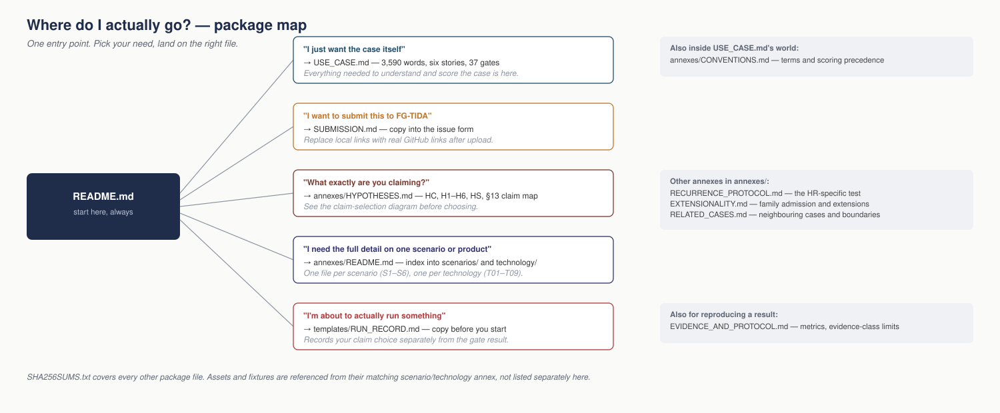

# When the controls work but the system fails

**FG-TIDA contributor use-case draft v0.9.3 · 29 September 2026 · open to revision**

**[Read the case](USE_CASE.md) · [Explore the annexes](annexes/README.md) · [Prepare a run](templates/RUN_RECORD.md)**

Six failure scenarios, three implementation walkthroughs, nine technology profiles and explicit hypotheses for review. This directory is a self-contained publication package. It contains the complete case-scope material; no historical archive or subsequent specification is required to read it.

**6 scenarios · 3 implementation walkthroughs · 9 technology profiles · 37 acceptance gates**

> [!NOTE]
> The profiles are documentary implementation walkthroughs, not nine executed product benchmarks.

## Start here

[Open the scalable figure](assets/reading/package_map.svg). The accompanying text remains the complete reference.

1. Read [USE_CASE.md](USE_CASE.md): the principal document, **3,590 words**, with scenario selection, preparation, execution and all **37 acceptance gates**. It frames and scores a declared case experiment. For a hypothesis claim, select HC, HR, HS or the relevant H1–H6 contrast using Section 5 and its linked protocol.
2. Read [the current hypotheses](annexes/HYPOTHESES.md): **HC, H1–H6 and HS**, with context definitions, six witness candidates and their support/refutation procedures. This is the current hypothesis protocol, not the principles/requirements traceability document.
3. For detailed fixtures, full walkthroughs, measurements or extensions, use [the complete annex index](annexes/README.md). All **20 technical annexes** are included as separate Markdown files.
4. Copy [the run-record template](templates/RUN_RECORD.md) before execution; record the hypothesis separately from R0/R1/R2 and distinguish gate results from hypothesis conclusions.
5. Use [SUBMISSION.md](SUBMISSION.md) for the FG-TIDA proposal fields. It contains the same 37 proposed technical requirements, identified by scenario.

## The three walkthroughs

*R0 is the ordinary configuration; R1 reinforces it; R2 retains that reinforced configuration under an admitted context change, with its safeguards and generic adaptation active.*

| Route | What is tested |
|---|---|
| R0 | Ordinary competent implementation with its declared controls. |
| R1 | Strongly defended implementation, reinforced before freeze; effective existing controls receive credit. |
| R2 | That same frozen R1 after an admitted observable material context change, retaining safeguards and generic adaptation. Recurrence requires demonstrated baseline correction first. |

A strong conventional implementation may pass. Legitimate-activity controls prevent a deny-all pass. There is no fourth implementation route. The A–D causal trial conditions in the hypothesis protocol are independent experimental factors, and HS describes an unproven functional response hypothesis; neither is an additional technology walkthrough or an executed solution result.

## Hypotheses are included explicitly

| Claim | Location and scope |
|---|---|
| HC — common causal sufficiency | [Hypotheses, section 2](annexes/HYPOTHESES.md#2-the-principal-hypothesis-of-causal-sufficiency): an admissible configured transfer/loss/change/reuse pathway for every family; not causal necessity. |
| H1–H6 | [Hypotheses, section 8](annexes/HYPOTHESES.md#8-the-six-canonical-hypotheses-and-their-refutation-tests): all six full statements, empirical contrasts and operational refutation tests. |
| HS — sufficient common response | [Hypotheses, section 9A](annexes/HYPOTHESES.md#9a-the-hypothesis-of-a-sufficient-common-response): functional proposal and future tests, without a prescribed architecture or a claimed result. |
| HR — recurrence after demonstrated correction | [Recurrence protocol](annexes/RECURRENCE_PROTOCOL.md): the more specific R2 question for a nominated frozen implementation. It is related to HC, not identical to it. |

Both S4 failure outcomes—unauthorized action and silent loss of the wider finding—remain separately visible. A result on only one does not establish both.

## Package contents

| Location | Contents |
|---|---|
| [USE_CASE.md](USE_CASE.md) | Main case; six stories, three routes, 37 gates, experiment instructions and assessment limits |
| [SUBMISSION.md](SUBMISSION.md) | Proposal form for FG-TIDA |
| [annexes/README.md](annexes/README.md) | Complete index: six scenarios, nine technology profiles and five common annexes |
| [annexes/CONVENTIONS.md](annexes/CONVENTIONS.md) | Working vocabulary, source-local labels and scoring precedence |
| [annexes/HYPOTHESES.md](annexes/HYPOTHESES.md) | Current hypothesis protocol and H1–H6 in full |
| [annexes/EXTENSIONALITY.md](annexes/EXTENSIONALITY.md) | Full family admission method and all six extension profiles |
| [annexes/RECURRENCE_PROTOCOL.md](annexes/RECURRENCE_PROTOCOL.md) | Corrected-baseline recurrence experiment and refutation |
| [annexes/EVIDENCE_AND_PROTOCOL.md](annexes/EVIDENCE_AND_PROTOCOL.md) | Shared protocol, full measurements, evidence classes and source boundaries |
| `annexes/scenarios/` and `annexes/technology/` | Full detailed scenario and technology annexes; all files linked in the index |
| `assets/` | Eleven scenario SVG figures plus three reading aids in SVG and PNG, referenced from the README and relevant annexes |
| `fixtures/S5-AWS/` | Four machine-readable JSON design artifacts, also printed in full in [T08](annexes/technology/T08.md) |
| [templates/RUN_RECORD.md](templates/RUN_RECORD.md) | Copyable record for claim selection, preregistration, gates and separate conclusions; not an additional technical annex |
| [SHA256SUMS.txt](SHA256SUMS.txt) | Integrity hashes for every other file in this package |

## Publish and maintain

Unzip the package and upload this directory’s contents together, preserving names and relative paths. Opening this README is the entry point; all case and annex links are local. The ZIP itself need not be committed as the working source. For a later correction, edit the affected Markdown or asset and commit that change. Preserve version history; do not manually maintain a second combined copy. Regenerate SHA256SUMS.txt whenever package files change; the supplied hashes identify this draft snapshot.

To submit through the FG-TIDA issue form, copy the relevant text from SUBMISSION.md and replace its local file links with the actual published GitHub links after upload. A commit permalink can identify the exact submitted version. No destination URL is invented in this package.

## Evidence and publication status

The profiles are documentary implementation walkthroughs, not nine executed product benchmarks. The four JSON artifacts are non-deployed designs with placeholder functions; their full contents and implementation assumptions are in T08. Scenario facts are synthetic unless explicitly attributed. Hypotheses and proposed witnesses remain unproven; preserve successful defences and negative or inconclusive results.

Contributor: **The Integral Management Society / Tegrity.AI**. Contact: **Iván Abril Palma — ivan.abril@tegrity.ai**. This is a public contributor draft, not an adopted FG-TIDA standard. Original authorship and applicable source terms remain in force. Principles, specification traceability and historical preservation records are separate deliverables and are not included as case annexes here.
