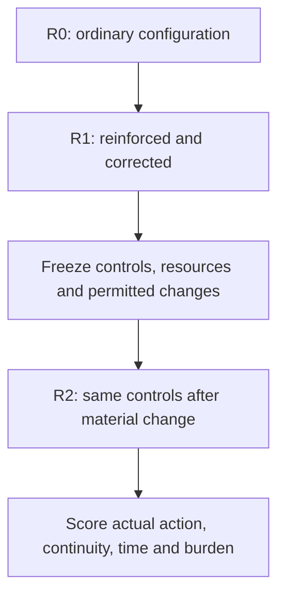

## Annex S2

**Shared mobility — Central Bridge.** Source identifier: 00F.

### Reader-facing story — The City That Stopped Safely

At 08:17, nothing in Aurora City has “failed” in the ordinary sense. The buses still know their routes. Robotaxis still avoid collisions. Fire/rescue still has emergency-access rules. The evacuation controller still follows the plume plan. Sensors still produce data.

Then the operating frame changes faster than the city can reconcile it.

A fire beside Riverfront produces smoke and heat. Heavy rain distorts cameras and particulate readings. A shared communications gateway delays feeds that several systems believe are independent. Wind near the high-rises no longer behaves like the city model. Four conclusions emerge:

- **Plan A:** evacuate east across Central Bridge;
- **Plan B:** reserve the same bridge for westbound fire/rescue access;
- **NORMAL:** continue because no fresh applicable closure reached this actor;
- **HOLD:** stop because the evidence or mandate conflicts.

No one of those answers has to be absurd.

That is the problem.

At 08:21, local collision avoidance does exactly what it was built to do: vehicles brake and avoid immediate impacts. But the bridge loses usable capacity. Evacuation slows. Fire access is blocked. HOLD vehicles occupy scarce space. NORMAL traffic continues to arrive.

> **Every vehicle can avoid a collision and the city can still fail.**

00F tests the boundary between **local correctness** and **system compatibility**. It asks whether a changing multi-actor city can detect that its previously acceptable response mapping has stopped composing — before local safety turns into systemic gridlock.

~~~mermaid
flowchart LR
    A["PLAN A evacuate east"] --> B{"Central Bridge same resource / same 5 min"}
    C["PLAN B reserve westbound rescue"] --> B
    D["NORMAL keep entering"] --> B
    E["HOLD stop / wait"] --> B
    B --> F["Local collision avoidance brakes successfully"]
    F --> G["Corridor capacity collapses"]
    G --> H["Evacuation delayed rescue access blocked exposure rises"]
~~~

**Executive paradox:** the immediate safety layer can succeed while the mobility mission fails.

---

### 1. Executive case card

| | |
|---|---|
| **Business failure** | Locally valid mobility/safety postures become mutually incompatible over one shared corridor. |
| **Narrative** | **The City That Stopped Safely** |
| **Shared resource** | Central Bridge + Riverfront approaches, five-minute resource-time window |
| **Visible postures** | Plan A · Plan B · NORMAL · HOLD |
| **Paradox** | Collision avoidance can succeed while evacuation/rescue capacity collapses. |
| **Core architectural question** | Can the city qualify composition of independently governed local decisions without requiring one supercontroller? |
| **Hard comparison** | Standard implementation → defended top-notch → same frozen top-notch under gradual/unknown regime drift |
| **Status** | Fictional reference scenario + quality plan; public corroboration; unexecuted comparative claim |

**Aurora City** is a fictional smart city with independently governed public buses, private robotaxis, delivery fleets, emergency vehicles, citizen mobility agents, traffic-signal controllers and infrastructure operators. They exchange some authenticated signals but do not share one owner, one complete model or one universal command hierarchy.

During the morning peak, severe rain coincides with a battery fire at a logistics facility beside the Riverfront corridor. Smoke, water, wind and intermittent communications degrade several telemetry channels at once. The visible evidence is real but incomplete: some sensors indicate a toxic-plume evacuation problem, others indicate a tunnel/fire-access problem, some vehicles have no current authenticated emergency signal, and some receive two incompatible alerts.

Four locally understandable responses emerge:

- **Emergency Plan A:** evacuate people east across Central Bridge, open outbound capacity and prevent new inbound civilian traffic;
- **Emergency Plan B:** close the east approach, reserve the same corridor for westbound fire/rescue access and divert civilians south;
- **NORMAL:** continue previously authorised trips because the actor's local road and safety conditions remain within its represented normal window;
- **HOLD:** stop or wait for human/authority confirmation because the received evidence or mandate is conflicting.

The failure is not that every participant behaves irrationally. The failure is that incompatible, locally justified postures compete for the same physical corridor while no shared control function qualifies what their divergence means. Local collision avoidance prevents some direct impacts, but it converts the conflict into gridlock: evacuation vehicles cannot clear, emergency services lose access, normal traffic continues to arrive and held buses occupy scarce safe space.

### 2. Concrete system and decision

#### 2.1 Actors and local windows

| Actor group | Principal/local objective | Primary window | Plausible local closure |
| --- | --- | --- | --- |
| Municipal evacuation controller | Move exposed people away from the possible plume | Air-quality sensors, wind estimate, municipal emergency plan and available outbound routes | Emergency Plan A |
| Fire/rescue and tunnel-access controller | Preserve responder access and isolate a possible fire/structural hazard | Thermal alarms, fire calls, tunnel/bridge status and emergency access rules | Emergency Plan B |
| Private robotaxi and delivery fleets | Complete authorised trips without violating local driving constraints | Vehicle sensors, commercial routing, authenticated road closures and local collision risk | NORMAL where no applicable fresh closure is received |
| Public buses and some personal agents | Avoid acting outside current authority when alerts conflict | Public instructions, route mandate, passenger condition and available human confirmation | HOLD |
| Local vehicle safety controllers | Avoid immediate collision | Nearby objects, speed, trajectory and braking envelope | Stop, slow or manoeuvre locally regardless of mission plan |

Each window contains useful evidence. None establishes the whole city state.

#### 2.2 Decision scope

The system-level decision is:

> For the next five minutes, which actors may enter, leave, reserve or cross Central Bridge and its Riverfront approaches, under which authority and bounded posture?

For the fixture, the decision scope is the material subject–proposition–decision boundary for that corridor allocation. The active evidence scope contains the current telemetry, provenance/freshness, participant intentions, authority, physical capacity, review capacity and useful response horizon. The open residual `R_U` includes unobserved physical causes, unregistered road users, missing dependencies and consequences that the bounded representation cannot guarantee.

The case does not require one global controller. It requires interoperable qualification of the shared decision surface before mutually incompatible local closures consume the same resource.

### 3. How the failure develops

#### Stage 1 — normal operation is genuinely qualified

Before 08:17, each actor operates inside a known envelope. Traffic plans, emergency routes, grants and policies are current. Central Bridge can support normal mixed use. Local controls and ordinary telemetry are sufficient for their declared purposes.

#### Stage 2 — noise and dependency changes accumulate

At 08:17, rain obscures two cameras, increases particulate readings and delays messages through a shared communications gateway. Wind near high-rise buildings differs from the city model. Several nominally separate feeds depend on the same upstream gateway, but not every consumer knows this. The logistics fire produces heat and smoke while drainage water begins affecting the adjacent underpass.

No single observation is necessarily false. The uncertainty concerns coverage, dependence, freshness and the response relation: the system cannot yet establish whether Plan A, Plan B, a combination or another bounded posture is correct for the shared corridor.

#### Stage 3 — local windows produce different closures

At 08:18:

- the evacuation controller crosses its plume threshold and emits Plan A;
- the fire/tunnel controller crosses its access-protection threshold and emits Plan B;
- private fleets with delayed but still valid-looking maps continue NORMAL;
- buses receiving both messages enter HOLD and request human confirmation.

Each local closure can be faithful to its own evidence and rules. The divergence is itself the important new ecosystem signal.

The opposite visible pattern is also possible. Fleets that reuse the same delayed map or imitate the first authoritative-looking closure can converge on `NORMAL` even though their apparent agreement comes from one correlated, stale basis. This is **false convergence**, not corroboration. It is a Type-2 closure if the shared corridor decision is treated as determined without sufficient support.

#### Stage 4 — the divergence is not composed

The exchanged messages carry actions and alert severity, but not consistently the observation boundary, source dependence, freshness, residual, expiry or condition for reopening. Each receiver therefore interprets the message inside a different frame. Plan A and Plan B both claim Central Bridge; NORMAL actors continue entering; HOLD actors remain in place.

As delayed alerts alternate, some actors can reverse repeatedly between A, B, NORMAL and HOLD. Without an evidence-change rule, expiry and hysteresis, this is not adaptive agility but oscillation between Type-2 closure and Type-1 non-closure. A timeout can force a Type-1 queue into an unsupported Type-2 default; a later contradiction can reopen that closure as Type-1 search when the discarded basis is no longer recoverable.

#### Stage 5 — local safety preserves vehicles but loses the mission

At 08:21, collision-avoidance controllers brake safely as opposed flows meet near the bridge. This is a valid local success. Systemically, the stopped vehicles remove corridor capacity. Fire access is delayed, evacuation slows, buses remain exposed and human operators receive more conflicting escalations than they can resolve within the useful window.

#### Stage 6 — potentially catastrophic outcome

The city has not suffered a universal technical failure. It has produced four technically understandable but mutually incompatible postures. The result can become catastrophic through delayed response, prolonged exposure, blocked emergency access and secondary incidents. A later forensic reconstruction can be complete while arriving too late to change the outcome.

#### Stage 6A — why “safe” can still mean “failed”

~~~mermaid
flowchart TB
    L["Local layer collision avoidance / emergency braking"]
    R["Resource layer who gets the bridge, in which direction, for how long?"]
    M["Mission layer evacuation + rescue + continued mobility"]

    L -->|"can PASS"| LP["No immediate collision"]
    R -->|"can FAIL"| RF["incompatible occupancy / gridlock"]
    M -->|"inherits resource failure"| MF["delayed rescue / evacuation / exposure"]

    LP -. "does not compensate for" .-> RF
~~~

**Non-fungibility in one picture:** success in the local safety domain does not cancel a failed shared-resource decision.

### 4. The failure mechanism

The initiating condition is **residual uncertainty after a material frame change**, not a requirement to reproduce all four quadrant positions from the enterprise case.

1. The event leaves the qualified operating envelope: the former response mapping is no longer sufficient.
2. Observation windows diverge because coverage, freshness and source dependence differ.
3. Local systems close against their own windows.
4. The closures share a physical resource but do not carry enough qualification to compose safely.
5. The ecosystem mistakes local correctness for a globally determined response.

At the foundational level, the mission response may face an established structural or declared-frame limit. Operationally, however, the architecture need not prove a structurally unresolved limit while the event is unfolding: it may preserve the state as unresolved and manage it through Type 1/Type 2 controls. Mismanagement can then add:

- **Type 1:** indefinite HOLD, escalation or search that consumes time and human capacity;
- **Type 2:** continued NORMAL or confident Plan A/B execution after its local basis is no longer sufficient for the wider corridor decision.

The existence of A/B/NORMAL/HOLD is not itself proof of failure. The failure occurs when their incompatibility over a material shared resource is not detected, qualified and bounded in time.

False convergence, divergence, oscillation and cascade are observable trajectories, not additional failure types. Defensive `UNKNOWN`, qualifier saturation or injected doubt create Type 1 when they impose unbounded HOLD/containment; they create Type 2 when habituation, pressure or a default suppresses the unresolved state and forces closure. A safe, reversible routing or segmentation test may also be an observation instrument: treating every unknown as permanently unknowable can create Type 1 just as treating it as harmless can create Type 2.

### 5. Quality-plan fixture

The plan is deterministic as a **quality-control flow**, not as a prediction that every telemetry disagreement causes physical catastrophe.

Before a run, the test fixture declares:

- the corridor decision and actor-specific scopes;
- the qualified normal envelope and the Plan-A/Plan-B applicability conditions;
- source identities, dependencies, freshness limits and missing-data treatment;
- the materiality and detectability threshold for a frame break;
- a two-minute qualification deadline inside the five-minute action horizon;
- the available municipal and fleet authorities and finite human-review capacity;
- invariant local controls that remain valid across regimes, including collision avoidance and emergency braking;
- authorised containment options, expiry and return-to-operation conditions;
- the full compute, communication, waiting, operator and response-cost ledger;
- an after-run branch oracle for evaluation only. The runtime system does not receive that oracle.

These values are virtual test parameters, not operational recommendations for a real city.

#### 5.1 Control-evidence states

To distinguish missing architecture from failed use of an existing control, 00F v0.2 uses the same evidence discipline as the later scenario family:

- **CAPABILITY_ABSENT** — no control exists for the required cross-actor/resource qualification;
- **CONTROL_PRESENT_NOT_INVOKED / BYPASSED** — the control exists but the path reaches actuation without invoking it;
- **CONTROL_EXECUTED_FAILED** — the control runs but classifies the branch incorrectly or too late for the declared horizon;
- **CONTROL_EXECUTED_PASS** — the control runs and produces an admitted outcome;
- **NOT_OBSERVABLE** — the available trace cannot establish which state occurred.

These labels are scenario evidence states, not new universal failure categories.

### 6. Gate register: challenge → sufficiency → hypothesis → KPI → disposition

| Gate | Decision | Mandatory evidence in this fixture | Conforming exit | Failure if bypassed |
| --- | --- | --- | --- | --- |
| **Q0 — frame shared use** | Is normal shared use of Central Bridge currently qualified? | decision/scope, owners, authority, source map, normal envelope, capacity, deadline, invariant controls and fallback | bounded scopes and response rules are current | actors begin without a common decision/resource boundary or bounded fallback |
| **Q1 — qualify the material break** | Has the normal frame become insufficient, and what remains observable? | material-break recall/precision; freshness/staleness; source diversity/retrievability; correlated-evidence error; U-invalidation; inherited indeterminacy; residual preservation; response margin | preserve the affected scope and explicit `UNKNOWN`; continue only unaffected qualified scopes | stale/correlated signals are treated as independent certainty or absence of one alert is treated as stability |
| **Q2 — compose local postures** | Are A, B, NORMAL and HOLD compatible over the shared corridor? | handoff integrity; qualification loss; scope/dependency preservation; wrong-domain/systemic closure; false convergence; incompatible-posture exposure; Type-1↔Type-2 transitions; targeted re-entry | compatible postures compose, or material incompatibility triggers bounded requalification | correlated agreement is mistaken for corroboration, local confidence is promoted system-wide, or opposed uses of the same resource advance |
| **Q3 — select bounded posture** | What may safely and legitimately happen before the cause is fully known? | owner/authority/expiry; posture correctness; false continuation/containment; authorised-response compliance; HELD time; human demand/capacity; qualifier burden; defensive/injected-UNKNOWN effect; deadline pass; response margin; posture oscillation | authorised owner applies scoped containment, restricted operation, reversible action or no commitment | a blanket halt, unauthorised plan, infinite escalation, silent timeout/default or unrestricted continuation is executed |
| **Q4 — targeted requalification** | What smallest evidence/review can restore a usable response mapping? | requalification latency; freshness; targeted re-entry precision/recall; evidence yield; marginal decision value; total burden; response margin | reopen only the material sources/dependencies and update affected scopes before expiry | undirected telemetry, agents and human review expand until the response window is exhausted |
| **Q5 — compose, arbitrate and resume** | May shared use resume, remain segmented or terminate, and which scoped result may govern? | residual preservation; handoff integrity; posture correctness; common outcome vector; dependency/hard-constraint map; veto owner/scope/expiry; timeout/default; evidence-versus-authority role; re-entry; oscillation and cascade reach/latency; observable outcome; deadline; total burden | declared precedence is applied; compatible use resumes, scopes are separated, or a qualified partial/no-conclusion state remains explicit | confidence, signature, timeout, stale veto or one successful local outcome silently becomes city-wide closure |

**Fixture-specific outcome measures.** `Incompatible-posture exposure` records the duration and criticality of simultaneously active incompatible postures over the same resource-time segment. `Conflicted corridor occupancy`, emergency-access delay and exposed-passenger time are observed effects. They supplement the declared measure set for this case; they do not create new universal hypotheses.

#### 6.1 Q0–Q5 at a glance

~~~mermaid
flowchart LR
    Q0["Q0 frame shared use"]
    Q1["Q1 material break"]
    Q2["Q2 compose postures"]
    Q3["Q3 bounded posture"]
    Q4["Q4 targeted requalification"]
    Q5["Q5 compose / resume"]

    Q0 --> Q1 --> Q2 --> Q3 --> Q4 --> Q5
    Q1 -. "frame insufficient" .-> R["REQUALIFY"]
    Q2 -. "incompatible resource use" .-> C["CONTAIN / REQUALIFY"]
    Q3 -. "capacity / authority limit" .-> B["bounded HOLD / ESCALATE"]
    Q4 -. "low yield / deadline" .-> N["NO COMMITMENT / bounded closure"]
~~~

The six gates are local acceptance conditions for this mobility case; they do not establish a universal standard or prescribe a particular architecture.

### 7. Deterministic gate logic

1. A mandatory field or KPI in `UNKNOWN` cannot produce `PASS`. It produces targeted `REQUALIFY`, bounded `HOLD/CONTAIN`, authorised `ESCALATE` or `NO COMMITMENT` according to remaining time and capacity.
2. A material disagreement between sources is not automatically an emergency and is not averaged away. Q1 states what is affected and what remains qualified.
3. If two or more postures require incompatible use of the same resource-time segment, Q2 cannot pass merely because each posture is locally valid.
4. `PASS WITH EXPLICIT LIMIT` preserves unresolved or residual state without requiring the runtime to prove a structurally unresolved limit. A explicit residual-limit marker may be added only when its structural or declared-frame basis is explicit. Neither status permits Plan A or B without a qualified basis.
5. If human demand exceeds declared capacity or the response margin falls below its minimum, Q3 applies the pre-authorised bounded fallback; it does not leave an indefinite HOLD.
6. Q4 stops evidence expansion when yield falls below its floor, burden exceeds its ceiling or the response margin is exhausted.
7. Q5 passes only when the shared-resource postures are compatible or physically/temporally separated, or when the output explicitly preserves a qualified partial/no-conclusion state.
8. Q5 applies the predeclared order: material dependency and hard constraint; legitimate veto owner, scope and expiry; qualified bounded response; timeout/default treatment; targeted re-entry; and posture-stability rule. Approval may authorize action but is not new evidence.
9. A posture reversal without new material evidence, expiry or changed authority fails the anti-oscillation rule. Any continuation that overrides these dispositions is recorded as a failure-route bypass.

Assessment may request reassessment; it does not create municipal authority, command private fleets or perform containment. Those actions remain with their authorized owners.

### 8. Failure diagnostics for the event

#### 8.1 failure trace — requirements not satisfied for the event

| Step | Local behaviour | Gate result | Propagated consequence |
| --- | --- | --- | --- |
| Q0 | actors share the corridor but not one current resource/scope contract | incomplete, workflow continues | no common criterion for material incompatibility |
| Q1 | each subsystem processes noisy, delayed or correlated telemetry inside its own window | mixed local PASS/HOLD | the normal frame's loss of validity is not represented consistently |
| Q2 | A, B, NORMAL and HOLD are treated as separate operational events | FAIL, bypassed | incompatible allocations reach the same corridor |
| Q3 | humans receive conflicting escalations; other actors continue or stop | capacity/deadline FAIL, bypassed | no bounded common posture takes effect in time |
| Q4 | more telemetry, retries and manual calls are launched | evidence-yield/burden FAIL, bypassed | response margin is consumed without restoring a response mapping |
| Q5 | local collision avoidance stops vehicles | systemic FAIL | immediate collisions may be avoided, but gridlock blocks evacuation and emergency access |

Within the declared fixture, mixed-mode divergence follows from bypassing Q2/Q3 after the incompatible postures are observable. The exact physical harm is not deterministic and must not be claimed as inevitable.

### 8A. Three evidence-distinct routes through the same event

The diagnostic traces below distinguish absence of a relevant capability from a control that is present but bypassed, incomplete or late. These are failure classifications within the selected experiment, not additional implementation routes.

#### 8A.1 capability-absent trace — composition capability absent

| Step | Local behavior | Evidence state | Consequence |
|---|---|---|---|
| Q0 | actors share Central Bridge but no common resource-time decision object exists | **CAPABILITY_ABSENT** | each actor can remain locally coherent |
| Q1 | local threshold/freshness logic runs | local PASS/HOLD | no shared frame-invalidity event is produced |
| Q2 | no component composes A/B/NORMAL/HOLD over the same resource-time segment | **CAPABILITY_ABSENT** | incompatible postures advance |
| Q3–Q5 | each application handles its own action/escalation | not reached as shared gates | gridlock can emerge despite locally valid controls |

This is evidence of a missing capability in the tested configuration, not superiority of an unspecified alternative.

#### 8A.2 ineffective-control trace — systemic control exists but is bypassed, incomplete or late

| Step | Local behavior | Evidence state | Consequence |
|---|---|---|---|
| Q0 | common corridor/resource model exists | PASS | shared frame is available |
| Q1 | source/freshness/dependency monitoring exists | PASS or late | monitoring alone does not establish compatible shared-resource use |
| Q2 | incompatibility detector exists but misses a new combination, is not invoked on one path, or fires after occupancy consumes the margin | **BYPASSED / CONTROL_EXECUTED_FAILED** | A/B/NORMAL/HOLD still reach the corridor |
| Q3 | fallback/escalation exists but human/response capacity is already binding | executed too late | no useful bounded posture takes effect |
| Q4/Q5 | requalification/resumption logic operates on an obsolete dependency/validity model | executed failure | the city resumes or contains on the wrong basis |

This is the correct route for strong-peer drift stress: the technology may be excellent and the configured controls real.

### 8B. Variants and controls

| Variant | Injected condition | Primary pressure | Expected property |
|---|---|---|---|
| **V0 — valid continuity** | no material frame/dependency change | anti-HOLD control | NORMAL/shared use proceeds without unnecessary containment |
| **V1 — direct A/B conflict** | Plan A and Plan B claim opposed bridge use | Q2 | incompatibility exposed before simultaneous use |
| **V2 — false convergence** | several actors converge on NORMAL through one stale/correlated source | Q1/Q2 | agreement is not treated as independent corroboration |
| **V3 — hidden common dependency** | nominally independent feeds share a degraded gateway/provider | Q1 | dependency/freshness basis is requalified |
| **V4 — timestamp-semantic drift** | timestamp remains valid-looking but its meaning changes by producer/path | Q1/Q4 | freshness semantics, not field presence, govern reliance |
| **V5 — finite human capacity** | review demand exceeds declared operator capacity | Q3 | bounded fallback; no indefinite escalation |
| **V6 — oscillation** | delayed alerts alternate A/B/NORMAL/HOLD | Q3/Q5 | evidence-change/expiry/hysteresis prevents uncontrolled reversals |
| **V7 — mixed actor visibility** | some private/unregistered actors remain outside the shared representation | Q2/Q5 | residual remains explicit; local coverage is not promoted to city completeness |
| **V8 — dependency/regime drift** | topology, source dependence or response mapping changes after top-notch controls are frozen | Q1/Q4 | basis model is requalified, or limitation remains explicit |
| **V9 — compressed response margin** | same evidence, less corridor/human time | Q3/Q4 | minimum-sufficient action/requalification remains inside useful horizon |

V0 prevents “stop everything” from winning. V8 is the primary adaptive strong-peer branch.

<!-- FREEZE-ADD:TECH-PROFILES:START -->
### 8C. Three implementation trajectories

The two maintained profiles instantiate the same comparison using very different technology substrates: [FIWARE NGSI-LD / Orion-LD](../technology/T03.md#annex-t03) and [AWS IoT TwinMaker / IoT Core](../technology/T04.md#annex-t04).

#### 00F-R0 — standard competent implementation

A technically sound city data/event architecture with authenticated sources, normal freshness/threshold handling, local application rules, dashboards and local safety. It is not deliberately broken. It may still fail to compose independently valid postures over the same resource-time segment.

#### 00F-R1 — defended top-notch implementation

R0 plus the strongest materially relevant conventional controls: governed semantics, source timestamps/provenance, independent paths where feasible, known-dependency monitoring, temporal analysis, resource-time reservation/conflict logic, finite human queues, bounded fallback, explicit authority/expiry and tested runbooks.

**Establish that R1 passes the nominal and selected known-degradation branches before interpreting an R2 result as recurrence after correction.**

#### 00F-R2 — same frozen top-notch implementation under gradual/unknown regime drift

Freeze R1 code/configuration, dependency graph, validity assumptions, thresholds and resource envelope after it passes the known controls. Then inject V8 or another preregistered weak/gradual change:

- hidden common dependency;
- coordinated sensor bias inside local tolerances;
- changed timestamp meaning;
- altered street-canyon/wind relation;
- shorter human/corridor response margin.

Score:

- **R2:** exact frozen strong peer under drift;

The frozen R1 retains its generic adaptation capabilities. The assessor supplies no private oracle or post-outcome code changes.

### 9. What this case tests and what would falsify the claim

The case tests whether a candidate architecture improves the common outcome vector under the same actors, telemetry, event sequence, compute, communication, human capacity and deadlines.

Record correct posture, incompatible-posture exposure, false continuation/containment, emergency-access delay, unresolved evidence, response authority, timeliness and total burden on nominal and changed-context branches. Passing the changed branch within the declared limits is a successful defence; it narrows the corresponding failure prediction.

The case does not test universal emergency prediction, city-wide command, legal authority creation or perfect knowledge of `R_U`. It preserves literal non-observability as a foundational residual-limit boundary, but the operational test does not require runtime proof of that classification: it tests whether unresolved limits are managed rather than hidden.

### 9A. External corroboration and state-of-the-art evidence addendum — reviewed 24 September 2026

00F is fictional, but the classes of failure it stresses—loss of situational awareness, locally reasonable automated actions composing into systemic instability, weak signals not becoming effective alarms, finite human oversight, and digital-model credibility under changing conditions—have documented neighbors in real systems.

**Evidence discipline:** the public sources establish neighboring mechanisms and consequence classes; they do not establish that Aurora City happened or that any proposed control would have prevented the cited event.

The sources below are deliberately **technology-agnostic**. They are not claims that FIWARE, Orion-LD, AWS IoT Core or TwinMaker caused these events.

| External evidence | Date / evidence class | Documented neighboring mechanism | 00F pressure point | What it does **not** establish |
|---|---|---|---|---|
| [NERC Final Report on the August 14, 2003 Blackout](https://www.nerc.com/globalassets/our-work/reports/event-reports/august_2003_blackout_final_report.pdf) | **2004 · official reliability investigation** | FirstEnergy's alarm processor failed; operators lost a major situational-awareness function, and multiple clues from customers, generators and neighboring operators were not pieced together until the system was already severely compromised. | Q1/Q3/Q4: local signals can exist while the shared operating frame is not recognized/requalified in time. | Does not reproduce the 00F mobility topology, telemetry or A/B/NORMAL/HOLD branches. |
| [CFTC statement on the Joint CFTC/SEC May 6, 2010 Flash Crash report](https://www.cftc.gov/PressRoom/SpeechesTestimony/chiltonstatement100710) | **1 Oct 2010 · official market investigation summary** | A large automated sell program interacted with other automated market behavior; disruption propagated across venues and the interrelatedness of markets amplified the event. | Q2/Q5: locally programmed automated actions can compose into a system-level state that no individual action expresses on its own. | Financial-market microstructure is not urban mobility and does not imply the same control solution. |
| [SEC — Knight Capital automated-router incident](https://www.sec.gov/newsroom/press-releases/2013-222) · [original v0.1 SEC administrative order PDF](https://www.sec.gov/litigation/admin/2013/34-70694.pdf) | **incident 1 Aug 2012; SEC order 16 Oct 2013 · official enforcement findings** | 212 customer orders triggered millions of automated orders and more than 4 million executions in 154 stocks; the firm lost more than USD 460 million. The SEC also documented control/deployment failures around the automated router. | Q0/Q2/Q3: a locally executing automated subsystem can rapidly create a much larger system state when control assumptions/configuration are wrong. | Does not establish a hidden regime change or any defect in FIWARE/AWS technologies. |
| [NTSB — Uber ATG Tempe investigation / HAR-19/03](https://www.ntsb.gov/investigations/Pages/HWY18MH010.aspx) · [original v0.1 HAR-19/03 PDF](https://www.ntsb.gov/investigations/accidentreports/reports/har1903.pdf) | **2019 · official accident investigation** | NTSB identified ineffective oversight of vehicle operators, automation complacency and inadequate safety risk assessment; the report notes humans are poor monitors of automation failures over time. | Q3/Q4: human oversight cannot be treated as infinite, continuously effective determination capacity. | Does not establish the 00F multi-actor divergence mechanism or a digital-twin failure. |
| [NIST, *Credibility Consideration for Digital Twins in Manufacturing*](https://www.nist.gov/publications/credibility-consideration-digital-twins-manufacturing) | **16 Dec 2022 · NIST / peer-reviewed publication** | NIST states that digital-twin results used for decision support require verification, validation and uncertainty quantification throughout the twin life cycle; credibility is purpose/context dependent. | Q1/Q5: a current/available digital representation is not automatically sufficient for a decision if its model validity/uncertainty is not qualified. | Manufacturing twins are not the Aurora City case and the source does not evaluate FIWARE or TwinMaker. |
| [NISTIR 8620, *Digital Twins Workshops Summary Report*](https://www.nist.gov/publications/digital-twins-workshops-summary-report) | **21 Jul 2026; updated 31 Aug 2026 · NIST state-of-the-art workshop report** | Industry/academia/government participants identified persistent challenges in interoperability, verification/validation/uncertainty quantification, cybersecurity and trustworthy scalable digital twins. | Q1/Q2/Q5: state-of-the-art practice still treats interoperability and model credibility as separate problems, consistent with 00F's distinction between data integration and decision sufficiency. | Does not show a specific smart-city incident or product failure. |

#### 9A.1 Evidence-use rule

This addendum supports the narrower proposition that the 00F stress surfaces have real neighbors:

- loss of situational awareness can occur while signals and systems remain partially operational;
- interactions among automated actors can create system-level effects beyond each local rule;
- weak alerts or monitoring outputs do not become effective control merely because they exist;
- human oversight has finite vigilance/capacity;
- digital-twin trustworthiness requires continuing validation, uncertainty qualification and context-appropriate credibility.

It does **not** establish that Aurora City happened, that FIWARE/AWS are inadequate, or that any proposed control would have prevented the cited event.

#### 9A.2 Relationship to the implementation profiles

The latest [FIWARE/Orion-LD v0.2 Draft](../technology/T03.md#annex-t03) and [AWS IoT TwinMaker / IoT Core v0.2 Draft](../technology/T04.md#annex-t04) show how the same quality-plan gates can be projected onto strong technology-specific substrates. This addendum remains outside those product analyses so the external corroboration is not misread as evidence against either technology.

NHTSA's [8 July 2026 call to action on autonomous vehicles interfering with first responders](https://www.nhtsa.gov/press-releases/av-developers-automated-vehicle-that-cannot-safely-interact-first-responders-danger) provides an additional real-world example of local vehicle behavior conflicting with a shared emergency-response mission; it does not establish the complete scenario.

### 10. Product-annex boundary

This annex defines the technology-neutral case and quality plan. The product annexes apply the same frozen fixture to each platform through an ordinary implementation, a defended implementation and that frozen defended implementation under material context change:

- [00F-A01 — FIWARE NGSI-LD / Orion-LD implementation profile](../technology/T03.md#annex-t03).
- [00F-A02 — AWS IoT TwinMaker / IoT Core implementation profile](../technology/T04.md#annex-t04).

Neither technology profile may change the event, actors, deadlines, resources or outcome criteria after results to favour a configuration.

**Technology-evidence freeze for presentation use:** the FIWARE/Orion-LD and AWS IoT TwinMaker/IoT Core annexes are dated design analyses, not rolling product descriptions. Their source bases were re-audited on **24 September 2026**. FIWARE is pinned to **Orion-LD 1.12.0 (28 Jan 2026)** while the standards reference is separately pinned to **ETSI GS CIM 009 V1.9.1 (2 Jul 2025)**; the annex explicitly does **not** claim full Orion-LD conformity to V1.9.1. AWS capability claims are tied to live documentation reviewed on the freeze date and to the **AWS IoT TwinMaker API Reference last published 14 Sep 2026**. Presentation claims about named technologies should cite those frozen source bases and must not infer later capabilities into the 17 September fixture.

**Status:** fictional reference failure scenario and proposed test plan; not a real incident report, deployed city design, safety case, product result or adopted standard.

